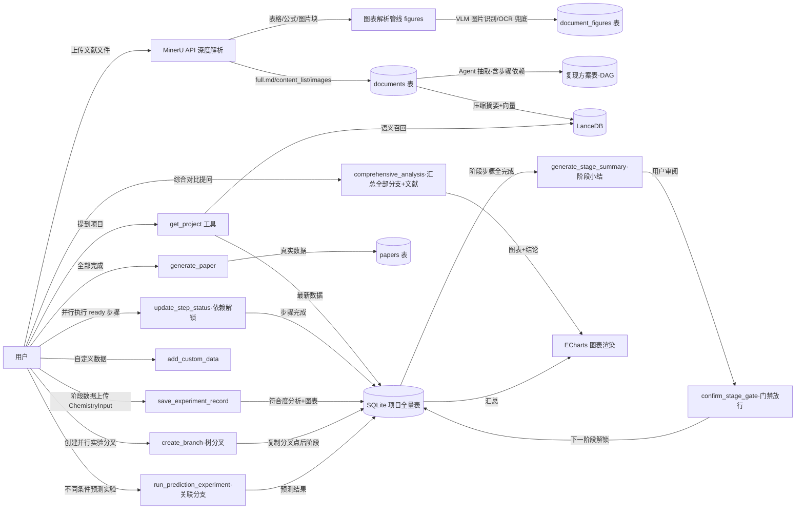

# 实验复现 Agent 实施计划（修订版 v0.10）

> 本文档为实验复现 Agent 的实施计划，供评审与修改。确认无误后再进入代码编写阶段。
> 版本：v0.10 ｜ 日期：2026-08-05
> v0.2 修订说明（依据用户反馈）：
> 1. 前端形态：**所有工具独立于聊天模式**，新增独立"文献复现工作台"页面，与聊天页无任何关联；
> 2. 补充**文献图表解析详细方案**；
> 3. Agent 所有分析与总结**配备图表展示**（ECharts 为主、VChart 备选）；
> 4. 数据录入具备**化学专业字符输入能力**（键盘 + 鼠标）。
> v0.3 修订：决策点 D6 已定——文献图表识别多模态模型采用 **DeepSeek-VL2**（OpenAI 兼容接口）。
> v0.4 修订（依据用户反馈）：
> 5. **数学公式渲染**：实验内容中的数学公式（LaTeX）正确显示（KaTeX）；
> 6. **AI 全程陪伴**：实验全程可在工作台随时向 AI 提问，注重 Markdown 格式转换；
> 7. **类型规范先行**：编码第一步将所有类型规范写入 `ai-server/type.ts`，正式编码严格引用，Agent 输出 JSON 必须遵循其中规范。
> v0.5 修订（依据用户反馈）：
> 8. **论文可选生成**：实验结束后由用户选择生成或不生成论文；
> 9. **AI 联想与预测实验**：Agent 总结后调用工具进行联想（搜索知识判断更优方案）、以**控制变量法**分析改变实验操作对结果性质的影响；用户可任选某流程进行 **AI 预测实验**，期间可随意修改尽可能多的实验变量，AI 预测结果并保证**理论有依据**。
> v0.6 修订（依据用户反馈）：
> 10. **VLM 配置**：DeepSeek-VL2 复用 `.env` 的 `DEEPSEEK_API_KEY`，模型名与 baseURL 由用户在 `.env` 中自行标注；
> 11. **图表导出确认**：确认图表数据可在生成论文时成功导出（ECharts 数据表 + PNG 导出方案）；
> 12. **论文人工标注**：论文中需要人工补充实际数据的地方统一额外标注，便于用户识别与填写。
> v0.7 修订（依据用户反馈，**工作流整体重设计**）：
> 13. **步骤级并行（DAG）**：复现方案中的步骤由"线性编号"升级为**依赖图（DAG）**，步骤之间可声明前后依赖，
>     无依赖的步骤可**并行执行**（同一时刻允许多个步骤进行中）；步骤状态机
>     `pending → ready → in_progress → completed / skipped`，前置完成自动解锁后继（见 §7.6）；
> 14. **阶段门禁与小结**：阶段与阶段之间不再"点击即滑过"，增加**明确边界**——阶段步骤全部完成后，
>     AI 自动生成**阶段小结**（结果汇总/符合度/异常与偏差/经验教训/下一步建议），用户审阅小结后
>     **手动确认放行**下一阶段，确认前下一阶段保持锁定（见 §7.7）；
> 15. **平行实验组（D9）**：阶段内可建立多个**平行实验组**（对照组/实验组、正交实验、条件扫描），
>     各实验组独立记录数据与符合度，看板横向对比（见 §7.8）。是否纳入主流程由评审确认。
> v0.8 修订（依据用户反馈，**5 项重大调整**）：
> 16. **文献解析改用 MinerU**：文献解析主方案切换为 **MinerU**（mineru.net 精准解析 API），
>     深度结构化输出 Markdown + 表格 + 公式 + 图片，取代 pdfjs 自绘管线；pdfjs+OCR 降级为兜底（见 §6）；
> 17. **树分叉并行实验（替代 v0.7 平行实验组）**：用户在阶段数据上传处可创建**并行实验分叉**，
>     每个分叉从分叉点之后的**所有阶段完全独立**（同一项目内，树状分叉，互不干扰），
>     分叉可再分叉，形成实验树（见 §7.8）；D9 决策定案为树分叉模型；
> 18. **功能顺序调整**：**AI 联想与预测实验**调整到"阶段数据上传与结果分析"之后、**论文生成**之前，
>     能力顺序变为 ①文献解析 ②复现方案 ③阶段数据上传与结果分析 ④AI 联想与预测实验 ⑤论文生成；
> 19. **预测驱动并行 + 综合对比**：用户可用 AI 联想与预测实验为**不同实验条件**产出并行实验，
>     最终综合**所有分叉的真实数据 + 预测结果 + 文献内容**回答用户问题（见 §7.9）；
> 20. **级联删除**：项目删除时清空全部关联数据，所有业务表外键统一 `ON DELETE CASCADE`，
>     DAO 提供级联删除入口（见 §4.4）。
> v0.9 修订（依据用户反馈，**3 项数据与录入增强**）：
> 21. **项目间数据共享与隔离**：不同项目的向量数据按 `project_id` **严格隔离**（查询默认仅限本项目），
>     同时预留**项目间联系通道**——用户可显式添加"参考项目"，查询本项目文献时可**同时参考其他项目**
>     的文献/数据，实现受控的跨项目共享（见 §4.5 / §7.10）；
> 22. **阶段数据延迟压缩入库**：阶段数据上传与结果分析后生成的内容**不即时向量化**，统一在
>     **用户点击"完成本次并行实验"后**由后台**异步批量压缩**存入向量库（不阻塞前端 UI 渲染，
>     见 §4.2 / §7.11）；
> 23. **阶段数据录入增强**：① Agent 依据文献为每个阶段**设计实验变量**并在界面渲染，
>     用户可**自定义增删改**；② 新增**实验事件**功能记录本阶段中用户认为会影响后续实验的事件
>     （可上传**图片/视频**附件）；③ 数据记录支持**图片/视频附件**与 **ECharts 空白统计图交互录数**
>     （统计图数据以 JSON 存储，向量库转文本摘要入库）（见 §7.12）。
> v0.10 修订（依据用户反馈，**4 项控制权与共享调整**）：
> 24. **附件存储定案（D10）**：图片/视频附件统一**复制到应用数据目录**（`appData/repro-media/{projectId}/…`），
>     删除项目时一并清理，不受原文件移动影响；
> 25. **共享请求机制（D11 扩展）**：参考项目默认共享范围**仅文献（documents）**；用户如需参考对方
>     **实验具体内容**，可向项目作者**发起共享请求**，作者审批通过后该参考关系范围提升为
>     summaries/all（见 §4.5 / §7.10）；
> 26. **阶段推进由用户全权控制**：**是否进入下一阶段完全由用户点击按钮决定**，AI 不参与决策；
>     阶段/步骤状态变更由**主进程**处理后，通过 **IPC 事件通知**直接驱动渲染进程更新 UI
>     （不依赖 Agent 对话流返回值，见 §7.7 / §10.4）；
> 27. **Agent 提示词约束**：系统提示词中明确**禁止 AI 提示用户进入下一阶段/完成阶段/点击按钮**，
>     流程推进提示由系统 UI 承担，AI 仅做分析、总结与答疑（见 §7.7 / §3.3）。

***

## 1. 需求概述

新建一个**实验复现 Agent** 及配套独立工作台页面，具备以下五大能力：

| 编号 | 能力             | 说明                                                                                                                                     |
| -- | -------------- | -------------------------------------------------------------------------------------------------------------------------------------- |
| ①  | 文献解析与项目存储      | 用户上传论文/资料（可多文件）→ **MinerU 深度结构化解析**（Markdown+表格+公式+图片）→ 理解化学实验全过程 → 以"项目"形式存入 SQLite → 内容压缩成关键摘要存入向量库（LanceDB）→ 随实验进行增量更新 → 用户提到项目时优先从数据库取最新数据 |
| ②  | 复现方案总结         | 从文献中总结复现所需化学材料、实验步骤、实验仪器、注意事项、**反应方程式、表征/分析方法、信息缺口**、可能遇到的问题，评估复现难度与可行性，存入 SQLite 表（v0.7：步骤含依赖图 DAG）                                            |
| ③  | 阶段数据上传与结果分析    | 用户完成某一阶段后上传数据（通用表结构 + 用户自定义数据：数据名称 + 化学数据类型 + 数据内容）→ Agent 分析是否符合预期（百分比）并给出标准结果参考 → 符合/不符合均保存为"实验现象 N"（名称可自定义）→ 对每个现象分析原因（具体到化学式）与实验细节；**v0.8：此处可创建"并行实验分叉"（树状，见 §7.8）** |
| ④  | **AI 联想与预测实验** | （v0.8 移至③后、⑤前）Agent 调用工具联想（搜索知识判断是否有更优方案），并以**控制变量法**分析改变实验操作对结果性质的影响；用户可任选某流程进行 **AI 预测实验**，可随意修改尽可能多的实验变量，AI 预测结果且**理论有依据**；**用户可用其产出不同实验条件的并行实验，并综合所有分叉数据+文献回答用户问题（见 §7.9）** |
| ⑤  | 论文生成（**可选**）   | （v0.8 移至最后）实验结束后**由用户选择生成或不生成论文**；若生成，基于库中真实数据撰写标准论文（内容必须属实）                                                                        |

**贯穿性要求（v0.5 / v0.7 / v0.8 增补）**：

- 文献图表（表格/结构式/谱图/数据图）需**详细解析方案**（v0.8：MinerU 为主，见 §6）
- 所有 Agent 分析与总结需**配套图表可视化**（ECharts，见 §8）
- 数据录入需支持**化学专业字符输入**（键盘 + 鼠标，见 §9）
- 实验内容中的**数学公式**需正确渲染显示（LaTeX + KaTeX，见 §8.5）
- 实验全程提供 **AI 陪伴**：工作台内随时可提问，AI 回答做完整 Markdown 转换（见 §10）
- **类型规范先行**：编码第一步将全部类型写入 `ai-server/type.ts`，Agent 输出 JSON 严格遵循（见 §3.3）
- **论文可选**：结束流程只提示，不强制；用户确认后才生成（见 §7.5）
- **预测理论约束**：AI 预测实验必须给出理论依据（反应式/定律/公式），无依据不输出结论（见 §7.4）
- **并行执行（v0.7）**：复现步骤按依赖图（DAG）组织，无依赖的步骤可并行进行（见 §7.6）
- **阶段门禁（v0.7）**：阶段之间必须有明确边界——阶段结束自动生成阶段小结，用户审阅确认后才放行下一阶段（见 §7.7）
- **树分叉并行实验（v0.8，替代 v0.7 平行实验组）**：阶段数据上传处可创建并行实验分叉，分叉点之后的阶段完全独立、互不干扰、可再分叉（见 §7.8）
- **综合对比（v0.8）**：实验结束前可综合所有分叉的真实数据 + AI 预测结果 + 文献内容回答用户问题（见 §7.9）
- **级联删除（v0.8）**：删除项目即清空其全部数据，所有业务表外键统一 `ON DELETE CASCADE`（见 §4.4）
- **项目间共享（v0.9/0.10）**：向量数据按项目隔离（默认仅查本项目），用户可显式添加"参考项目"（默认仅文献共享）；如需实验具体内容须向作者发起共享请求并经审批（见 §4.5 / §7.10）
- **延迟压缩入库（v0.9）**：阶段数据不即时向量化，点击"完成本次并行实验"后后台异步批量压缩入库，不阻塞 UI（见 §4.2 / §7.11）
- **阶段录入增强（v0.9）**：Agent 设计的阶段实验变量（用户可增删改）+ 实验事件（图片/视频附件）+ 记录附件与 ECharts 空白统计图录数（见 §7.12）
- **用户驱动阶段推进（v0.10）**：是否进入下一阶段完全由用户点击按钮决定；状态变更由主进程处理后经 IPC 事件通知驱动渲染进程，AI 不参与决策也不提示推进（见 §7.7 / §10.4）

***

## 2. 现状分析

### 2.1 现有架构

```
┌─ Renderer (Vue3) ──────────────────────────────┐
│  路由: /lab(实验中心) /chat(聊天) /login …      │
│  实验中心 ExperimentLab = localStorage 演示数据  │
│  stores/chat.ts (聊天会话)                      │
│        │ window.api (preload contextBridge)    │
├─ Preload ──────────────────────────────────────┤
│  ai.chat / ai.chatStream / db.*                │
├─ Main (Electron) ──────────────────────────────┤
│  ai-server/  agent.ts(createAgent)             │
│              model.ts(ChatOpenAI-DeepSeek)     │
│              prompt.ts / tools/*               │
│              index.ts (IPC: ai:chat*)          │
│  database/   sqlite.ts (better-sqlite3)        │
│              lancedb.ts (向量检索)              │
│              dao/ + index.ts (IPC: db:*)       │
└────────────────────────────────────────────────┘
```

### 2.2 已具备的基础

- **SQLite**：`conversations / messages / documents` 表与 DAO 模式
- **LanceDB**：`createTable / addData / searchVectors / tableExists` 通用接口（含 IPC + preload）
- **LangChain Agent**：`createAgent` + `tool()` 成熟范式
- **路由**：vue-router，可新增独立路由

### 2.3 需要补齐的缺口

| 缺口       | 现状 | 方案                              |
| -------- | -- | ------------------------------- |
| 文件上传/解析  | 无  | 新增文件选择 IPC + **MinerU API 解析**（v0.8 主方案，txt/md 本地直读） |
| PDF 图表解析 | 无  | 见 §6（MinerU 深度结构化为主 + DeepSeek-VL2/OCR 兜底） |
| 文本向量化    | 无  | 见决策点 D1                         |
| 实验数据表    | 无  | 新增 15 张通用表（见 §4，v0.8：含树分叉实验分支）             |
| 独立前端页面   | 无  | 新增 `/repro` 文献复现工作台（见 §7/§10）   |
| 图表可视化    | 无  | ECharts 渲染组件（见 §8）              |
| 化学字符输入   | 无  | ChemistryInput 组件（见 §9）         |

### 2.4 现有工作流的问题诊断（v0.7 重设计依据）

> v0.6 及以前的工作流为**严格线性管道**，与实际化学实验执行方式不符。具体问题：

**问题 1：无并行概念**

- 步骤：`reproduction_steps` 仅有线性 `step_no`，步骤天然被当作"串行编号"，前端按编号顺序展示；
- 阶段：`experiment_phases` 只有 `phase_order`，状态机为 `pending → in_progress → completed`，同一时刻**只允许一个阶段处于进行中**；
- 表现：真实实验中"铜粉预处理"与"反应装置准备"可同时进行、"反应保温 4h"期间可并行准备后处理溶剂，当前模型无法表达，用户只能机械地一步一步点击；
- 对照实验（一次性加铜粉 vs 分批加铜粉、不同柠檬酸用量）这类**平行实验组**无法建模。

**问题 2：阶段与阶段之间间隔不明显**

- 当前"确认完成本阶段"按钮直接标记 completed 并**自动滑入下一阶段**（`PhasePanel.confirmPhase`），中间没有任何小结、审阅或门禁；
- 用户无法在阶段边界停留审视：本阶段结果如何、是否符合预期、有哪些偏差、下一步是否需要调整；
- 前端仅有纵向卡片列表，没有时间线/泳道等能区分阶段边界的可视化。

**v0.7 重设计目标**：工作流从"线性管道"升级为 **DAG 并行执行 + 阶段门禁检查点** 模型，具体见 §7.6 / §7.7 / §7.8。

***

## 3. 总体架构设计

### 3.1 多 Agent 架构（相互独立）

> **v0.2 变更**：实验复现 Agent 与聊天 Agent **完全解耦**。聊天 Agent（现有）保持不动；实验 Agent 只服务于独立工作台页面，通过**专属 IPC** 调用，聊天侧无法触发，双向无关联。

```
src/main/
├── ai-server/
│   ├── agent.ts                 # 通用聊天 Agent（保持原样，不受影响）
│   ├── experiment/
│   │   ├── agent.ts             # 实验复现 Agent（createAgent + 专属提示词 + 专属工具）
│   │   ├── prompt.ts            # 实验工作流系统提示词（v0.10：禁止提示用户推进阶段/点击按钮，推进由用户驱动）
│   │   ├── tools.ts             # 实验工具集（见 §5）
│   │   └── pipeline.ts          # 重型管线：文献抽取(含步骤依赖)、图表解析调度、符合度分析、阶段小结、综合对比、论文生成
│   └── index.ts                 # IPC：新增 ai:experiment-*（与 ai:chat-* 完全分离）
├── files/
│   ├── reader.ts                # 本地直读（txt/md）；PDF 走 MinerU API
│   ├── mineru.ts                # v0.8：MinerU API 客户端（批量上传/轮询/下载 zip/解包 full.md+content_list.json+images）
│   ├── render.ts                # 降级兜底：pdfjs 页面/图块渲染 PNG（@napi-rs/canvas）
│   ├── ocr.ts                   # 降级兜底：tesseract.js OCR
│   └── figures.ts               # 图表解析调度（MinerU 结构化优先 + DeepSeek-VL2 图片识别 + OCR 兜底，document_figures 入库）
├── database/                    # 新增 DAO：project / reproduction / experiment(含 branch) / paper / figure / prediction
└── index.ts
```

### 3.2 数据流总览



### 3.3 类型规范先行（`ai-server/type.ts`，v0.4 强制要求）

> **编码第一步**：将所有用到的类型规范集中写入 `src/main/ai-server/type.ts`（现有 `AiChat` 在此扩展），
> 每个字段必须有注释说明作用。**后续所有代码（DAO / 工具 / 管线 / IPC / 前端 preload 声明）严格引用这些类型**，
> 尤其是 **Agent 输出的 JSON 格式必须按照 type.ts 中的规范**（模型提示词中直接嵌入类型定义示例）。

`type.ts` 将定义的主要类型（草案，编码时以此为基础细化）：

```ts
// ===== Agent 回复规范（核心：AI 输出 JSON 必须遵循） =====
// v0.10 提示词约束：AI 仅做分析/总结/答疑/联想/预测，【禁止提示用户进入下一阶段/完成阶段/点击任何按钮】；
// 流程推进（门禁放行、步骤状态、分支完成）完全由用户在界面点击按钮触发（见 §7.7 / §10.4）。
export interface AiChat {
  think: string                      // 思考过程（Markdown）
  messages: string                   // 最终回答（Markdown，可含 LaTeX 公式与化学符号）
  charts?: ChartSpec[]               // 可选：本次回复附带的可视化图表
}

export type ChartType = 'gauge' | 'bar' | 'line' | 'pie' | 'radar' | 'scatter'
// v0.7：gantt（步骤依赖/阶段泳道，ECharts custom series 实现）| timeline（阶段门禁时间线）
// v0.8：tree（分叉实验树）
// v0.9+：ChartTypeV2 已包含 ChartType，ChartSpec.type 直接使用 ChartTypeV2
export type ChartTypeV2 = ChartType | 'gantt' | 'timeline' | 'tree'
export interface ChartSpec {
  id: string                          // 图表唯一标识
  title: string                       // 图表标题
  type: ChartTypeV2                   // 图表类型（前端据此选择渲染，含基础类型 + gantt/timeline/tree）
  echartsOption: Record<string, unknown>  // 完整 ECharts option（Agent 生成，前端直接渲染）
}

// ===== 项目 =====
export type ProjectStatus = 'ongoing' | 'completed'
export interface Project { id; name; description; status; summary; created_at; updated_at }
export interface ProjectDocument { id; project_id; document_id; role }   // 项目-文献关联

// ===== 全局文献（documents 表，跨项目共享，不随项目删除） =====
export interface Document {
  id: number                          // documents.id
  title: string                       // 文档标题
  content: string                     // 正文全文（Markdown，MinerU full.md）
  parser: string                      // 解析来源：mineru / local
  created_at: string                  // 导入时间
}

// ===== 项目间共享（v0.9 / v0.10，见 §4.5 / §7.10） =====
// 向量数据默认按项目隔离；用户显式建立"参考项目"关系后，查询本项目时可同时参考对方文献/数据。
// v0.10：默认 scope=documents（仅文献）；如需实验具体内容，向作者发起共享请求，审批通过后提升 scope。
export interface ProjectLink {
  id: number                          // 关联 ID
  project_id: number                  // 当前项目
  ref_project_id: number              // 被参考项目（共享来源）
  ref_name: string                    // 被参考项目名称（快照，便于展示）
  scope: string                       // 共享范围：documents(仅文献，默认) / summaries(文献+实验摘要) / all
  created_at: string
}
// 共享请求（v0.10：请求方 → 项目作者审批，审批通过后提升对应 project_links.scope）
export type LinkRequestStatus = 'pending' | 'approved' | 'rejected'
export interface ProjectLinkRequest {
  id: number                          // 请求 ID
  project_id: number                  // 请求方项目（想参考别人）
  target_project_id: number           // 被请求项目（作者审批）
  target_owner_name: string           // 被请求项目作者/项目名（快照）
  scope: string                       // 请求的共享范围：summaries / all
  reason: string                      // 请求说明（申请理由）
  status: LinkRequestStatus           // pending 待审批 / approved 已通过 / rejected 已拒绝
  created_at: string                  // 发起时间
  resolved_at: string | null          // 审批时间
}
// 向量库条目所属项目隔离标记（v0.9：LanceDB 每条向量必带 project_id，查询默认过滤）
export interface ProjectSummary {
  project_id: number                   // 所属项目（v0.9：隔离键，查询默认仅限本项目）
  chunk_index: number                  // 分块序号
  text: string                         // 压缩后的关键内容摘要
  source: SummarySource                // 摘要来源（文献/步骤/记录/现象）
  vector: number[]                     // 文本向量
}

// ===== 复现方案 =====
export interface ReproductionMaterial { id; project_id; name; formula; cas; quantity; purity; purpose; notes }

// v0.7：步骤状态机（并行执行核心）
// pending 未开始 / ready 前置全部完成可开始 / in_progress 进行中 / completed 已完成 / skipped 已跳过
export type StepStatus = 'pending' | 'ready' | 'in_progress' | 'completed' | 'skipped'
// v0.7：步骤由线性编号升级为依赖图（DAG）
// 步骤条件（结构化对象，对应 reproduction_steps.conditions 的 JSON 结构，仅含文献给出的字段）
export interface StepConditions {
  temperature?: string               // 温度，如 "80°C"
  time?: string                      // 时间，如 "2h"
  atmosphere?: string                // 气氛，如 "N2"
  pressure?: string                  // 压强，如 "常压" / "0.5 MPa"
  stirring?: string                  // 搅拌，如 "300 rpm"
  ph?: string                        // pH
  other?: string                     // 其他条件（文献原文未结构化的部分）
}
export interface ReproductionStep {
  id; project_id; step_no; title; description; conditions: StepConditions; duration; notes;
  depends_on: number[]               // 前置步骤 id 列表（空 = 无依赖，可立即执行）；DAG 保证无环
  status: StepStatus                 // 步骤执行状态（见 §7.6 状态机）
  branch_id?: number                 // v0.8：所属并行实验分叉（树分叉），空 = 主线流程
}
export interface ReproductionInstrument { id; project_id; name; specification; purpose; notes }
export interface ReproductionConcern { id; project_id; category; content; risk_level; solution }
export interface ReproductionAssessment { id; project_id; difficulty_score; feasibility; analysis; risk_points }

// ===== 复现方案扩展（反应方程式 / 表征方法 / 信息缺口） =====
// 与上述五类共同构成完整复现方案；实际代码中已实现（type.ts + 3 张表 + DAO），本处补齐文档规范
export interface ReproductionReaction {
  id: number                          // 反应 ID
  project_id: number                  // 所属项目
  equation: string                    // 反应方程式（含化学式，如 A + B → C）
  type: string                        // 反应类型：主反应 / 副反应 / 后处理等
  purpose: string                     // 用途/说明
  notes: string                       // 备注
}
export interface ReproductionCharacterization {
  id: number                          // 表征 ID
  project_id: number                  // 所属项目
  target: string                      // 检测对象：产物 / 中间体 / 原料
  method: string                      // 检测手段：NMR / IR / MS / 熔点 / HPLC / XRD 等
  conditions: string                  // 仪器条件与制样方法
  expected: string                    // 预期值（化学位移/峰位/熔点范围/纯度等，仅来自文献）
  notes: string                       // 备注
}
export type GapCategory = 'condition' | 'procedure' | 'material' | 'instrument' | 'characterization' | 'other'
export interface ReproductionGap {
  id: number                          // 缺口 ID
  project_id: number                  // 所属项目
  category: GapCategory               // 缺口类别
  content: string                     // 缺口内容
  impact: string                      // 对结果的影响评估
  assumption: string                  // 建议兜底假设（必须标注为假设）
}

// ===== 实验阶段与记录 =====
// v0.7：阶段状态扩展 pending_review（步骤全完成、待 AI 小结与用户确认放行）
export type PhaseStatus = 'pending' | 'in_progress' | 'pending_review' | 'completed'
// v0.7：阶段门禁状态（阶段边界）
// locked 锁定（前置阶段未放行） / open 可开始 / passed 已确认放行
export type PhaseGateStatus = 'locked' | 'open' | 'passed'
export interface ExperimentPhase {
  id; project_id; name; phase_order; status; expected; created_at;
  branch_id?: number                 // v0.8：所属并行实验分叉，空 = 主线流程
  gate_status: PhaseGateStatus       // 门禁状态（见 §7.7）
  summary: string                    // 阶段小结（AI 生成，Markdown）
  summary_created_at?: string        // 小结生成时间
  can_parallel: boolean              // v0.7：是否允许与后续阶段并行（分叉场景）
}
export type RecordType = 'phase' | 'phenomenon'
export interface ExperimentRecord { id; project_id; phase_id; record_type; name; content; data_json;
                                    expected; compliance_percent; is_expected; cause_analysis; detail; created_at;
                                    branch_id?: number;    // v0.8：所属分叉，空 = 主线
                                    attachments: string;    // v0.9：附件 JSON（图片/视频本地路径数组）
                                    chart_data: string;     // v0.9：ECharts 统计图录数 JSON（见 ChartRecordData）
                                    vector_status: string } // v0.9：pending 待入库 / indexed 已入库（延迟压缩，§7.11）

// ===== 阶段实验变量（v0.9，见 §7.12） =====
// Agent 依据文献为每个阶段设计可记录/可控的实验变量，前端渲染后用户可增删改
export interface ExperimentPhaseVariable {
  id: number                          // 变量 ID
  project_id: number                  // 所属项目
  phase_id: number                    // 所属阶段
  branch_id?: number                  // 分叉归属（可空）
  key: string                         // 变量标识（如 reaction_temp）
  name: string                        // 变量名称（如"反应温度"）
  type: VariableType                  // 变量类型（temperature/time/ratio…）
  unit: string                        // 单位（°C / min / mol/L…）
  default_value: string               // 文献默认取值
  current_value: string               // 本次实验实际取值（用户填写）
  options?: string[]                  // 枚举可选值
  is_agent_generated: boolean         // 是否 Agent 生成（false = 用户自定义新增）
  description: string                 // 变量作用说明
  sort_order: number                  // 显示顺序
  created_at: string
}

// ===== 实验事件（v0.9，见 §7.12） =====
// 记录本阶段实验过程中用户认为会影响后续实验的事件，可附图片/视频
export interface ExperimentEvent {
  id: number                          // 事件 ID
  project_id: number                  // 所属项目
  branch_id?: number                  // 分叉归属
  phase_id?: number                   // 所属阶段（可空=项目级）
  name: string                        // 事件名称
  content: string                     // 事件描述（Markdown）
  media_paths: string[]               // 附件（图片/视频本地路径）
  created_at: string
}

// ===== ECharts 空白统计图录数（v0.9，见 §7.12） =====
// 用户用空白统计图交互式录入数据，JSON 存 SQLite；压缩入库时转文本摘要进向量库
export interface ChartRecordData {
  type: string                        // 图表类型：line/bar/scatter（录入模板）
  title: string                       // 图表标题
  x_label: string                     // X 轴名称
  y_label: string                     // Y 轴名称
  unit: string                        // 数值单位
  series: Array<{ name: string; data: Array<[number | string, number]> }>  // 用户录入的数据序列
  summary_text?: string               // v0.9：入库前由 LLM 生成的文本摘要（如"温度60→100°C，产率72%→85%，90°C达峰"）
}

// ===== 并行实验分叉（v0.8，树分叉模型，替代 v0.7 平行实验组） =====
// 用户在阶段数据上传处创建分叉：分叉点之后的阶段被复制为该分支独立的阶段序列，
// 分支间数据互不干扰，分支可再分叉形成"实验树"。
export interface ExperimentBranch {
  id: number                          // 分叉 ID
  project_id: number                  // 所属项目
  parent_branch_id: number | null     // 父分叉 id（null = 从主线分出；形成树）
  name: string                        // 分支名（如"实验组A-分批加铜粉"）
  description: string                 // 分支说明（变量设定、目的）
  variable_overrides: string          // 相对父分支的变量差异 JSON
  fork_phase_id: number | null        // 分叉点：从哪个阶段之后开始独立（该阶段之前共享父分支已完成数据）
  index_status: string                // v0.9：pending 未入库 / indexed 已入库（点击"完成本次并行实验"后异步压缩，§7.11）
  created_at: string
}
// 阶段小结内容（v0.7：写入 ExperimentPhase.summary 的 Markdown 结构约定）
export interface PhaseSummary {
  results: string                     // 本阶段结果汇总（数据/现象）
  compliance: string                  // 符合预期情况（百分比/是否预期）
  anomalies: string                   // 异常与偏差
  lessons: string                     // 经验教训
  next_advice: string                 // 下一步建议（是否需调整方案/直接放行）
}
export type ChemDataType = 'mass' | 'volume' | 'concentration' | 'yield' | 'temperature' | 'time' |
                           'ph' | 'color' | 'spectrum' | 'melting_point' | 'boiling_point' |
                           'density' | 'viscosity' | 'pressure' | 'purity' | 'observation' | 'other'
export interface CustomData { id; project_id; record_id; data_name; data_type; data_value; unit; extra; created_at }

// ===== 文献图表 =====
export type FigureType = 'table' | 'chemical_structure' | 'spectrum' | 'chart' | 'photograph'
export type FigureStatus = 'pending' | 'parsed' | 'manual'
export interface DocumentFigure { id; document_id; project_id; figure_index; page_number; figure_type;
                                  caption; structured_data; ocr_text; image_path; status; created_at }
export interface StructuredFigureData { table?; smiles?; spectrum?; chart?; description? }

// ===== 论文 =====
export interface Paper {
  id: number                             // 论文 ID
  project_id: number                     // 所属项目
  title: string                          // 论文标题
  content: string                        // 论文全文（Markdown，含图表占位符与【待人工补充】标注）
  charts: ChartSpec[]                    // 论文引用图表数据（随文保存，供导出/重新渲染）
  created_at: string                     // 生成时间
}

// ===== AI 联想与预测实验（能力④，v0.8 由⑤调整为④） =====
export type VariableType = 'temperature' | 'time' | 'concentration' | 'ratio' | 'catalyst' |
                           'atmosphere' | 'stirring' | 'pressure' | 'ph' | 'amount' | 'other'
export interface ExperimentVariable {
  key: string                            // 变量标识（对应步骤/条件）
  name: string                           // 变量名称（如"反应温度"）
  type: VariableType                     // 变量类型
  value: number | string                 // 当前取值
  unit: string                           // 单位（如 °C、min、mol/L）
  min?: number                           // 建议最小值（用于前端滑块）
  max?: number                           // 建议最大值
  step?: number                          // 调节步长
  options?: string[]                     // 可选值（枚举型变量，如催化剂种类/气氛）
  description: string                    // 变量作用说明（改变它会影响什么）
}
export interface PredictionExperiment {
  id: number                             // 预测实验记录 ID
  project_id: number                     // 所属项目
  branch_id?: number                     // v0.8：关联的分叉（空 = 主线），用于按分叉对比
  name: string                           // 预测实验名称
  base_flow: string                      // 基于的实验流程描述
  variables: ExperimentVariable[]        // 全部变量及本次取值（尽可能多的可调变量）
  predicted_result: string               // AI 预测的实验结果（Markdown，含公式）
  property_analysis: string              // 结果性质分析（各性质如何变化）
  theory_basis: string                   // 理论依据（反应式/定律/公式，必须非空）
  created_at: string
}

// ===== 向量摘要来源（能力①：见"项目"小节 ProjectSummary，v0.9 已上移） =====
export type SummarySource = 'document' | 'step' | 'record' | 'phenomenon'

// ===== MinerU 解析结果（v0.8，能力①文献解析主方案） =====
export interface MineruParseResult {
  document_id: number                  // 入库后的 documents.id
  title: string                        // 文档标题
  markdown: string                     // full.md 正文（含表格/公式，LaTeX 保留）
  content_list: unknown[]              // content_list.json（各内容块：文本/表格/公式/图片，含坐标与层级）
  image_files: string[]                // 解包出的图片本地路径（供 VLM 识别/前端展示）
  table_count: number                  // MinerU 已结构化表格数
  formula_count: number                // 公式数
}

// ===== 文献抽取管线输出（能力①②：create_project_from_documents 内部 LLM 抽取结果） =====
export interface DocumentExtraction {
  principle: string                    // 实验原理
  materials: ReproductionMaterial[]    // 材料清单
  steps: ReproductionStep[]            // 实验步骤（v0.7：LLM 必须输出步骤间依赖 depends_on，
                                       //   "加入铜粉后继续反应"这类前后关系要精确表达，允许空依赖=可并行）
  instruments: ReproductionInstrument[]  // 仪器清单
  concerns: ReproductionConcern[]      // 注意事项/潜在问题
  reactions: ReproductionReaction[]    // 反应方程式（主/副/后处理）
  characterizations: ReproductionCharacterization[]  // 表征/分析方法（NMR/IR/MS/熔点等）
  gaps: ReproductionGap[]              // 信息缺口（文献未说明，需假设或人工确认）
  assessment: ReproductionAssessment   // 难度与可行性评估
  phases: Array<{                       // 建议的实验阶段（v0.7）
    name: string
    expected: string
    can_parallel: boolean              // 是否可与后续阶段并行执行（默认 false）
  }>
  summary: string                      // 压缩摘要（写入 projects.summary）
  // v0.8 说明：分叉由用户在阶段数据上传处主动创建（create_branch），不依赖文献抽取
}

// ===== 符合度分析输出（能力③） =====
export interface ComplianceAnalysis {
  compliance_percent: number           // 符合预期百分比 0~100
  is_expected: boolean                 // 是否符合预期
  expected: string                     // 标准结果参考
  cause_analysis: string               // 原因分析（具体到化学式/反应式）
  detail: string                       // 实验细节（条件/用量/现象）
}

// ===== AI 联想输出（能力④，v0.8 从⑤改为④） =====
export interface OptimizationSuggestion {
  title: string                        // 建议标题（如"换用 Pd/C 催化剂"）
  description: string                  // 建议内容
  reason: string                       // 依据（文献/理论/数据）
  confidence: number                   // 置信度 0~100
  changedVariables?: string[]          // 涉及改变的变量 key
}
export interface VariableEffect {
  key: string                          // 变量标识
  name: string                         // 变量名称
  direction: 'increase' | 'decrease' | 'switch'  // 改变方向
  affectedProperties: Array<{ property: string; change: string }>  // 结果性质变化（如 产率↑、纯度↓、速率↑）
  analysis: string                     // 机理解释（含理论依据）
}

// ===== 综合对比分析（v0.8，能力④） =====
// 综合所有分叉的真实数据 + AI 预测结果 + 文献内容，回答用户问题
export interface ComprehensiveAnalysis {
  summary: string                      // 综合分析结论（Markdown）
  branch_compare: Array<{              // 各分支/预测结果对比
    branch_id: number | null           // 分支 id（null=主线）
    name: string                       // 分支/实验名
    key_results: string                // 关键结果
    compliance: string                 // 符合预期情况
    pros_cons: string                  // 优缺点
  }>
  literature_support: string           // 文献支撑（引用文献原文/图数据）
  conclusion: string                   // 最终结论与建议
}

// ===== 工具输入/输出类型（与 §5 工具一一对应） =====
export interface DocumentImportResult {
  documentId: number                   // documents.id
  title: string                        // 文档标题
  contentLength: number                // 正文长度（字符数）
  figureCount: number                  // 解析出的图表数
  parser: string                       // v0.8：mineru | local（标识解析来源）
}
export interface SaveRecordInput {
  project_id: number                   // 所属项目
  phase_id?: number                    // 关联阶段（可空）
  branch_id?: number                   // v0.8：所属分叉（可空 = 主线）
  name: string                         // 记录/现象名称（用户可自定义）
  content: string                      // 用户上传的数据原文（Markdown）
  data_json?: Record<string, unknown>  // 结构化数据
  attachments?: string[]               // v0.9：附件本地路径（图片/视频）
  chart_data?: ChartRecordData         // v0.9：ECharts 统计图录数 JSON
  compliance: ComplianceAnalysis       // 符合度分析结果（Agent 生成）
}
export interface RunPredictionInput {
  project_id: number                   // 所属项目
  branch_id?: number                   // v0.8：关联分叉（用于平行实验，可空）
  flow: string                         // 基于的实验流程描述
  name?: string                        // 预测实验名称（缺省自动生成）
  variables: ExperimentVariable[]      // 本次全部变量取值
}
export interface CreateBranchInput {
  project_id: number                   // 所属项目
  parent_branch_id?: number            // v0.8：父分叉（空 = 从主线分出）
  fork_phase_id: number                // 分叉点阶段（复制该阶段及其后的阶段）
  name: string                         // 分支名
  description: string                  // 变量设定/目的说明
  variable_overrides?: Record<string, unknown>  // 相对父分支的变量差异
}
export interface ProjectContext {
  project: Project                     // 项目基本信息
  documents: ProjectDocument[]         // 关联文献
  materials: ReproductionMaterial[]    // 材料清单
  steps: ReproductionStep[]            // 步骤（v0.7：含 depends_on/status，v0.8：含 branch_id）
  instruments: ReproductionInstrument[]  // 仪器
  concerns: ReproductionConcern[]      // 注意事项
  reactions: ReproductionReaction[]    // 反应方程式
  characterizations: ReproductionCharacterization[]  // 表征/分析方法
  gaps: ReproductionGap[]              // 信息缺口
  assessment: ReproductionAssessment | null  // 难度评估
  phases: ExperimentPhase[]            // 实验阶段（v0.7：含 gate_status/summary，v0.8：含 branch_id）
  records: ExperimentRecord[]          // 阶段记录/现象（含附件/图表/向量状态，v0.9）
  customData: CustomData[]             // 自定义数据
  phaseVariables: ExperimentPhaseVariable[]  // v0.9：各阶段实验变量（Agent 生成 + 用户自定义）
  events: ExperimentEvent[]            // v0.9：实验事件（含图片/视频附件）
  branches: ExperimentBranch[]         // v0.8：并行实验分叉（树结构，含父分叉引用；v0.9：含 index_status）
  links: ProjectLink[]                 // v0.9：参考项目（跨项目共享关系）
  predictions: PredictionExperiment[]  // 历史预测实验
  papers: Paper[]                      // 已生成论文
  summaries: string[]                  // 向量召回的摘要文本
}

// ===== IPC 交互（与工作台页面对接） =====
export interface ExperimentAgentRequest {
  projectId?: number                 // 当前项目（可为空）
  message: string                    // 用户输入（含 Markdown/公式/化学符号）
  history: { role: string; content: string }[]  // 陪伴对话历史
}

// ===== 主进程 → 渲染进程事件通知（v0.10，见 §10.4） =====
// 阶段/步骤/分支状态变更、延迟入库完成、共享请求等由主进程 webContents.send 广播，
// 渲染进程 stores/repro.ts 监听并刷新视图（不依赖 Agent 对话流）。
export type ExperimentEventName =
  | 'experiment:state-changed'          // 结构化状态变更（门禁/步骤/分支/项目状态）
  | 'experiment:index-done'             // 后台延迟入库完成（§7.11）
  | 'experiment:share-request-received' // 收到共享请求（§7.10）
  | 'experiment:share-resolved'         // 共享请求审批结果
export type ExperimentStateKind =
  | 'phase-gate'                        // 阶段门禁（放行/返回修改/解锁）
  | 'step-status'                       // 步骤状态变更
  | 'branch-status'                     // 分叉状态变更（含索引完成）
  | 'project-status'                    // 项目状态变更
  | 'record-added'                      // 记录/事件/变量新增（数据面板刷新）
export interface ExperimentEventPayload {
  projectId: number                    // 所属项目（避免跨项目串扰）
  kind: ExperimentStateKind            // 变更类型
  entityId?: number                    // 变更实体 id（阶段/步骤/分支等）
  [key: string]: unknown               // 扩展字段（如 scope 变更值）
}
```

> 说明：`AiChat` 中的 `charts` 为可选字段；实验 Agent 的所有回复（符合度分析、方案总结、现象原因、论文等）与 AI 陪伴的回答统一遵循该结构；pipeline 内部的结构化抽取结果（如材料清单、步骤）也以 type.ts 中的类型为准，通过工具落库。

### 3.4 类型覆盖核对（五大能力 × 类型映射）

> 编码前逐项核对了类型是否覆盖全部功能，下表为覆盖矩阵，**保证所有功能代码都能找到对应类型，不允许出现"临时造类型"**。

| 功能点                       | 使用的类型（type.ts）                                                                                                                                   | 覆盖 |
| ------------------------- | ------------------------------------------------------------------------------------------------------------------------------------------------ | -- |
| **① 文献解析与项目存储**           | `Project` / `ProjectDocument` / **`Document`（全局表）** / `DocumentImportResult` / `ProjectSummary` / `ProjectContext` / **`MineruParseResult`（v0.8）**                          | ✅  |
| **② 复现方案总结**              | `ReproductionMaterial` / `ReproductionStep` / `ReproductionInstrument` / `ReproductionConcern` / `ReproductionAssessment` / **`ReproductionReaction` / `ReproductionCharacterization` / `ReproductionGap`** / `DocumentExtraction` | ✅  |
| **③ 阶段数据上传与结果分析**         | `ExperimentPhase` / `ExperimentRecord` / `CustomData` / `ChemDataType` / `ComplianceAnalysis` / `SaveRecordInput`（v0.8：含 branch_id）                | ✅  |
| **④ AI 联想与预测实验（v0.8 顺序调整）** | `ExperimentVariable` / `VariableType` / `PredictionExperiment` / `OptimizationSuggestion` / `VariableEffect` / `RunPredictionInput` / **`ComprehensiveAnalysis`（v0.8）** | ✅  |
| **⑤ 论文生成（可选）**            | `Paper`（含 `charts` 随文导出 + 【待人工补充】标注）                                                                                                  | ✅  |
| **v0.7 步骤并行执行（DAG）**     | `ReproductionStep.depends_on` / `ReproductionStep.status` / `StepStatus`                                                                          | ✅  |
| **v0.7 阶段门禁与小结**          | `ExperimentPhase.gate_status` / `ExperimentPhase.summary` / `PhaseGateStatus` / `PhaseStatus`（含 pending_review）/ `PhaseSummary`                  | ✅  |
| **v0.8 树分叉并行实验**         | `ExperimentBranch` / `CreateBranchInput` / `ReproductionStep.branch_id` / `ExperimentPhase.branch_id` / `ExperimentRecord.branch_id` / `PredictionExperiment.branch_id` | ✅  |
| **v0.9 项目间共享与隔离**      | `ProjectLink` / `ProjectSummary.project_id`（隔离键）                                                                                              | ✅  |
| **v0.10 共享请求与审批**      | `ProjectLinkRequest` / `LinkRequestStatus`（默认 documents，请求审批后提升 scope）                                                                    | ✅  |
| **v0.9 阶段实验变量**         | `ExperimentPhaseVariable`（Agent 生成 + 用户增删改）                                                                                              | ✅  |
| **v0.9 实验事件**           | `ExperimentEvent`（含 media_paths 图片/视频）                                                                                                    | ✅  |
| **v0.9 统计图录数 + 延迟入库**  | `ChartRecordData` / `ExperimentRecord.attachments` / `ExperimentRecord.chart_data` / `ExperimentRecord.vector_status` / `ExperimentBranch.index_status`   | ✅  |
| Agent 输出 JSON（全部回复/分析/总结） | `AiChat`（think / messages / charts）                                                                                                              | ✅  |
| 图表可视化                     | `ChartSpec` / `ChartTypeV2`（基础 gauge/bar/line/pie/radar/scatter + v0.7 gantt/timeline + v0.8 tree）                                                          | ✅  |
| **图表数据导出到论文（v0.6）**       | `Paper.charts`（ChartSpec[] JSON，前端 getDataURL 导出 PNG / Markdown 数据表）                                                                        | ✅  |
| 化学字符输入                    | `ChemDataType`（数据录入）+ 前端 ChemistryInput（Unicode 文本）                                                                                              | ✅  |
| 数学公式                      | `AiChat.messages` 内嵌 LaTeX（KaTeX 渲染），无需额外类型                                                                                                      | ✅  |
| AI 陪伴                     | `ExperimentAgentRequest` / `AiChat`                                                                                                              | ✅  |
| 文献图表解析（v0.8：MinerU 为主）    | `DocumentFigure` / `FigureType` / `FigureStatus` / `StructuredFigureData` / `MineruParseResult`                                                   | ✅  |
| IPC / 工具参数                | `ExperimentAgentRequest` / `SaveRecordInput` / `RunPredictionInput` / `CreateBranchInput` / `ProjectContext` / `DocumentImportResult`              | ✅  |
| **事件通知（v0.10，§10.4）**     | `ExperimentEventName` / `ExperimentStateKind` / `ExperimentEventPayload`（主进程广播 → 渲染进程刷新）                                                       | ✅  |

> 若后续编码中发现新类型需求，必须先补充到 type.ts 并同步更新本核对表，再引用编写。

***

## 4. 数据库设计

### 4.1 SQLite 表结构（通用设计，适用于任意化学实验）

> 设计原则：所有表以 `project_id` 关联；数据结构通用（`content` 存 Markdown/JSON）；
> 特定化学信息通过 `experiment_custom_data`（EAV 风格）扩展，保证不同实验都能复用。
> **级联删除（v0.8）**：所有业务表外键统一声明 `ON DELETE CASCADE`；删除项目 → 级联清空
> 全部关联数据（方案/阶段/记录/分叉/论文/预测/图表/对话等）；DAO 提供 `deleteProject` 级联入口，
> 需确保 `PRAGMA foreign_keys = ON`（见 §4.4）。

```sql
-- 1. 实验项目
CREATE TABLE projects (
  id INTEGER PRIMARY KEY AUTOINCREMENT,
  name TEXT NOT NULL,                      -- 项目名称（用户可自定义）
  description TEXT DEFAULT '',             -- 项目简介/来源
  status TEXT DEFAULT 'ongoing',           -- ongoing(进行中) / completed(已完成)
  summary TEXT DEFAULT '',                 -- 文献要点压缩摘要（同步存向量）
  created_at DATETIME DEFAULT (datetime('now','localtime')),
  updated_at DATETIME DEFAULT (datetime('now','localtime'))
);

-- 2. 项目-文献关联（一个项目可来自多篇文献/资料）
CREATE TABLE project_documents (
  id INTEGER PRIMARY KEY AUTOINCREMENT,
  project_id INTEGER NOT NULL,
  document_id INTEGER NOT NULL,
  role TEXT DEFAULT 'source',
  created_at DATETIME DEFAULT (datetime('now','localtime')),
  FOREIGN KEY (project_id) REFERENCES projects(id) ON DELETE CASCADE
);

-- 3. 文献图表解析结果（v0.2 新增，见 §6）
CREATE TABLE document_figures (
  id INTEGER PRIMARY KEY AUTOINCREMENT,
  document_id INTEGER NOT NULL,
  project_id INTEGER,                      -- 关联项目（可选）
  figure_index INTEGER,                    -- 图序号
  page_number INTEGER,                     -- 所在页码
  figure_type TEXT DEFAULT '',             -- table/chemical_structure/spectrum/chart/photograph
  caption TEXT DEFAULT '',                 -- 图题
  structured_data TEXT DEFAULT '{}',       -- 结构化识别结果 JSON（表格/谱图/曲线/SMILES）
  ocr_text TEXT DEFAULT '',                -- OCR 文本（兜底）
  image_path TEXT DEFAULT '',              -- 原图本地缓存路径
  status TEXT DEFAULT 'pending',           -- pending/parsed/manual(待人工确认)
  created_at DATETIME DEFAULT (datetime('now','localtime')),
  FOREIGN KEY (document_id) REFERENCES documents(id) ON DELETE CASCADE
);

-- 4. 复现方案：化学材料/试剂（能力②）
CREATE TABLE reproduction_materials (
  id INTEGER PRIMARY KEY AUTOINCREMENT,
  project_id INTEGER NOT NULL,
  name TEXT NOT NULL,
  formula TEXT DEFAULT '',                 -- 化学式（如 H2SO4）
  cas TEXT DEFAULT '',                     -- CAS 号
  quantity TEXT DEFAULT '',                -- 用量（如 "5.0 g"、"50 mL"）
  purity TEXT DEFAULT '',                  -- 纯度
  purpose TEXT DEFAULT '',
  notes TEXT DEFAULT '',
  FOREIGN KEY (project_id) REFERENCES projects(id) ON DELETE CASCADE
);

-- 5. 复现方案：实验步骤（能力②，v0.7：升级为依赖图 DAG，支持并行执行）
CREATE TABLE reproduction_steps (
  id INTEGER PRIMARY KEY AUTOINCREMENT,
  project_id INTEGER NOT NULL,
  step_no INTEGER NOT NULL,
  title TEXT DEFAULT '',
  description TEXT NOT NULL,
  conditions TEXT DEFAULT '',              -- 条件（温度/时间/气氛，JSON）
  duration TEXT DEFAULT '',
  notes TEXT DEFAULT '',
  depends_on TEXT DEFAULT '[]',            -- v0.7：前置步骤 id 数组 JSON（空=无依赖可立即执行；DAG 无环）
  status TEXT DEFAULT 'pending',           -- v0.7：pending/ready/in_progress/completed/skipped（见 §7.6）
  branch_id INTEGER,                       -- v0.8：所属并行实验分叉 id，空=主线流程（树分叉）
  FOREIGN KEY (project_id) REFERENCES projects(id) ON DELETE CASCADE,
  FOREIGN KEY (branch_id) REFERENCES project_branches(id) ON DELETE CASCADE
);

-- 6. 复现方案：实验仪器/装置（能力②）
CREATE TABLE reproduction_instruments (
  id INTEGER PRIMARY KEY AUTOINCREMENT,
  project_id INTEGER NOT NULL,
  name TEXT NOT NULL,
  specification TEXT DEFAULT '',
  purpose TEXT DEFAULT '',
  notes TEXT DEFAULT '',
  FOREIGN KEY (project_id) REFERENCES projects(id) ON DELETE CASCADE
);

-- 7. 复现方案：注意事项/潜在问题（能力②）
CREATE TABLE reproduction_concerns (
  id INTEGER PRIMARY KEY AUTOINCREMENT,
  project_id INTEGER NOT NULL,
  category TEXT DEFAULT 'operation',       -- safety/operation/waste/other
  content TEXT NOT NULL,
  risk_level TEXT DEFAULT '',              -- 高/中/低
  solution TEXT DEFAULT '',
  FOREIGN KEY (project_id) REFERENCES projects(id) ON DELETE CASCADE
);

-- 8. 复现难度与可行性评估（能力②）
CREATE TABLE reproduction_assessment (
  id INTEGER PRIMARY KEY AUTOINCREMENT,
  project_id INTEGER NOT NULL,
  difficulty_score REAL DEFAULT 0,         -- 0~100
  feasibility TEXT DEFAULT '',             -- 可行/较难/不可行
  analysis TEXT DEFAULT '',
  risk_points TEXT DEFAULT '[]',
  FOREIGN KEY (project_id) REFERENCES projects(id) ON DELETE CASCADE
);

-- 8b. 复现方案：反应方程式（能力②，与实现保持一致）
CREATE TABLE reproduction_reactions (
  id INTEGER PRIMARY KEY AUTOINCREMENT,
  project_id INTEGER NOT NULL,
  equation TEXT NOT NULL,                  -- 反应方程式（含化学式，如 A + B → C）
  type TEXT DEFAULT '',                    -- 主反应 / 副反应 / 后处理等
  purpose TEXT DEFAULT '',
  notes TEXT DEFAULT '',
  FOREIGN KEY (project_id) REFERENCES projects(id) ON DELETE CASCADE
);

-- 8c. 复现方案：表征/分析方法（能力②）
CREATE TABLE reproduction_characterizations (
  id INTEGER PRIMARY KEY AUTOINCREMENT,
  project_id INTEGER NOT NULL,
  target TEXT DEFAULT '',                  -- 检测对象：产物 / 中间体 / 原料
  method TEXT NOT NULL,                    -- 检测手段：NMR / IR / MS / 熔点 / HPLC / XRD 等
  conditions TEXT DEFAULT '',
  expected TEXT DEFAULT '',                -- 预期值（化学位移/峰位/熔点范围/纯度等，仅来自文献）
  notes TEXT DEFAULT '',
  FOREIGN KEY (project_id) REFERENCES projects(id) ON DELETE CASCADE
);

-- 8d. 复现方案：信息缺口（能力②，文献未说明、复现时需假设或人工确认）
CREATE TABLE reproduction_gaps (
  id INTEGER PRIMARY KEY AUTOINCREMENT,
  project_id INTEGER NOT NULL,
  category TEXT DEFAULT 'condition',       -- condition/procedure/material/instrument/characterization/other
  content TEXT NOT NULL,                   -- 缺口内容
  impact TEXT DEFAULT '',                  -- 对结果的影响评估
  assumption TEXT DEFAULT '',              -- 建议兜底假设（必须标注为假设）
  FOREIGN KEY (project_id) REFERENCES projects(id) ON DELETE CASCADE
);

-- 9. 实验阶段（能力③，v0.7：门禁 + 小结，见 §7.7；v0.8：分支归属）
CREATE TABLE experiment_phases (
  id INTEGER PRIMARY KEY AUTOINCREMENT,
  project_id INTEGER NOT NULL,
  branch_id INTEGER,                       -- v0.8：所属并行实验分叉 id，空=主线（树分叉）
  name TEXT NOT NULL,                      -- 默认 "阶段1/2/3…"，可改
  phase_order INTEGER NOT NULL,
  status TEXT DEFAULT 'pending',           -- pending/in_progress/pending_review/completed
  gate_status TEXT DEFAULT 'locked',       -- v0.7：locked(前置未放行)/open(可开始)/passed(已确认放行)
  summary TEXT DEFAULT '',                 -- v0.7：阶段小结（AI 生成，Markdown，见 §7.7）
  summary_created_at DATETIME,             -- v0.7：小结生成时间
  can_parallel INTEGER DEFAULT 0,          -- v0.7：是否可与后续阶段并行执行（分叉场景）
  expected TEXT DEFAULT '',                -- 阶段预期结果（来自文献）
  created_at DATETIME DEFAULT (datetime('now','localtime')),
  FOREIGN KEY (project_id) REFERENCES projects(id) ON DELETE CASCADE,
  FOREIGN KEY (branch_id) REFERENCES project_branches(id) ON DELETE CASCADE
);

-- 9b. 并行实验分叉（v0.8：树分叉模型，替代 v0.7 平行实验组；见 §7.8）
--     用户在阶段数据上传处创建分叉：复制分叉点及其后的阶段为该分支独立的阶段序列，
--     分叉点之前的阶段共享父分支（已完成数据），分支可再分叉形成"实验树"。
CREATE TABLE project_branches (
  id INTEGER PRIMARY KEY AUTOINCREMENT,
  project_id INTEGER NOT NULL,
  parent_branch_id INTEGER,                -- 父分叉 id，空=从主线分出
  name TEXT NOT NULL,                      -- 分支名，如"实验组A-分批加铜粉"
  description TEXT DEFAULT '',             -- 分支说明（变量设定、目的）
  variable_overrides TEXT DEFAULT '{}',    -- 相对父分支的变量差异 JSON
  fork_phase_id INTEGER,                   -- 分叉点阶段 id（复制该阶段及其后的阶段）
  index_status TEXT DEFAULT 'pending',     -- v0.9：pending 未入库 / indexed 已入库（完成并行实验后异步压缩，§7.11）
  created_at DATETIME DEFAULT (datetime('now','localtime')),
  FOREIGN KEY (project_id) REFERENCES projects(id) ON DELETE CASCADE,
  FOREIGN KEY (parent_branch_id) REFERENCES project_branches(id) ON DELETE CASCADE,
  FOREIGN KEY (fork_phase_id) REFERENCES experiment_phases(id) ON DELETE SET NULL
);

-- 9c. 阶段实验变量（v0.9，见 §7.12：Agent 依据文献生成，用户可增删改）
CREATE TABLE experiment_phase_variables (
  id INTEGER PRIMARY KEY AUTOINCREMENT,
  project_id INTEGER NOT NULL,
  phase_id INTEGER NOT NULL,
  branch_id INTEGER,                       -- 分叉归属，空=主线
  key TEXT NOT NULL,                       -- 变量标识（如 reaction_temp）
  name TEXT NOT NULL,                      -- 变量名称（如"反应温度"）
  type TEXT DEFAULT 'other',               -- 变量类型（temperature/time/ratio…）
  unit TEXT DEFAULT '',
  default_value TEXT DEFAULT '',           -- 文献默认取值
  current_value TEXT DEFAULT '',           -- 本次实验实际取值
  options TEXT DEFAULT '[]',               -- 枚举可选值 JSON
  is_agent_generated INTEGER DEFAULT 1,    -- 1 Agent 生成 / 0 用户自定义
  description TEXT DEFAULT '',
  sort_order INTEGER DEFAULT 0,
  created_at DATETIME DEFAULT (datetime('now','localtime')),
  FOREIGN KEY (project_id) REFERENCES projects(id) ON DELETE CASCADE,
  FOREIGN KEY (phase_id) REFERENCES experiment_phases(id) ON DELETE CASCADE,
  FOREIGN KEY (branch_id) REFERENCES project_branches(id) ON DELETE CASCADE
);

-- 9d. 实验事件（v0.9，见 §7.12：记录会影响后续实验的事件，可附图片/视频）
CREATE TABLE experiment_events (
  id INTEGER PRIMARY KEY AUTOINCREMENT,
  project_id INTEGER NOT NULL,
  branch_id INTEGER,                       -- 分叉归属，空=主线
  phase_id INTEGER,                        -- 所属阶段，空=项目级
  name TEXT NOT NULL,                      -- 事件名称
  content TEXT DEFAULT '',                 -- 事件描述（Markdown）
  media_paths TEXT DEFAULT '[]',           -- 附件本地路径 JSON（图片/视频）
  created_at DATETIME DEFAULT (datetime('now','localtime')),
  FOREIGN KEY (project_id) REFERENCES projects(id) ON DELETE CASCADE,
  FOREIGN KEY (branch_id) REFERENCES project_branches(id) ON DELETE CASCADE,
  FOREIGN KEY (phase_id) REFERENCES experiment_phases(id) ON DELETE SET NULL
);

-- 10. 阶段实验记录（通用，能力③核心：一次上传=一条记录）
CREATE TABLE experiment_records (
  id INTEGER PRIMARY KEY AUTOINCREMENT,
  project_id INTEGER NOT NULL,
  phase_id INTEGER,
  branch_id INTEGER,                       -- v0.8：所属并行实验分叉 id，空=主线
  record_type TEXT DEFAULT 'phase',        -- phase(阶段结果) / phenomenon(实验现象)
  name TEXT NOT NULL,                      -- 记录名称（现象可自定义，如"实验现象1-黄色沉淀"）
  content TEXT NOT NULL,                   -- 用户上传的数据原文（Markdown）
  data_json TEXT DEFAULT '{}',             -- 结构化数据 JSON
  attachments TEXT DEFAULT '[]',           -- v0.9：附件本地路径 JSON（图片/视频）
  chart_data TEXT DEFAULT '{}',            -- v0.9：ECharts 统计图录数 JSON（ChartRecordData）
  vector_status TEXT DEFAULT 'pending',    -- v0.9：pending 待入库 / indexed 已入库（延迟压缩，§7.11）
  expected TEXT DEFAULT '',                -- 预期结果参考（Agent 生成）
  compliance_percent REAL,                 -- 符合预期百分比 0~100
  is_expected INTEGER,                     -- 1 符合 / 0 不符合
  cause_analysis TEXT DEFAULT '',          -- 原因分析（具体到化学式/反应式）
  detail TEXT DEFAULT '',                  -- 实验细节（条件/用量/现象，具体到化学式）
  created_at DATETIME DEFAULT (datetime('now','localtime')),
  FOREIGN KEY (project_id) REFERENCES projects(id) ON DELETE CASCADE,
  FOREIGN KEY (phase_id) REFERENCES experiment_phases(id) ON DELETE SET NULL,
  FOREIGN KEY (branch_id) REFERENCES project_branches(id) ON DELETE CASCADE
);

-- 10b. 项目间共享关系（v0.9 / v0.10，见 §4.5 / §7.10）
CREATE TABLE project_links (
  id INTEGER PRIMARY KEY AUTOINCREMENT,
  project_id INTEGER NOT NULL,             -- 当前项目
  ref_project_id INTEGER NOT NULL,         -- 被参考项目（共享来源）
  ref_name TEXT DEFAULT '',                -- 被参考项目名称（快照）
  scope TEXT DEFAULT 'documents',          -- documents(仅文献，默认) / summaries(文献+实验摘要) / all
  created_at DATETIME DEFAULT (datetime('now','localtime')),
  FOREIGN KEY (project_id) REFERENCES projects(id) ON DELETE CASCADE,
  FOREIGN KEY (ref_project_id) REFERENCES projects(id) ON DELETE CASCADE
);

-- 10c. 共享请求（v0.10：请求方 → 项目作者审批，审批通过后提升 project_links.scope）
CREATE TABLE project_link_requests (
  id INTEGER PRIMARY KEY AUTOINCREMENT,
  project_id INTEGER NOT NULL,             -- 请求方项目（想参考别人实验内容）
  target_project_id INTEGER NOT NULL,      -- 被请求项目（作者审批）
  target_owner_name TEXT DEFAULT '',       -- 被请求项目作者/项目名（快照）
  scope TEXT NOT NULL DEFAULT 'summaries', -- 请求的共享范围：summaries / all
  reason TEXT DEFAULT '',                  -- 请求说明（申请理由）
  status TEXT DEFAULT 'pending',           -- pending 待审批 / approved 已通过 / rejected 已拒绝
  created_at DATETIME DEFAULT (datetime('now','localtime')),
  resolved_at DATETIME,                    -- 审批时间
  FOREIGN KEY (project_id) REFERENCES projects(id) ON DELETE CASCADE,
  FOREIGN KEY (target_project_id) REFERENCES projects(id) ON DELETE CASCADE
);

-- 11. 用户自定义数据（通用 EAV，能力③：任何实验都可用）
CREATE TABLE experiment_custom_data (
  id INTEGER PRIMARY KEY AUTOINCREMENT,
  project_id INTEGER NOT NULL,
  record_id INTEGER,
  data_name TEXT NOT NULL,                 -- 数据名称（用户自定义）
  data_type TEXT NOT NULL,                 -- 化学数据类型（枚举见下）
  data_value TEXT NOT NULL,                -- 数据内容
  unit TEXT DEFAULT '',
  extra TEXT DEFAULT '{}',
  created_at DATETIME DEFAULT (datetime('now','localtime')),
  FOREIGN KEY (project_id) REFERENCES projects(id) ON DELETE CASCADE
);

-- 12. 论文（能力④，可选生成；v0.6：随文保存图表数据 + 人工待补充标注）
CREATE TABLE papers (
  id INTEGER PRIMARY KEY AUTOINCREMENT,
  project_id INTEGER NOT NULL,
  title TEXT DEFAULT '',
  content TEXT NOT NULL,                   -- 论文全文（Markdown，含图表占位符与【待人工补充】标注）
  charts TEXT DEFAULT '[]',                -- 论文引用图表数据（ChartSpec[] JSON，供导出/重新渲染）
  created_at DATETIME DEFAULT (datetime('now','localtime')),
  FOREIGN KEY (project_id) REFERENCES projects(id) ON DELETE CASCADE
);

-- 13. AI 预测实验记录（能力④：联想预测的虚拟实验，v0.8：可关联分叉）
CREATE TABLE prediction_experiments (
  id INTEGER PRIMARY KEY AUTOINCREMENT,
  project_id INTEGER NOT NULL,
  branch_id INTEGER,                       -- v0.8：关联的分叉 id，空=主线（用于平行实验对比）
  name TEXT NOT NULL,                      -- 预测实验名称
  base_flow TEXT DEFAULT '',               -- 基于的实验流程描述
  variables TEXT NOT NULL DEFAULT '[]',    -- 全部变量及取值 JSON（ExperimentVariable[]，尽可能多）
  predicted_result TEXT DEFAULT '',        -- AI 预测的实验结果（Markdown，含公式）
  property_analysis TEXT DEFAULT '',       -- 结果性质分析（各性质如何变化）
  theory_basis TEXT NOT NULL,              -- 理论依据（反应式/定律/公式，非空约束）
  created_at DATETIME DEFAULT (datetime('now','localtime')),
  FOREIGN KEY (project_id) REFERENCES projects(id) ON DELETE CASCADE,
  FOREIGN KEY (branch_id) REFERENCES project_branches(id) ON DELETE CASCADE
);
```

**化学数据类型枚举**（`experiment_custom_data.data_type`）：

```Markdown
mass(质量) | volume(体积) | concentration(浓度) | yield(产率) | temperature(温度) |
time(时间) | ph(pH) | color(颜色) | spectrum(光谱) | melting_point(熔点) |
boiling_point(沸点) | density(密度) | viscosity(黏度) | pressure(压力) |
purity(纯度) | observation(观察结果) | other(其他)
```

### 4.2 LanceDB 向量库设计（v0.9：隔离 + 延迟入库）

- 表名：`project_summaries`
- 字段：`project_id`（**v0.9：隔离键**）、`chunk_index`、`text`（压缩关键内容）、`source`（document/step/record）、`vector`
- **隔离（v0.9）**：每条向量必带 `project_id`；`searchProjectSummaries` 查询默认以 `project_id` 过滤，**仅召回本项目内容**；跨项目检索必须显式传入"参考项目 id 列表"（来自 `project_links`，见 §4.5）
- **写入时机（v0.9 调整，见 §7.11）**：
  ① 文献解析建项目时（立即入库）；
  ② **阶段数据上传与结果分析后的内容不即时向量化**——保存时仅置 `vector_status=pending`；
  ③ 用户点击"**完成本次并行实验**"（分支/主线结束）→ 后台**异步批量压缩**该分支全部 `pending` 记录
     （含符合度分析、实验事件、统计图录数的文本摘要）→ 写入向量库并置 `indexed`；
  ④ 项目整体完成时兜底执行。
- **异步不阻塞**：压缩/向量化在主进程后台队列执行，不占用 IPC 响应通道；前端显示轻量"后台整理中"提示，不影响 UI 交互（见 §7.11）
- **读取**：`get_project` 先按名称精确匹配 SQLite 取最新结构化数据，再向量语义补充召回（默认本项目 + 参考项目）

### 4.3 DAO 与 IPC

- 新增 DAO：`project.dao.ts`、`reproduction.dao.ts`、`experiment.dao.ts`（phases/records/custom\_data/branches/events/phase-variables/links）、`paper.dao.ts`、`figure.dao.ts`、`prediction.dao.ts`
- 复现方案扩展：`reproduction.dao.ts` 增加 `reactions(projectId)`/`addReaction`/`clearReactions`、`characterizations(projectId)`/`addCharacterization`/`clearCharacterizations`、`gaps(projectId)`/`addGap`/`clearGaps`（反应方程式/表征/缺口，与实现一致）
- 步骤 DAG（v0.7）：`reproduction.dao.ts` 增加 `updateStepStatus(id, status)`（触发后继依赖解锁计算）、`setStepDependencies(id, depends_on)`、`readySteps(projectId, branchId?)`（当前所有可开始步骤）
- 阶段门禁（v0.7）：`experiment.dao.ts` 增加 `updatePhase(id, {status|gate_status|summary|…})`、`openFirstPhase(projectId, branchId?)`、`phaseSteps(phaseId)`（阶段内步骤及依赖）
- 树分叉（v0.8）：`experiment.dao.ts` 增加 `branches(projectId)`、`createBranch(projectId, {parent_branch_id, fork_phase_id, name, …})`（**事务内复制分叉点后的阶段/步骤**）、`branchPhases(branchId)`、`branchRecords(branchId)`、`branchTree(projectId)`（递归树）
- 阶段录入（v0.9）：`experiment.dao.ts` 增加 `phaseVariables(phaseId)`/`upsertPhaseVariable`/`deletePhaseVariable`（用户增删改实验变量）、`events(projectId|phaseId)`/`addEvent`（实验事件）、`pendingRecords(projectId, branchId)`（待入库记录）
- 项目共享（v0.9/0.10）：`project.dao.ts` 增加 `links(projectId)`/`addLink`/`removeLink`（参考项目关系）、`linkRequests(projectId|targetProjectId)`/`createLinkRequest`/`resolveLinkRequest`（共享请求审批，approved 后提升对应 link scope）
- 级联删除（v0.8）：`project.dao.ts` 增加 `deleteProject(projectId)`——先删项目（`DELETE FROM projects`），由外键 `ON DELETE CASCADE` 级联清空全部子表数据；`sqlite.ts` 确保连接时执行 `PRAGMA foreign_keys = ON`（见 §4.4）
- 新增 IPC：`db:project-*`、`db:reproduction-*`、`db:experiment-*`、`db:paper-*`、`db:figure-*`、`db:prediction-*`、`db:event-*`、`db:link-*`（v0.9）
- preload `index.ts` / `index.d.ts` 同步暴露

### 4.4 级联删除设计（v0.8 新增）

> **需求**：项目一旦删除，其全部数据（方案/步骤/阶段/记录/自定义数据/分叉/预测/论文/图表/项目对话/文档关联/实验变量/实验事件/共享关系）必须清零，不允许残留孤儿数据。

- **外键策略**：所有以 `project_id` 关联的业务表外键统一声明 `ON DELETE CASCADE`；
  分叉表 `project_branches` 的 `parent_branch_id`（父分叉）与子表 `branch_id` 同样 `ON DELETE CASCADE`（删分叉 → 级联删其子分叉、阶段、记录、预测）；
  `fork_phase_id` 用 `ON DELETE SET NULL`（防环形引用）。
- **开关**：`sqlite.ts` 初始化连接时执行 `PRAGMA foreign_keys = ON`（better-sqlite3 默认关闭，必须显式开启，否则级联不生效）。
- **入口**：`ProjectDao.deleteProject(projectId)` 单条 `DELETE FROM projects WHERE id=?` 触发级联；
  前端删除确认弹窗提示"将清空该项目的全部实验数据，且不可恢复"。
- **文档归属**：`documents` 为全局共享表（不随项目删除），仅删除 `project_documents` 关联记录；
  `document_figures` 随 `document_id` 级联。
- **向量库**：删除项目时同步清理 LanceDB `project_summaries` 中 `project_id` 对应的向量条目；
  `project_links` 中 `ref_project_id` 被删 → 级联删除该共享关系。

### 4.5 项目间共享与隔离设计（v0.9 新增，v0.10：共享请求审批）

> **需求**：不同项目的数据必须**隔离**（默认互不可见），但用户做本项目时可选择**参考另一个项目**的文献/数据，实现受控的跨项目共享。

- **隔离（默认）**：
  - LanceDB 每条向量带 `project_id`，`searchProjectSummaries(query, projectId, referenceIds=[])` 默认仅查本项目；
  - SQLite 侧 `get_project` / `search_project_knowledge` 同样只返回本项目数据。
- **共享通道（用户显式授权，分级）**：
  - **级别一（默认，直接建立）**：添加"参考项目" → `project_links.scope=documents`，仅共享对方**文献/摘要**（MinerU 解析的正文与向量），无需审批；
  - **级别二/三（需审批，v0.10）**：如需参考对方**实验具体内容**（实验记录/事件/符合度等，scope=summaries/all），请求方向对方**发起共享请求** `project_link_requests`（附理由）→ 对方作者在主进程通知中收到请求 → **审批通过**后该参考关系 scope 提升，**拒绝**则维持 documents 或不可达；
  - 审批通过后 `get_project` / `search_project_knowledge` / `comprehensive_analysis` 传入 `reference_project_ids`，
    跨项目召回对应 scope 的内容（scope=documents 仅文献；summaries 含实验摘要；all 含记录细节）；
  - 共享是**单向**的：A 参考 B 不自动让 B 看到 A；删除共享关系即刻失效；被请求方随时可撤回/降级已批准的关系。
- **前端**：项目侧边栏/设置中"参考项目"管理（添加/移除/范围选择 + 发起共享请求）；"通知"入口展示收到的共享请求（同意/拒绝）。
- **安全边界**：跨项目召回严格受 scope 约束；AI 回复引用他项目内容时标注来源项目名（如"[参考：项目B]"）；请求与审批全程留痕（resolved\_at/status）。

***

## 5. Agent 工具集设计（experiment 工具）

> 所有工具仅由实验复现工作台页面触发（`ai:experiment-*` IPC），与聊天 Agent 完全隔离。

| 工具名                             | 类别 | 输入                                                                                                     | 输出/作用                                                                     |
| ------------------------------- | -- | ------------------------------------------------------------------------------------------------------ | ------------------------------------------------------------------------- |
| `list_projects`                 | 查询 | 无                                                                                                      | 所有项目（id/名称/状态/更新时间）                                                       |
| `get_project`                   | 查询 | `name` 或 `project_id`、`reference_project_ids?`                                                          | 项目最新全量上下文：方案+阶段+分叉+实验变量+事件+记录+自定义数据+向量摘要（能力①，v0.9：可含参考项目召回）              |
| `search_project_knowledge`      | 查询 | `query`、`reference_project_ids?`                                                                       | 向量语义召回项目关键内容（v0.9：默认仅本项目，可显式传参考项目跨项目检索，见 §4.5）                          |
| `import_documents`              | 文档 | `file_paths[]`、`title`                                                                                 | **v0.8**：txt/md 本地直读；PDF 走 **MinerU API** 深度解析 → documents 表 + 图表块入库（见 §6）        |
| `create_project_from_documents` | 文档 | `project_name`、`document_ids[]`                                                                        | 内部 LLM 管线：抽取实验全过程（v0.7：含步骤依赖 depends_on；**v0.9：同时为各阶段生成实验变量**）→ 写复现方案表 → 摘要向量（能力①②） |
| `add_experiment_phase`          | 写入 | `project_id`、`branch_id?`、`name`、`expected`、`can_parallel?`                                          | 新增实验阶段（默认 gate=locked，首个自动 open；v0.8：可挂到分叉）                                  |
| `update_step_status`            | 写入 | `project_id`、`step_id`、`status`                                                                       | **v0.7**：更新步骤状态（pending/ready/in_progress/completed/skipped），完成时自动解锁后继依赖（§7.6）   |
| `generate_stage_summary`        | 生成 | `project_id`、`phase_id`                                                                                | **v0.7**：阶段内步骤全完成时调用——AI 汇总本阶段结果/符合度/异常/经验/建议，写入阶段 summary（§7.7）            |
| `confirm_stage_gate`            | 写入 | `project_id`、`phase_id`、`decision`（pass/back）                                                          | **v0.7**：确认放行当前阶段 → 解锁下一阶段（gate=open）；decision=back 则返回修改（§7.7）               |
| `create_branch`                 | 写入 | `project_id`、`parent_branch_id?`、`fork_phase_id`、`name`、`description`、`variable_overrides?`              | **v0.8**：创建并行实验分叉——事务内复制分叉点及其后的阶段/步骤为独立分支，返回分支 id（§7.8）                    |
| `switch_branch`                 | 查询 | `project_id`、`branch_id?`                                                                              | **v0.8**：切换当前工作分叉（空=主线），返回该分支的独立阶段/步骤/记录上下文                              |
| `finish_branch`                 | 写入 | `project_id`、`branch_id?`                                                                              | **v0.9**：点击"完成本次并行实验"——标记分支完成 + 触发后台异步压缩入库（§7.11，不阻塞响应）                   |
| `list_phase_variables`          | 查询 | `project_id`、`phase_id`、`branch_id?`                                                                  | **v0.9**：列出该阶段的实验变量（Agent 生成 + 用户自定义，§7.12）                                |
| `update_phase_variables`        | 写入 | `project_id`、`phase_id`、`branch_id?`、`variables: ExperimentPhaseVariable[]`                             | **v0.9**：用户增/删/改阶段实验变量（§7.12）                                                |
| `save_experiment_event`         | 写入 | `project_id`、`phase_id?`、`branch_id?`、`name`、`content`、`media_paths?`                                   | **v0.9**：保存实验事件（可附图片/视频，§7.12）                                              |
| `save_experiment_record`        | 写入 | `project_id`、`phase_id?`、`branch_id?`、`name`、`content`、`attachments?`、`chart_data?`、`compliance`        | 保存阶段结果/实验现象 + 原因分析（能力③；v0.8：可挂分叉；v0.9：含附件/统计图录数，仅置 vector\_status=pending） |
| `add_custom_data`               | 写入 | `project_id`、`branch_id?`、`data_name`、`data_type`、`data_value`、`unit?`                                 | 用户自定义数据（EAV，v0.8：可归属分叉）                                                       |
| `add_project_link`              | 写入 | `project_id`、`ref_project_id`、`scope?`                                                                | **v0.9**：添加"参考项目"（默认 scope=documents 直接建立；更高范围走请求，§4.5）                    |
| `remove_project_link`           | 写入 | `project_id`、`link_id`                                                                                 | **v0.9**：移除"参考项目"关系                                                            |
| `request_project_share`         | 写入 | `project_id`、`target_project_id`、`scope`（summaries/all）、`reason`                                     | **v0.10**：向目标项目作者发起共享请求（申请参考其实验具体内容，§4.5 / §7.10）                    |
| `respond_project_share`         | 写入 | `request_id`、`decision`（approve/reject）                                                               | **v0.10**：项目作者审批共享请求；approve 后提升对应 link scope，主进程通知请求方                    |
| `list_share_requests`           | 查询 | `project_id`（我方收到）/ `asRequester`                                                                   | **v0.10**：列出待我审批 / 我发起的共享请求及状态                                                    |
| `update_project_status`         | 写入 | `project_id`、`status`                                                                                  | 标记完成/进行中                                                                  |
| `list_experiment_variables`     | 联想 | `project_id`、`branch_id?`、`flow?`                                                                      | 列出该流程中所有可改变的变量（条件/用量/配比/催化剂/气氛等，尽可能多），返回 `ExperimentVariable[]` 及当前值（能力④）   |
| `suggest_optimizations`         | 联想 | `project_id`、`branch_id?`                                                                              | 调用知识搜索（web\_search / SciGraph）判断是否存在更合理/效果更好的方案，返回优化建议（含文献与理论依据）（能力④）       |
| `analyze_variable_effects`      | 联想 | `project_id`、`branch_id?`、`flow?`                                                                      | 控制变量法分析：对每个变量给出"改变取值 → 结果性质（产率/纯度/速率/现象等）如何变化"，返回性质变化对照（能力④）            |
| `run_prediction_experiment`     | 预测 | `project_id`、`branch_id?`、`flow`、`variables: ExperimentVariable[]`                                      | 按用户设定的变量值预测实验结果（含理论依据），保存到 prediction\_experiments（v0.8：可关联分叉）并返回预测报告（能力④）  |
| `comprehensive_analysis`        | 综合 | `project_id`、`question`、`branch_ids?`、`reference_project_ids?`                                           | **v0.8/v0.9**：综合所有分叉的真实数据 + AI 预测结果 + 文献内容（v0.9：可含参考项目）回答用户问题，返回 ComprehensiveAnalysis（含对比图表）（能力④） |
| `generate_paper`                | 生成 | `project_id`                                                                                           | 汇总真实数据（含各分叉）→ 写标准论文 → papers 表并返回全文（能力⑤，用户确认后调用）                          |

**步骤并行执行（v0.7，§7.6）**：`update_step_status` 是并行执行的核心——步骤完成时自动检查依赖该步骤的所有后继，若其全部前置均 completed 则置为 `ready`；`ready` 步骤可随时进入 `in_progress`，同一时刻允许多个步骤并行进行；阶段完成判定 = 该阶段（分支内）所有步骤 completed/skipped。

**阶段门禁与小结（v0.7，§7.7）**：阶段内步骤全部完成后，用户点击"生成小结"调用 `generate_stage_summary` 生成小结，阶段进入 `pending_review`；用户审阅小结后调 `confirm_stage_gate` 放行（下一阶段 `open`）或返回修改（当前阶段回到 `in_progress`）。**v0.10：全程用户按钮驱动 + 主进程事件通知（§10.4），AI 不参与推进。**

**符合度分析（能力③）**：用户上传阶段数据后 Agent：① 读取该阶段 `expected` 与上传数据；② 给出符合百分比、是否预期、标准结果参考；③ 不符合则提示自定义现象名，分析原因（具体到化学式/反应式）与细节；④ `save_experiment_record` 落库并置 `vector_status=pending`。**该分析响应携带图表数据（§8）；v0.9：延迟压缩入库（§7.11）。**

**树分叉并行实验（v0.8，§7.8）**：用户在阶段数据上传处点击"创建并行实验"→ `create_branch`：复制分叉点及其后的阶段为独立分支，分支内步骤/阶段/记录/预测完全独立，可再分叉形成实验树；`switch_branch` 切换当前工作分支；`finish_branch` 完成分支并触发异步入库。

**AI 联想与预测实验（能力④）**：用户在"预测实验"Tab 主动触发（不自动进入）——`suggest_optimizations`（搜索更优方案）+ `analyze_variable_effects`（控制变量法分析）；用户选定某流程并调整变量后，`run_prediction_experiment` 预测结果并保存；**预测必须带理论依据（反应式/定律/公式），无依据不输出结论。**

**综合对比（v0.8/0.9，§7.9）**：实验结束前用户可提问，`comprehensive_analysis` 汇总**所有分叉的真实数据 + AI 预测结果 + 文献内容（可含参考项目）**，输出分支对比表与结论（含图表）。

**项目间共享（v0.9，§4.5）**：`add_project_link`/`remove_project_link` 管理"参考项目"；`get_project`/`search_project_knowledge`/`comprehensive_analysis` 传入 `reference_project_ids` 后跨项目召回文献/摘要（默认隔离）。

**阶段录入增强（v0.9，§7.12）**：`list_phase_variables`/`update_phase_variables` 管理 Agent 生成的阶段实验变量（用户可增删改）；`save_experiment_event` 记录实验事件（含图片/视频）；`save_experiment_record` 支持附件与 ECharts 空白统计图录数。

***

## 6. 文献解析与图表解析详细方案（v0.2 新增，v0.8 改为 MinerU 主方案）

### 6.1 图表类型分类

| 类型                   | 说明       | 典型例子                     |
| -------------------- | -------- | ------------------------ |
| `table`              | 数据表格     | 试剂用量表、反应条件表、表征数据表        |
| `chemical_structure` | 化学结构/反应式 | 化合物结构式、合成路线图、反应机理图       |
| `spectrum`           | 谱图       | NMR / IR / MS / UV-Vis   |
| `chart`              | 数据图      | 柱状图、折线图、散点图（产率/动力学/条件优化） |
| `photograph`         | 实物照片     | 晶体照片、实验装置图、TLC 板         |

### 6.2 解析管线（v0.8：MinerU 深度结构化为主）

> **MinerU 简介**：上海人工智能实验室开源文档解析工具，可对 PDF/图片/docx/ppt/excel 做**深度结构化**——
> 识别版式、表格、公式、图片、多栏布局，输出 Markdown + JSON（content_list）+ 图片资源。
> 本方案接入 mineru.net **精准解析 API**（需 Token）。

```
文献文件（PDF/docx/图片…）
  │
  ├─(A) txt/md ──────────────→ reader.ts 本地直读（正文入库）
  │
  └─(B) PDF 等复杂文档 → MinerU 精准解析 API（files/mineru.ts）：
      │  ① POST /api/v4/file-urls/batch 申请上传 URL（Token 鉴权，≤200MB/≤200页/单次≤50 文件）
      │  ② PUT 上传本地文件
      │  ③ 轮询 GET /api/v4/extract/task/{task_id} → state=done 后取 full_zip_url
      │  ④ 下载 zip 并解包：
      │       · full.md             → 正文 Markdown（含表格/公式，LaTeX 保留）→ documents 表
      │       · content_list.json   → 各内容块（文本/表格/公式/图片 + 坐标/层级）
      │       · images/             → 图片资源（结构式/谱图/数据图/照片）
      │  ⑤ 表格/公式块：MinerU 已结构化 → 直接解析为 structured_data 入库（无需 VLM）
      │  ⑥ 图片块：仅抽取 → 交给 (C) 识别层
      │
  ├─(C) 图片识别层  对 MinerU 抽取出的每张图片：
      │   · 主：DeepSeek-VL2（D6 已定，OpenAI 兼容接口，图片 base64 输入）
      │       统一输出结构化 JSON（见 6.3）——识别结构式→SMILES、谱图→峰表、数据图→series
      │   · 兜底：tesseract.js OCR 提取图内文字（VLM 调用失败/无 Key 时）
      │
  └─(D) 入库层  结果写 document_figures 表
              status = parsed / manual(待人工确认)
              → 前端"图表解析"区展示 原图 + 识别结果，供用户确认/修正
                （化学结构式需人工校验 SMILES、谱图需校验峰表）

  降级路径：MINERU_API_KEY 缺失/调用失败 → 退回 pdfjs 渲染 + @napi-rs/canvas 抽图（render.ts）
            + OCR/VLM 识别（功能降级不缺失）
```

**MinerU 配置**（`.env`，用户自行标注）：

```
MINERU_API_KEY=xxx                 # v0.8：mineru.net API Token（API 管理页面创建）
MINERU_BASE_URL=https://mineru.net # v0.8：默认即可，自建/镜像时改
```

### 6.3 结构化识别输出（统一 JSON 契约）

```json
{
  "figure_index": 1,
  "type": "table | chemical_structure | spectrum | chart | photograph",
  "caption": "图1：xxx",
  "title": "标题",
  "content": {
    "table": [["试剂","用量"],["NaCl","5.0 g"]],        // table 类型（MinerU 表格块可直接给）
    "smiles": "C1=CC=CC=C1",                            // chemical_structure 类型（VLM 识别）
    "spectrum": { "x": [0, 10, ...], "y": [...], "peaks": [{"ppm": 7.26, "multiplicity": "s"}] },  // spectrum 类型
    "chart": { "series": [{"name":"产率","data":[...]}] },  // chart 类型
    "description": "..."                                 // photograph 等类型
  }
}
```

### 6.4 关键点与兜底

- 扫描版 PDF：MinerU 支持 OCR 开启（`is_ocr=true`）自动识别扫描件；仍失败时退回 pdfjs 渲染 + OCR/多模态
- 结构式/谱图识别置信度低 → 标记 `manual`，前端展示原图让用户确认或手动补充（SMILES/峰表）
- 识别失败不阻断主流程：文献正文先入库，图表待补
- MinerU 不可用（无 Key / 调用失败 / 配额超限）→ 退化 pdfjs + OCR + 人工，功能降级不缺失
- DeepSeek-VL2 不可用（无 Key / 调用失败）→ 图片块退化为 OCR + 人工

### 6.5 DeepSeek-VL2 接入说明（D6 已定，v0.6 配置调整）

- **接口**：OpenAI 兼容 Chat Completions（`image_url` 传 base64 图块数据）
- **API Key**：**复用 `.env` 中已有的 `DEEPSEEK_API_KEY`**（无需新增 Key）
- **配置**（`.env`，模型名与 baseURL 由用户自行标注）：
  ```
  DEEPSEEK_API_KEY=sk-xxx               # 已有，直接复用
  VLM_MODEL=deepseek-vl2                # 用户标注：DeepSeek-VL2 模型名
  VLM_BASE_URL=https://api.deepseek.com/v1   # 用户标注：VLM 服务地址（或部署地址）
  ```
- **调用方式**：图片 → base64 → `image_url` 消息 → 请求输出严格 JSON（提示词中给出 6.3 契约示例，`response_format: {type:'json_object'}` 强制 JSON）
- **降级**：未标注 `VLM_MODEL` / `VLM_BASE_URL` / 调用失败 / 返回非法 JSON 时 → 自动降级为 tesseract.js OCR + 标记 `manual` 待人工确认
- 文本模型与 VL2 共用 `DEEPSEEK_API_KEY`，模型名不同，互不影响

***

## 7. Agent 工作流设计

### 7.1 场景①：文献 → 项目创建（能力①②，v0.8：MinerU 解析）

```
上传文献 → import_documents：
    txt/md → 本地直读；PDF 等 → MinerU API 深度解析（§6.2）
    → 正文 full.md 入库 documents + 表格/公式块直接结构化 + 图片块入图表解析队列
→ create_project_from_documents：
    a. 分块读取全文（含 document_figures 结构化图表数据）
    b. LLM 抽取：原理 / 材料 / 步骤 / 仪器 / 注意事项 / 反应方程式 / 表征方法 / 信息缺口 / 难点
       v0.7：步骤必须同时输出依赖关系 depends_on——
       判断依据：步骤 B 的操作在物理/化学上依赖步骤 A 的产物或状态
       （如"加入预处理后的铜粉"依赖"铜粉预处理"）；无依赖的步骤可并行。
       v0.9：同时为每个阶段生成【实验变量清单】（ExperimentPhaseVariable）——
       基于文献中该阶段的反应条件（温度/时间/配比/催化剂/气氛等），写入 experiment_phase_variables
    c. 写 reproduction_* 表（含 depends_on、初始 status=pending）+ assessment
    d. 压缩摘要 → projects.summary + LanceDB 向量（立即入库）
    e. 生成实验阶段列表 experiment_phases（主线 branch_id=空）：
       首个阶段 gate=open，其余 locked；按文献推进顺序给出 can_parallel 建议（默认 false）
       v0.8：分叉（并行实验）由用户在阶段数据上传处主动创建（§7.8），不在此处生成
→ 响应含图表：复现方案概览（材料配比图、难度雷达图、步骤依赖/甘特图）
→ 前端「复现方案」页以步骤泳道图展示依赖，用户可手工增删依赖连线后确认
```

### 7.2 场景②：项目提及与增量更新（能力①，v0.9：支持参考项目）

```
"继续我的 xxx 实验 / 查看 xxx 项目"
→ get_project：SQLite 最新结构化数据 + 向量语义召回
   v0.9：若该项目配置了参考项目（project_links），可同时召回参考项目文献/摘要（标注来源）
→ 基于最新数据完成用户任务
→ 记录/事件保存仅置 vector_status=pending，不即时向量化（见 §7.11）
```

### 7.3 场景③：阶段数据上传与结果分析（能力③，v0.8：分叉入口；v0.9：录入增强）

```
用户在「阶段与记录」页选择当前分支（主线/某分叉）与当前阶段
① 实验变量区：展示 Agent 依据文献生成的【阶段实验变量】（ExperimentPhaseVariable）
   用户可增/删/改（update_phase_variables），填写本次实际取值 current_value
② 数据记录区（save_experiment_record，挂 branch_id）：
   · 文本/现象描述（ChemistryInput + Markdown）
   · 附件：上传图片/视频（本地路径入 attachments）
   · 统计图录数：ECharts 空白统计图交互录入数据（ChartRecordData JSON，见 §7.12）
   → Agent 对比 expected 与用户数据 → 符合度% + 标准结果参考
     （响应携带图表：符合度仪表盘 gauge + 实际vs预期对比 bar）
   → 若不符合：分析原因（具体到化学式/反应方程式/可能副反应）+ 实验细节
   → 记录置 vector_status=pending（不即时向量化）
③ 实验事件区：记录本阶段中用户认为会影响后续实验的事件（save_experiment_event，
   可附图片/视频），事件独立于记录，供后续阶段/综合对比引用
④ **分叉入口**：用户在本阶段数据上传完成后，可点击"创建并行实验" → create_branch（见 §7.8）
```

### 7.4 场景④：AI 联想与预测实验（能力④，v0.8 由⑤前移）

> **触发时机**：用户主动进入"预测实验"Tab（位于阶段数据上传之后、论文生成之前）；不自动进入、不由 AI 发起。

```
① 知识联想  suggest_optimizations：
      web_search / SciGraph 检索同类反应、条件优化文献
      → 判断是否有更合理 / 效果更好的方案（催化剂、溶剂、温度、时间、后处理…）
② 控制变量分析  analyze_variable_effects：
      list_experiment_variables 先列出全部可调变量（尽可能多）：
        温度 / 时间 / 浓度 / 配比 / 催化剂种类与用量 / 气氛 / 搅拌速度 /
        压强 / pH / 加料顺序 / 溶剂种类 / 后处理方式 …
      对每个变量分析："取值变化 → 结果性质（产率/纯度/选择性/速率/现象/副产物）如何变化"
③ 用户任选某个流程 → 进入预测实验模式
      run_prediction_experiment（v0.8：可选择关联到某分叉 branch_id，用于平行实验对比）：
        前端变量面板展示全部变量（滑块/输入/下拉，当前值高亮，可随意修改）
        用户改变量 → AI 预测实验结果（结果数值范围、性质变化、现象）+ 理论依据
      理论依据必须包含（无依据不输出结论）：
        反应方程式 / 定律（勒夏特列原理、阿伦尼乌斯方程 k=A·e^(−Ea/RT)）/
        热力学（ΔG=ΔH−TΔS）/ 动力学速率方程 / 已知数据外推
④ 结果保存 prediction_experiments（含 branch_id），可在"预测实验"Tab 回看与再次调整
⑤ **产出并行实验（v0.8）**：用户可针对"不同实验条件"连续创建多个预测/分叉实验，
      作为该项目的平行实验集合，供最终综合对比（见 §7.9）
```

### 7.5 场景⑤：论文生成（能力⑤，**可选**，v0.8 移至最后）

```
实验全部阶段完成 / 用户点击"结束实验"
→ 系统提示："实验已完成，是否生成论文？"（用户自由选择，可不生成）
→ 用户选择生成 → generate_paper 管线：
    a. 校验所有分支的阶段 completed（未完成则提示仍可生成；v0.8：含各分叉结果汇总）
    b. 汇总 projects + reproduction_* + phases + records + custom_data + document_figures + branches + predictions
    c. 按标准论文结构撰写：摘要/引言/材料与方法/结果与讨论/结论/参考文献
       v0.8：存在分叉时，"结果与讨论"按分支并列对比撰写
    d. 约束：数据仅取自数据库，不虚构（管线内二次校验）；预测结果需标注"预测/未验证"
    e. 图表数据随论文导出（见 §8.6）；缺失真实数据处加"待人工补充"标注（见 §8.7）
→ 存入 papers 表（含 charts JSON），Markdown 返回，可下载
→ 用户选择不生成 → 仅标记项目 completed，不写 papers 表
```

### 7.6 场景⑥：步骤并行执行（v0.7 新增，能力③核心改造）

> **目标**：真实实验中"铜粉预处理"与"反应装置准备"可同时进行、"反应保温 4h"期间可并行准备后处理溶剂。
> 步骤之间只保留必要的先后依赖，其余允许并行推进。

**步骤状态机**（`StepStatus`）：

```
pending ──(前置全部 completed)──▶ ready ──(用户点击"开始")──▶ in_progress
   ▲                                │                           │
   └──────(修改依赖/重置)──────────┘                           │
                                                    completed ◀─┘（用户确认或数据达标）
                                                    skipped（用户标记跳过）
```

**执行规则**：

1. 阶段 `open` 后，该阶段内 `depends_on` 为空的步骤自动进入 `ready`；
2. 用户在「阶段与记录」页可**同时开始多个 `ready` 步骤**（点击"开始"→ `in_progress`），并行执行；
3. 步骤完成（`update_step_status`）时自动传播：检查所有依赖它的后继步骤，若其全部前置均已 completed/skipped → 置为 `ready`；
4. 步骤可记录结果（`save_experiment_record`，挂步骤/阶段），记录即视为该步骤的执行证据；
5. **阶段完成判定**：该阶段（所在分支内）所有步骤均为 completed/skipped；
6. 未开始就被跳过的步骤：允许用户标记 `skipped`，但其后继若完全依赖它则保持 `pending` 并提示冲突（不强制阻断，由用户确认）。

**依赖维护**：步骤依赖由 LLM 抽取生成（§7.1），用户可在「复现方案」页泳道图上**手工增删依赖连线**（防止误抽，保证可校正）；修改依赖后前端重算各步骤 `ready` 状态。

### 7.7 场景⑦：阶段门禁与小结（v0.7 新增，v0.10：用户全权驱动 + 主进程事件通知）

> **目标**：阶段与阶段之间有明确边界，用户在每个阶段结束点停留审阅，不再"点击即滑过"。
> **v0.10**：**是否进入下一阶段完全由用户点击按钮决定**，AI 不参与决策、不提示推进；
> 状态变更由**主进程**处理后经 **IPC 事件通知**直接驱动渲染进程更新 UI（见 §10.4）。

**门禁状态机**（`PhaseGateStatus` + `PhaseStatus`）：

```
阶段 n：in_progress（gate=open）
   └─ 全部步骤 completed/skipped ──▶ 阶段 n：pending_review（gate=open，等待小结）
         │
         ├─ 用户点击"生成小结"（或阶段小结已由后台异步生成）→ 小结写入 phases.summary，
         │    小结内容（PhaseSummary）：本阶段结果汇总 / 符合预期情况 /
         │      异常与偏差 / 经验教训 / 下一步建议（含是否符合预期、是否需调整方案）
         │    小结随阶段卡片展示（MarkdownRenderer + 图表）
         │
         └─ 用户审阅小结后点击【确认放行】→ confirm_stage_gate（主进程处理）：
               ├─ decision=pass  → 阶段 n：completed（gate=passed）
               │                   → 主进程更新下一阶段 gate=open/status=in_progress
               │                   → 广播事件 experiment:phase-gate-updated
               │                   → 渲染进程收到事件直接刷新阶段时间线
               │                   （若下一阶段 can_parallel，允许与后续阶段同时进行）
               └─ decision=back  → 阶段 n 回到 in_progress，用户修正后再走小结流程
```

**用户驱动原则（v0.10）**：
- 阶段小结生成、放行、返回修改、步骤开始/完成/跳过、分支完成——**全部由用户在界面点击按钮触发**；
- 按钮点击 → 渲染进程调用 IPC → **主进程**执行 DAO 更新并校验（如阶段前置是否放行）→ 成功后**广播状态事件**
  （`experiment:state-changed`）→ 所有窗口监听事件刷新对应视图；
- **AI 不参与流程推进**：系统提示词明确禁止 AI 提示"进入下一阶段/完成阶段/点击按钮"（见 §3.3 提示词约束）；
  AI 仅做分析、总结、答疑、联想与预测。

**边界可视化**：前端「阶段与记录」页以**垂直时间线**呈现各阶段，阶段间以醒目分隔线+小结卡片分隔；当前阶段高亮，锁定阶段置灰显示"等待上一阶段放行"。

### 7.8 场景⑧：树分叉并行实验（v0.8，替代 v0.7 平行实验组）

> **场景**：文献研究常含平行对照——"一次性加入铜粉(3:5)" vs "分批加入铜粉(2:5+1:5)"、不同柠檬酸用量对比。
> 用户在**阶段数据上传处**主动创建并行实验，每个分叉从分叉点之后的**所有阶段完全独立**
> （同属一个项目），彼此数据互不干扰，分叉可再分叉，形成**实验树**。

```
用户在「阶段与记录」页某阶段数据上传后点击"创建并行实验" → create_branch：
    name（如"实验组A-分批加铜粉"）、description、variable_overrides、parent_branch_id（空=从主线分出）
→ 事务内执行分叉：
    a. 复制分叉点阶段（fork_phase_id）及其后的所有阶段 → 新分支的独立阶段序列
       （分叉点之前的阶段/步骤/记录仍归属父分支，共享已完成数据）
    b. 各分叉阶段内步骤（含依赖 DAG）一并复制，初始状态重置为 pending/ready
    c. 分支数据全部带 branch_id 归属
→ 用户 switch_branch 切换当前工作分叉，各分叉独立执行步骤（§7.6）、独立数据上传（§7.3）、独立门禁（§7.7）
→ 分支内可再点击"创建并行实验" → 形成子分叉（实验树）
→ 「数据看板」横向对比：各分叉同一指标（产率/纯度/时间）bar/pie 对比图
→ AI 预测实验可关联到指定分叉（run_prediction_experiment.branch_id），补充该分叉的预期结果
→ 项目完成判定：主线与所有分叉均完成（未完成的分叉可单独标记"放弃"）
→ 论文生成时各分叉结果并列写入"结果与讨论"（§7.5）；综合对比见 §7.9
```

> 与 v0.7 平行实验组的差异：v0.8 分叉是"阶段之后的完整独立序列"（树结构、可再分叉），
> 而非"阶段内的平行小组"；分叉点之前的阶段为各分支共享。

### 7.9 场景⑨：综合对比分析（v0.8 新增，v0.9：含参考项目）

> **需求**：用户完成多个分叉/预测实验后，可综合**所有分叉的真实数据 + AI 预测结果 + 文献内容**回答用户问题。

```
触发：用户在"预测实验"Tab 或 AI 陪伴区提出对比类问题（"哪个条件最优？""温度提高 10°C 会怎样？"）
→ comprehensive_analysis：
    a. 汇总 project_branches（全部主线+分叉）的阶段、记录、符合度、实验事件
    b. 汇总 prediction_experiments（关联各分叉/主线的预测结果）
    c. 检索 document_figures / 文献正文关键段落（MinerU 结构化表格/公式/图数据）作为文献支撑
    d. v0.9：若配置了参考项目，可跨项目召回对方文献/摘要作为补充证据（标注来源项目）
    e. LLM 综合：逐分支列出关键结果/符合度/优缺点 → 对比结论 + 文献佐证 → 最终建议
→ 响应携带图表：分支对比 bar/pie、预测 vs 实际对照、文献指标参考线
→ 可在"预测实验"Tab 回看各次综合对比结论
```

### 7.10 场景⑩：项目间数据共享（v0.9 新增，v0.10：分级共享 + 请求审批）

> **需求**：不同项目数据**默认隔离**；用户做本项目时可选择**参考另一个项目**的文献/数据，实现受控跨项目共享。
> **v0.10**：默认仅共享**文献**；参考对方**实验具体内容**须发起共享请求并经作者审批。

```
【级别一：文献共享（直接建立）】
用户在项目设置中点击"添加参考项目" → 选择目标项目 → add_project_link（scope=documents，无需审批）
→ 此后 get_project / search_project_knowledge / comprehensive_analysis 自动携带 reference_project_ids：
    · LanceDB 按 [本项目, 参考项目…] 多 project_id 召回对方文献向量摘要
    · SQLite 侧补充参考项目的文献关键内容
→ AI 回复中引用他项目内容时标注来源项目名（如"[参考：项目B文献]"）
→ 用户可随时移除参考关系（remove_project_link），即刻失效；共享单向、默认隔离

【级别二/三：实验内容共享（需审批）】
用户需要参考对方【实验记录/事件/符合度等具体内容】（scope=summaries/all）
→ request_project_share：填写请求范围与理由 → 写入 project_link_requests（status=pending）
→ 主进程广播通知给目标项目作者（experiment:share-request-received，渲染进程弹提示）
→ 作者在"通知"入口查看请求 → respond_project_share：
    · approve → 请求方对应 project_links.scope 提升为 summaries/all → 主进程通知请求方
    · reject  → 状态置 rejected，请求方维持 documents 或无法访问实验内容
→ 作者可随时撤回/降级已批准的共享关系；请求与审批全程留痕（status/resolved_at）
```

### 7.11 场景⑪：完成并行实验 → 后台延迟压缩入库（v0.9 新增）

> **需求**：阶段数据上传后的内容压缩入库，时机在**并行实验完全结束**（用户点击"完成本次并行实验"）之后，
> 且**不阻塞前端 UI 渲染与流畅**。

```
阶段数据保存（save_experiment_record / save_experiment_event）：
    仅写 SQLite，置 vector_status=pending（不调用 embedding，不占 UI 线程）
用户点击"完成本次并行实验" → finish_branch：
    ① 标记该分支（branch_id，空=主线）完成
    ② 触发主进程【后台索引队列】异步执行（不等待、不阻塞响应）：
        收集该分支全部 vector_status=pending 的记录/事件/阶段小结/统计图录数
        统计图录数（ChartRecordData）先经 LLM 转文本摘要（summary_text）
        压缩为关键摘要 → 生成向量 → 批量写入 LanceDB（project_id + branch_id 标识）
        完成后置 indexed，并发送事件通知（experiment:index-done）
    ③ 前端仅显示轻量提示"正在后台整理实验数据…"，用户可继续其他操作
项目整体完成（全部主线+分叉）时兜底执行一次全量索引
```

### 7.12 场景⑫：阶段数据录入增强（v0.9 新增，能力③）

> 三项能力：Agent 生成的**阶段实验变量**（可增删改）、**实验事件**（含图片/视频）、
> **记录附件 + ECharts 空白统计图录数**。

```
① 阶段实验变量（ExperimentPhaseVariable）：
   - create_project_from_documents 解析文献时，按阶段生成变量清单
     （如"铜粉预处理"阶段：预处理温度 40°C、乙醇用量 3.0g、硫酸用量 3.0g、搅拌 0.5h）
   - 前端「阶段与记录」页渲染为变量卡片表单：默认值 + 本次实际取值输入
   - 用户可点击"添加变量/删除/修改"（update_phase_variables），自定义变量 is_agent_generated=false
② 实验事件（ExperimentEvent）：
   - 记录本阶段中用户认为会影响后续实验的事件（如"反应液突然变黑""温度计异常"）
   - 可上传图片/视频附件（复用文件选择 IPC，media_paths 存本地路径）
   - 事件独立展示于阶段卡片，阶段小结与综合对比会引用最近事件
③ 记录附件与统计图录数：
   - save_experiment_record 支持 attachments（图片/视频）与 chart_data（ChartRecordData）
   - 统计图录数：前端 ChartDataRecorder.vue 提供 ECharts 空白坐标系，用户点击/拖拽或
     表格填值录入数据点 → 生成 series JSON 存入 chart_data（SQLite JSON 列）
   - 向量库方案：压缩入库时将该 JSON 经 LLM 转为自然语言摘要
     （如"温度 60→100°C，产率 72%→85%，90°C 达峰"）写入向量库，保证数值数据可被语义召回；
     SQLite 保留原始 JSON 供图表重渲染与论文导出
```

***

## 8. 图表可视化方案（v0.2 新增）

### 8.1 技术选型

- **主：ECharts**（`echarts`，生态成熟、文档全、支持深色主题）
- **备选：VChart**（`@visactor/vchart`，仅当需要 ECharts 不擅长的图表类型时再引入，默认不装）

### 8.2 Agent 响应扩展

所有 Agent 分析与总结的响应统一为：

```json
{
  "think": "思考过程",
  "messages": "文字分析（Markdown）",
  "charts": [
    {
      "id": "chart-1",
      "title": "符合预期程度",
      "type": "gauge",
      "echartsOption": { "series": [{ "type": "gauge", "data": [{ "value": 82, "name": "符合度" }] }] }
    }
  ]
}
```

### 8.3 前端渲染

- 新增组件 `ChartCard.vue`：接收 `ChartSpec`，用 `echarts` 实例化渲染，跟随应用深浅色主题
- 新增公共方法 `useChartTheme()`：适配 `--color-*` 变量
- 渲染位置：工作台各处 Agent 分析结果卡片下方、数据看板 Tab

### 8.4 图表场景映射

| 场景      | 图表类型                                               |
| ------- | -------------------------------------------------- |
| 符合度分析   | gauge（符合百分比）+ bar（实际 vs 预期）                        |
| 多阶段进度   | line（各阶段符合度趋势）                                     |
| 材料/试剂清单 | bar / pie（用量、摩尔配比）                                 |
| 产率对比    | bar                                                |
| 实验现象统计  | pie（符合/不符合/异常占比）                                   |
| 谱图数据    | line（NMR/IR 峰形，直接渲染 document\_figures.spectrum 数据） |
| 复现难度评估  | radar（原料可得性/操作难度/仪器要求/安全性/时长 多维评估）                 |
| 论文数据摘要  | bar / pie（各阶段结果汇总）                                 |
| 变量敏感性分析 | bar / radar（各变量对结果性质的影响程度）                         |
| 控制变量扫描  | line（单变量连续变化时结果性质变化曲线，如温度 60\~100°C 扫描）            |
| 预测结果对比  | bar（原流程 vs 预测流程各性质对比）                              |
| 预测置信区间  | line + area（预测值及上下界）                               |
| **步骤依赖/并行（v0.7）** | **gantt**（步骤泳道图：每行一步骤，横轴时间/顺序，依赖连线箭头，并行步骤同段并列） |
| **阶段门禁时间线（v0.7）** | **timeline**（垂直时间线：各阶段节点 + 门禁状态 + 小结摘要点）           |
| **分叉实验树（v0.8）** | **tree**（实验树：主线+各分叉节点、分叉点位置、各分支状态）                |
| **分叉结果对比（v0.8）** | bar / pie（各分叉同一指标产率/纯度/时间横向对比）                      |
| **综合对比（v0.8）** | bar（真实 vs 预测 vs 文献参考值对照）+ line（各分叉趋势）                |

### 8.5 数学公式渲染方案（v0.4 新增）

> 实验内容（复现步骤、条件、符合度计算、现象分析、论文）中可能含数学公式，如
> `c₁V₁ = c₂V₂`、$K\_{sp} = \[Ag^+]\[Cl^-]$、产率公式 $\text{收率} = \frac{m\_{实际}}{m\_{理论}} \times 100%$ 等，必须正确渲染显示。

- **方案**：**KaTeX**（`katex`，快、轻量） + **marked**（项目已有）集成
- **语法约定**（存储统一 LaTeX，与 Markdown 共存）：
  - 行内公式：`$...$`（如 `$K_{sp} = [Ag^+][Cl^-]$`）
  - 块级公式：`$$...$$`（如 `$$\text{收率} = \frac{m_{实际}}{m_{理论}} \times 100\%$$`）
- **渲染链路**：Markdown 源码 → 先解析 `$`/`$$` 公式段（KaTeX 渲染为 HTML，含错误兜底样式）→ 剩余 Markdown 走 marked → 统一插入文档；前端 `MarkdownRenderer.vue` 组件封装该流程，供 AI 回复、方案、记录、论文等所有 Markdown 展示处复用
- **错误兜底**：公式语法错误时显示"公式解析失败"占位，不阻塞整段渲染；KaTeX 白名单加载（`\ce` 等化学宏可选）
- 化学公式（H₂O 等 Unicode 上下标）与 LaTeX 数学公式并存互不冲突（一个走文本、一个走 KaTeX）

### 8.6 图表数据导出到论文（v0.6，已确认可行）

> 需求确认：Agent 分析产生的图表（ECharts）数据必须能在生成论文时成功导出。

- **存储**：`papers` 表新增 `charts TEXT`（ChartSpec[] JSON），论文生成时随文保存
- **论文内容中的图表表达**（Markdown 约定，双保险）：
  1. **数据表**（必含）：每个图表位置先输出对应的 **Markdown 数据表格**（从 echartsOption 的 series/data 反解），保证"导出成 .md / 无渲染环境"时数据依然完整可见；
  2. **图表占位符**（增强）：`` —— 前端预览时识别占位符并替换为 ECharts 渲染实例。
- **导出链路（已确认 ECharts 官方能力）**：
  - 导出 `.md`：保留 Markdown 数据表 + 占位符（数据不丢失）
  - 导出 `.html`（可选增强）：`echarts.getInstanceByDom(...).getDataURL({ type: 'png', pixelRatio: 2 })` 将每个图表导出为 base64 PNG 内嵌到 HTML，论文自带真实图表图片
  - 图表数据与论文内容分离存储，可随时重新渲染/重新导出
- **验证**：编码联调阶段对"符合度仪表盘 / 控制变量扫描曲线 / 预测结果对比"三张典型图执行导出冒烟测试

### 8.7 论文人工待补充数据标注（v0.6 新增）

> 需求：论文中需要人工填写实际数据的地方必须额外标注，让用户一眼可见。

- **标注约定**：generate_paper 在生成时识别"需要真实数据但库中缺失或仅为 AI 推断"的部分，统一输出醒目引用块：
  ```markdown
  > ⚠️ **【待人工补充】**：此处需填入实际 ____ 数据（例如实际产率、实测熔点、谱图峰表、实验照片等）
  ```
- **需标注的典型位置**：
  - 实际测量数据：产率、熔点/沸点、纯度、光谱峰表、动力学数据（库中只有 AI 分析/预测值时）
  - 实验图片：产物照片、装置照片、TLC/谱图扫描件（系统未存储图片时）
  - 个人实验细节：具体操作差异、异常现象的主观描述
  - 参考文献核对：引用文献需人工确认条目
- **前端**：论文预览中高亮显示所有"待人工补充"标注块；导出论文时保留标注文字，用户填写后可替换
- **生成约束**：AI 不得自行编造上述数据——缺失即标注，保证论文内容属实

### 8.8 空白统计图录数（v0.9 新增，能力③）

> 需求：数据记录时用户可选择**统计图记录数据**——用 ECharts 空白统计图交互录入数据，作为记录的可视化载体。

- **组件**：`ChartDataRecorder.vue` —— 渲染一个空白的 ECharts 坐标系（坐标轴标签/单位由用户或 Agent 预设），
  用户可通过以下方式录入数据：
  - 点击/拖拽画布添加数据点（scatter/line）；
  - 表格填值模式：逐行填写 x/y；
  - 从已有文献图表（document_figures.chart）导入模板后修改。
- **数据存储**：录入结果序列化为 `ChartRecordData` JSON 存入 `experiment_records.chart_data`（SQLite JSON 列）；
  前端随时可重新渲染该图（含后续编辑）。
- **向量库方案（自行设计）**：压缩入库时把数值序列交给 LLM 生成**自然语言摘要** `summary_text`
  （如"温度 60→100°C，产率 72%→85%，在 90°C 达峰；R²=0.98"），摘要进向量库，保证数值数据可被语义召回；
  原始 JSON 保留在 SQLite，供图表重渲染、综合对比与论文导出（PNG/数据表）。
- **配套**：记录卡片同时展示文本描述 + 附件图 + 统计图（ChartCard 渲染）；论文导出时统计图走 §8.6 数据表 + PNG 双保险。

***

## 9. 化学专业字符输入方案（v0.2 新增）

### 9.1 需求

用户保存数据（阶段记录、现象、自定义数据）时，支持**键盘 + 鼠标**输入化学专业字符：上下标、希腊字母、化学箭头、单位、离子、状态符号等。

### 9.2 方案：`ChemistryInput.vue` 组件

**① 化学符号面板（鼠标点击插入）**

分类 Tab + 按钮网格，点击即在光标处插入：

| 分类    | 内容（示例）                                                                                           |
| ----- | ------------------------------------------------------------------------------------------------ |
| 上下标   | 下标 ₀₁₂₃₄₅₆₇₈₉₊₋ 上标 ⁺⁻⁰¹²³⁴⁵⁶⁷⁸⁹；以及"转为下标/转为上标"按钮（对选中文本）                                           |
| 希腊字母  | α β γ δ Δ ε θ λ μ π σ φ χ ψ ω Ω                                                                  |
| 化学箭头  | → ⇌ ↽⇀ ↺ ↑ ↓ △(加热) ⊕ ⊖                                                                           |
| 单位符号  | °C °F mL L μL mol g kg ppm Å nm μm % w/w v/v                                                     |
| 离子/基团 | H⁺ Na⁺ K⁺ Ca²⁺ Mg²⁺ Fe²⁺ Fe³⁺ Cu²⁺ Al³⁺ NH₄⁺ OH⁻ Cl⁻ SO₄²⁻ CO₃²⁻ NO₃⁻ PO₄³⁻ CH₃ C₂H₅ Ph Me Et Ac |
| 状态符号  | (s) (l) (g) (aq) ↓(沉淀) ↑(气体)                                                                     |

**② 键盘支持**

- 快捷键：Ctrl+Shift+D 转下标、Ctrl+Shift+U 转上标、Alt+快捷键插入常用符号（可配置）
- **公式美化**：选中 `H2O` 或输入后按 Ctrl+Alt+F → 自动转 `H₂O`、`Fe3+` → `Fe³⁺`（Unicode）

**③ 智能格式化规则（美化算法）**

- 化学式规范表（元素符号列表）驱动：元素符号后的数字转下标（H2O→H₂O、C2H5OH→C₂H₅OH）
- 数字后紧跟 `+`/`-` 电荷时转上标（Fe3+→Fe³⁺、SO4 2-→SO₄²⁻）
- 保护规则：纯数字/年份（2024）不转换、已有 Unicode 上下标不重复转换

**④ 存储与渲染**

- 统一以 **Unicode 上下标文本**存储（H₂O、SO₄²⁻），Markdown 兼容，SQLite 文本列可存，ECharts 标题/坐标轴直接支持
- 渲染端无需额外解析，天然兼容 Markdown 展示

### 9.3 应用位置

- 自定义数据录入表单（data\_name / data\_value）
- 阶段记录 / 实验现象录入
- 复现方案人工修正（材料化学式、条件等）

***

## 10. 前端独立页面设计（v0.2 变更：完全脱离聊天）

### 10.1 路由与入口

- 新增路由 `/repro` → `views/ReproductionLab.vue`（文献复现工作台）
- 首页导航增加入口（与"实验中心/聊天"平级）
- **与聊天页零耦合**：不调用 `ai:chat*`，仅调用 `ai:experiment-*` / `file:*` / `db:*`

### 10.2 页面结构

```
ReproductionLab（文献复现工作台）
├─ 顶部栏：标题 / 项目状态 / 操作（上传文献、新建项目、结束实验、生成/不生成论文、下载论文）
│    右侧"通知"入口（v0.10）：共享请求待办（同意/拒绝）、后台入库完成、引用他项目等事件提示
├─ 左侧栏：项目列表（新建/搜索/状态标签；删除项目弹窗确认"将清空全部数据，不可恢复"；v0.10：参考项目管理 + 共享请求入口）
├─ 中部：项目详情（Tab 切换）
│   ├─ Tab1 复现方案：材料表 / 步骤泳道图(v0.7 依赖连线，可手工增删) / 仪器表 / 注意事项 / 难度雷达图
│   ├─ Tab2 实验阶段与记录（v0.7/0.8 重设计）：垂直时间线呈现当前分支的各阶段
│   │    ├─ 分支切换器：主线 / 各分叉（树状缩进），可切换当前工作分支（switch_branch）
│   │    ├─ 阶段节点卡片：状态徽标 + 量化指标 + 步骤列表（步骤状态机可视化，并行步骤并列高亮）
│   │    ├─ 阶段间门禁间隔：醒目分隔线 + 阶段小结卡片（AI 生成，MarkdownRenderer 渲染）
│   │    ├─ 当前阶段步骤操作：可同时开始多个 ready 步骤（并行执行）、标记完成/跳过
│   │    ├─ 阶段结束：生成小结 → 审阅 → 确认放行（pass）/返回修改（back）
│   │    ├─ 实验变量区（v0.9）：Agent 生成的阶段实验变量卡片（可增删改、填实际取值）
│   │    ├─ 实验事件区（v0.9）：事件列表 + 新增事件（含图片/视频上传）
│   │    ├─ 数据记录区（v0.9）：文本描述 + 图片/视频附件 + ECharts 空白统计图录数（ChartDataRecorder）
│   │    ├─ 记录/现象列表 + 每条记录的分析与图表（按 branch_id 归属当前分支，含附件缩略图/统计图）
│   │    └─ 分叉入口：本阶段数据上传后 → "创建并行实验"按钮（create_branch，§7.8）
│   ├─ Tab3 图表解析：document_figures 原图 + 识别结果（表格/谱图/结构式），支持人工修正
│   ├─ Tab4 数据看板：自定义数据 + 汇总图表（ECharts，v0.8：含分叉对比图）
│   ├─ Tab5 预测实验与综合对比（能力④，v0.8：位于阶段数据之后、论文之前）：
│   │    变量面板（尽可能多的可调变量，可关联分叉）+ 控制变量扫描曲线 +
│   │    预测结果卡片（图表 + 理论依据）+ 历史预测记录 +
│   │    综合对比入口：对"不同实验条件"的多个分叉/预测做汇总对比（comprehensive_analysis，可含参考项目）
│   └─ Tab6 论文：预览 / 生成（用户主动选择）/ 下载（.md）
└─ 右侧：AI 陪伴工作区（v0.4：全程陪伴，独立对话式面板，非聊天页组件）
    ├─ 操作引导（上传文献→建项目→按阶段执行(可并行)→分叉/预测→阶段小结放行→结束实验 步骤条）
    ├─ AI 陪伴消息流：实验全程任何时刻都可提问（化学原理、步骤、结果解释等）
    │   回复经 MarkdownRenderer 转换（Markdown + LaTeX 公式 + 图表 ChartCard）
    ├─ Agent 工作流消息（建项目/符合度分析/现象原因/阶段小结/总结联想/预测/综合对比，消息携带 charts）
    └─ 数据录入表单（含 ChemistryInput + 化学符号面板）
```

> **AI 陪伴（v0.4）**：实验 Agent 同时充当"全程陪伴"，对话不限定固定流程——用户可随时问
> "这一步为什么变黄？""浓度公式怎么写？""下一步怎么做？"等任意问题，Agent 结合当前项目
> 数据回答；所有回复统一走 `AiChat` 规范（think/messages/charts），前端用 `MarkdownRenderer.vue`
> 做 **Markdown → HTML 转换**（含 KaTeX 公式、表格、代码块、图表占位）。
>
> **结束流程（v0.5 / v0.8）**：用户点击"结束实验"→ 系统提示是否生成论文（可跳过）；存在分叉时，
> 可先用 `comprehensive_analysis` 综合对比各分叉，再决定是否生成论文（§7.9）。
>
> **阶段边界（v0.7）**：Tab2 以垂直时间线区分阶段，阶段间必须有"小结→确认放行"的明确间隔；
> 锁定阶段置灰并提示"等待上一阶段放行"，用户无法越级开始（除非该阶段 can_parallel 且已放行前置）。
>
> **分支视图（v0.8）**：Tab2 顶部分支切换器展示实验树（主线+分叉，缩进层级）；
> 分叉点之前的阶段显示为"共享"，分叉点之后为独立时间线。
>
> **参考项目（v0.9）**：项目设置中可添加/移除"参考项目"（§4.5 / §7.10）；AI 回复引用他项目内容时标注来源。
>
> **后台整理（v0.9）**：点击"完成本次并行实验"后顶部轻提示"正在后台整理实验数据…"，不阻塞任何交互（§7.11）。

### 10.3 组件清单（新增）

| 组件                                      | 说明                                          |
| --------------------------------------- | ------------------------------------------- |
| `views/ReproductionLab.vue`             | 工作台主页面                                      |
| `components/repro/ProjectSidebar.vue`   | 项目列表（删除确认弹窗：级联清空全部数据；v0.9：参考项目管理入口）          |
| `components/repro/PlanPanel.vue`        | 复现方案 Tab（含图表、v0.7：步骤泳道图依赖编辑）                 |
| `components/repro/PhasePanel.vue`       | 阶段与记录 Tab（v0.7：阶段时间线 + 步骤状态机 + 门禁小结 + 记录卡片；v0.8：分叉入口；v0.9：实验变量/事件/附件/统计图录数） |
| `components/repro/PhaseVariables.vue`   | v0.9：阶段实验变量卡片（Agent 生成 + 用户增删改）              |
| `components/repro/EventPanel.vue`       | v0.9：实验事件列表 + 新增（含图片/视频上传）                  |
| `components/repro/AttachmentUpload.vue` | v0.9：图片/视频附件上传组件（复用文件选择 IPC）                |
| `components/repro/ChartDataRecorder.vue`| v0.9：ECharts 空白统计图交互录数（点击/拖拽/表格填值，见 §8.8）    |
| `components/repro/ReferenceProjects.vue`| v0.9：参考项目管理（添加/移除/范围选择，§4.5）                |
| `components/repro/GanttChart.vue`       | v0.7：步骤依赖/泳道甘特图（并行步骤可视化，依赖连线可编辑）           |
| `components/repro/StageGate.vue`        | v0.7：阶段门禁组件（小结卡片 + 放行/返回修改按钮）               |
| `components/repro/FigurePanel.vue`      | 图表解析 Tab（原图+识别结果+人工修正）                      |
| `components/repro/DataBoard.vue`        | 数据看板 Tab（自定义数据 + 汇总图表，v0.8 含分叉对比）            |
| `components/repro/BranchTree.vue`       | v0.8：分叉实验树（主线+各分叉节点、状态、分叉点；v0.9：含入库状态）     |
| `components/repro/BranchPanel.vue`      | v0.8：分叉创建/切换面板（switch_branch + create_branch + finish_branch） |
| `components/repro/PredictionPanel.vue`  | 预测实验 Tab（能力④：变量面板 + 预测结果卡片 + 历史记录 + 综合对比）   |
| `components/repro/ComprehensivePanel.vue` | v0.8：综合对比面板（多分叉/预测结果汇总 + 文献支撑 + 结论，v0.9：可含参考项目） |
| `components/repro/VariableControl.vue`  | 变量控制器（v0.5：滑块/输入/下拉，展示尽可能多的可调变量，实时调值触发预测；v0.8：可关联分叉） |
| `components/repro/PaperPanel.vue`       | 论文 Tab（用户主动选择生成）                            |
| `components/repro/AgentPanel.vue`       | AI 陪伴工作区（随时提问 + 工作流交互，非聊天组件）                |
| `components/repro/MarkdownRenderer.vue` | 统一 Markdown 渲染（v0.4：marked + KaTeX 公式，§8.5） |
| `components/repro/ChemistryInput.vue`   | 化学字符输入（§9）                                  |
| `components/repro/ChartCard.vue`        | ECharts 图表卡片（§8，v0.7：gantt/timeline，v0.8：tree；v0.9：支持统计图录数重渲染） |
| `components/repro/ChemSymbolPanel.vue`  | 化学符号面板                                      |

### 10.4 事件驱动渲染（v0.10 新增）

> **需求**：是否进入下一阶段完全由用户按钮决定；状态变更由**主进程**处理后**直接通知渲染进程**刷新，
> 不依赖 Agent 对话流返回值。

- **事件通道**：主进程在阶段/步骤/分支/项目状态变更后，通过 `webContents.send` 广播事件：
  - `experiment:state-changed`（携带变更类型与 projectId）——阶段门禁/步骤状态/分支状态等任何结构化状态变化；
  - `experiment:index-done`（v0.9）——后台延迟入库完成；
  - `experiment:share-request-received`（v0.10）——收到共享请求；
  - `experiment:share-resolved`（v0.10）——共享请求审批结果。
- **主进程封装**：`experiment/events.ts` 提供 `notifyStateChange(projectId, kind)`；所有 DAO 写操作的服务层
  在提交成功后统一调用，避免散落。
- **渲染进程监听**：`stores/repro.ts` 全局注册 `window.api.onExperimentEvent(...)`，收到事件后按 projectId
  命中当前项目则触发 `refreshContext()`（增量拉取上下文），并弹出轻量通知（共享请求/入库完成）。
- **按钮 → 主进程 → 事件 → 渲染**的闭环（以"确认放行"为例）：
  ```
  用户点击【确认放行】 → renderer 调 api.db.experiment.confirmGate(projectId, phaseId, 'pass')
  → main：校验前置 → 更新当前阶段 completed + 解锁下一阶段 open
  → main：notifyStateChange(projectId, 'phase-gate')
  → renderer 收到 experiment:state-changed → 刷新阶段时间线（无需任何 Agent 参与）
  ```
- **一致性**：事件驱动与请求-响应并存——按钮操作走请求-响应确保成功/失败反馈；状态广播保证
  多视图（Tab2 时间线 / 分支树 / 看板）同步刷新；失败时主进程返回错误，渲染进程提示且不广播。

***

## 11. 新增依赖

| 依赖                  | 用途                         | 备注                                                       |
| ------------------- | -------------------------- | -------------------------------------------------------- |
| `katex`             | 数学公式渲染（§8.5）               | 渲染进程                                                     |
| MinerU API（v0.8）    | 文献深度结构化解析（PDF/docx/图片等）    | 主进程 HTTP 调用（files/mineru.ts），无 npm 依赖；需 `.env` 配置 `MINERU_API_KEY` |
| `pdf-parse`         | PDF 文本提取（降级兜底）             | 主进程，可选                                                    |
| `pdfjs-dist`        | PDF 页面渲染 + 图块提取（降级兜底）      | 主进程，可选                                                    |
| `@napi-rs/canvas`   | main 进程无 DOM 渲染 PDF 页为 PNG（降级兜底） | 主进程，可选                                              |
| `tesseract.js`      | 图内文字 OCR 兜底                | 可选                                                       |
| `echarts`           | 图表可视化                      | 渲染进程                                                     |
| 本地 embedding（D1）    | 文本向量化                      | 决策点 D1                                                   |
| DeepSeek-VL2（D6 已定） | 文献图片识别（结构式/谱图/数据图）        | 复用 `DEEPSEEK_API_KEY`；`.env` 由用户标注 VLM_MODEL / VLM_BASE_URL |

> v0.8：移除 `mammoth` 依赖（docx 由 MinerU 直接解析）。

***

## 12. 实施步骤（分阶段）

> 按 v0.4 要求，**P1 为类型规范先行**：所有类型写入 `ai-server/type.ts` 后，后续阶段严格引用。

| 阶段              | 内容                                                                                                                     | 产出                    |
| --------------- | ---------------------------------------------------------------------------------------------------------------------- | --------------------- |
| **P1 类型规范**     | `ai-server/type.ts` 集中定义全部类型（AiChat/ChartSpec/Project/复现方案/实验记录/自定义数据/图表/预测变量/预测实验/论文/IPC），逐字段注释；Agent 输出 JSON 规范嵌入提示词。v0.7：步骤依赖/门禁；v0.8：`ExperimentBranch`/`MineruParseResult`/`ComprehensiveAnalysis`/branch_id；v0.9：`ProjectLink`/`ExperimentPhaseVariable`/`ExperimentEvent`/`ChartRecordData`/vector_status/index_status；v0.10：`ProjectLinkRequest`/`LinkRequestStatus` + **提示词禁止推进约束** | type.ts 完整可引用         |
| **P2 数据层**      | 21 张业务表（v0.8：project\_branches/步骤依赖/门禁；v0.9：experiment\_phase\_variables、experiment\_events、project\_links、记录附件/统计图/向量状态；v0.10：project\_link\_requests；复现方案扩展：reproduction\_reactions/characterizations/gaps）+ 6 个 DAO + IPC + preload；**全部外键 ON DELETE CASCADE + PRAGMA foreign_keys=ON + deleteProject 级联入口（§4.4）**（另含全局 documents 表，不随项目删除） | 全表可增删改查，删除项目即级联清空     |
| **P3 文件导入**     | `file:open` + `mineru.ts`（MinerU API：批量上传/轮询/下载 zip/解包 full.md+content_list+images）+ `reader.ts`（txt/md 本地直读）；v0.9/0.10：附件（图片/视频）**复制到应用数据目录**（D10 定案）     | 文献可上传并深度结构化入库，附件托管       |
| **P4 图表解析**     | `figures.ts`（MinerU 结构化优先：表格/公式块直取 + 图片块 DeepSeek-VL2/OCR 兜底 + pdfjs 降级）+ document\_figures                     | 图表可识别入库，降级路径可用        |
| **P5 向量化**      | embedding 接入 + `project_summaries`（v0.9：project_id 隔离键）+ **后台延迟索引队列**（finish_branch 后异步批量压缩入库，§7.11）+ 统计图录数转文本摘要（§8.8）+ 删除项目清理向量 | 向量按项目隔离、延迟批量可写可召回     |
| **P6 实验 Agent** | experiment agent + 27 工具 + pipeline（抽取/符合度/联想/预测/综合对比/阶段变量生成/延迟索引/论文）+ **事件通知（experiment/events.ts，§10.4）**。v0.7：步骤状态机、门禁；v0.8：分叉/综合对比；v0.9：finish\_branch、阶段变量、实验事件、参考项目；v0.10：共享请求/审批工具 + 提示词禁止推进 | Agent 可完成五大能力 + 并行执行 + 门禁 + 树分叉 + 跨项目参考(分级审批) + 阶段录入增强 + 综合对比 + AI 陪伴（不推进流程） |
| **P7 前端工作台**    | ReproductionLab + 各 Tab + GanttChart + StageGate + BranchTree/BranchPanel + PhaseVariables + EventPanel + AttachmentUpload + ChartDataRecorder + ReferenceProjects（含共享请求/通知）+ ComprehensivePanel + **事件监听（stores/repro.ts，§10.4）** + MarkdownRenderer(KaTeX) + ChartCard + VariableControl + ChemistryInput + AgentPanel | 独立页面可用：阶段边界清晰、用户全权推进（事件驱动刷新）、分支可管理、阶段录入增强、共享分级可审批 |
| **P8 联调测试**     | 端到端：文献(MinerU)→建项目（步骤依赖+阶段变量）→复现方案→**并行执行阶段步骤**→**阶段数据上传（变量/事件/附件/统计图录数）**→**阶段小结+门禁放行（验证按钮驱动+事件刷新、AI 不提示推进）**→**创建分叉/多条件预测**→**完成并行实验→后台延迟入库验证（不阻塞 UI）**→**综合对比问答（含参考项目）**→**共享请求→审批→跨项目实验内容召回验证**→论文(可选)；**删除项目级联清空验证** | 全流程可用                 |

***

## 13. 待确认决策点（请在评审时选择/修改）

| 编号     | 决策点      | 推荐方案                                                                                   | 备选方案                                  |
| ------ | -------- | -------------------------------------------------------------------------------------- | ------------------------------------- |
| **D1** | 文本向量化    | 本地模型 `@huggingface/transformers` + bge-small-zh / all-MiniLM-L6-v2（离线可用）               | ① 外部 embedding API（需 Key）；② 纯关键词（无向量） |
| **D2** | 文件格式     | **已定（v0.8）**：PDF/DOCX/PPT/Excel/图片 → **MinerU API**；txt/md 本地直读                           | 无 MinerU Key → pdfjs+OCR 降级               |
| **D3** | 前端形态     | **已定**：独立页面 `/repro`，与聊天零耦合                                                            | —                                     |
| **D4** | Agent 路由 | **已定**：专属 IPC `ai:experiment-*`，聊天不可触发                                                 | —                                     |
| **D5** | 论文导出     | Markdown（存库 + 下载 .md）                                                                  | Word(.docx) / LaTeX                   |
| **D6** | 多模态模型选型  | **已定**：DeepSeek-VL2 负责 MinerU 抽出的图片块识别（结构式/谱图/数据图）；复用 `DEEPSEEK_API_KEY`              | 未标注 VLM → OCR + 人工兜底（功能降级）              |
| **D7** | 图表库      | **ECharts 主选**（VChart 不引入，需要时再加）                                                       | 双库并存                                  |
| **D8** | 数学公式渲染   | **KaTeX 主选**（`$...$` / `$$...$$`，与 marked 集成）                                          | MathJax（功能全但更重）                       |
| **D9** | 并行实验模型（v0.8 定案） | **树分叉模型**：阶段数据上传处创建分叉，分叉点之后阶段完全独立、可再分叉（§7.8）；配合 AI 预测驱动多条件实验 + 综合对比（§7.9） | 仅步骤级并行（§7.6），不做分支 |
| **D10** | 附件/媒体存储（v0.10 已定） | **复制到应用数据目录**（`appData/repro-media/{projectId}/…`）：删除项目可一并清理、不受原文件移动影响 | ~~仅存原始路径引用~~（已否决） |
| **D11** | 参考项目共享范围（v0.10 已定） | **默认 documents（仅文献）**，直接建立；**实验具体内容须发起共享请求并经作者审批**后提升至 summaries/all（§4.5 / §7.10） | ~~默认 all~~（已否决，隐私风险高） |

***

## 14. 风险与注意事项

- **PDF 扫描件**：MinerU 支持 `is_ocr=true` 开启 OCR 识别扫描件；仍失败时提示用户优先使用带文本层的 PDF
- **结构式/谱图识别置信度**：MinerU 结构化表格/公式可信度高，但图片类（结构式/谱图）仍需 VLM/人工校验（前端图卡确认），避免错误数据进入论文
- **符合度判断**依赖 LLM 推理，`content` 字段保留用户原始数据原文，保证可追溯
- **内容属实约束**：论文生成只从数据库取数，生成后提示用户核对
- **大文件**：MinerU 限制 ≤200MB/≤200 页；超大文献切分（page_ranges）分批解析；向量摘要按块写入
- **MinerU 依赖网络与配额（v0.8）**：解析依赖外网 API 与每日 1000 页额度——无 Key/失败/超限时自动降级 pdfjs+OCR；解析为异步任务，前端显示进度（pending/running/done）
- **聊天隔离**：实验 Agent 的 IPC 与聊天 IPC 分开注册，确保互不影响
- **Unicode 化学字符**在部分字体下显示差异，前端统一字体栈保证 H₂O/Fe³⁺ 等符号渲染一致
- **公式兼容**：LaTeX 公式语法错误需有兜底样式，且避免与 Markdown 中 `$` 符号冲突（转义处理）；MinerU 输出的公式为 LaTeX 与 KaTeX 语法兼容
- **类型约束**：Agent 输出必须严格符合 `type.ts`（think/messages/charts），解析失败时前端容错降级显示；pipeline 结构化输出同样受类型约束，防止脏数据入库
- **预测是假设而非结论**：AI 预测实验的理论依据只保证推理过程有据可依，不保证实际结果；预测结果需标注"预测/未验证"，避免与真实实验结果混淆
- **变量面板规模**：变量过多时按类别分组折叠展示，避免单屏信息过载；数值型变量统一带单位与范围
- **图表导出**：论文导出时若 ECharts 未挂载（无 DOM 环境）则退化为 Markdown 数据表，保证数据不丢；PNG 导出需在渲染进程执行并做冒烟测试（§8.6）
- **人工标注完整**：generate_paper 提示词强制要求"凡缺失真实数据必标注【待人工补充】"，管线后置检查器扫描论文中是否遗漏待补充项
- **依赖抽取准确率（v0.7）**：LLM 抽取的步骤依赖可能误判，必须在「复现方案」页提供依赖编辑（增删连线）；依赖修改后前端重算 ready 状态
- **并行状态一致性（v0.7）**：同一阶段内多个 `in_progress` 步骤时，步骤/记录数据需带步骤与阶段双归属，避免记录串位；状态更新走 DAO 事务
- **门禁误锁（v0.7）**：阶段未放行时锁定下一阶段，需在 UI 明确提示原因（"等待上一阶段放行"），并提供 `decision=back` 返回修改通道，避免用户卡死
- **阶段小结依赖 AI（v0.7）**：小结生成失败（无 Key/超时）时降级为仅提示"本阶段步骤已完成"，用户仍可手动放行，不阻塞流程
- **分叉数据膨胀（v0.8）**：多分叉会复制阶段/步骤，数据量成倍增长——分叉时提示用户当前数据量；看板/对比视图按分支过滤；未完成分叉可标记"放弃"避免影响项目完成判定
- **级联删除不可逆（v0.8）**：删除项目即清空全部数据——前端强制二次确认弹窗；`deleteProject` 前可先导出备份（可选）；测试用例必须覆盖级联清空验证
- **综合对比依赖数据完整（v0.8）**：分叉数据缺失（未完成/放弃）时，`comprehensive_analysis` 需明确标注"该分支数据不完整"，避免误导结论
- **跨项目共享越权（v0.9/0.10）**：共享必须用户显式建立、单向、可撤销；默认仅文献（documents），实验具体内容须经作者审批（v0.10）；AI 回复引用他项目内容须标注来源项目，防止实验细节意外泄露
- **共享审批与通知（v0.10）**：审批依赖主进程通知触达——请求方审批超时需可"催办/撤销"；审批通过后须同步提升 scope 并广播事件，避免两侧视图不一致；被请求方随时可撤回/降级
- **事件驱动一致性（v0.10）**：按钮操作走请求-响应保证成败反馈，状态广播（experiment:state-changed）保证多视图同步——广播丢失时渲染进程在下次刷新兜底对齐；事件 payload 需带 projectId 避免跨项目串扰
- **AI 不越权推进（v0.10）**：提示词强制约束 + 工具层兜底（AI 无阶段放行/状态推进工具，此类操作仅暴露给前端按钮的 IPC，Agent 不可调用）
- **延迟入库遗漏（v0.9）**：用户未点"完成本次并行实验"就结束项目 → 项目完成时兜底全量索引；索引失败（无 Key/embedding 异常）标记 `pending` 并在下次触发时重试，不丢数据
- **统计图录数精度（v0.9）**：数值序列转文本摘要会损失部分信息——SQLite 保留原始 JSON 供精确使用；向量摘要仅作语义检索线索
- **媒体文件管理（v0.9/0.10）**：附件复制到应用数据目录（D10 定案），删除项目需同步清理媒体目录避免磁盘残留；大视频限制大小并提示压缩

