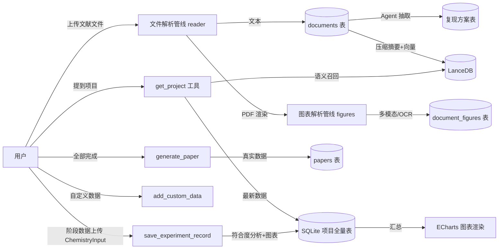

# 实验复现 Agent 实施计划（修订版 v0.6）

> 本文档为实验复现 Agent 的实施计划，供评审与修改。确认无误后再进入代码编写阶段。
> 版本：v0.6 ｜ 日期：2026-08-04
> v0.2 修订说明（依据用户反馈）：
> 1. 前端形态：**所有工具独立于聊天模式**，新增独立"文献复现工作台"页面，与聊天页无任何关联；
> 2. 补充**文献图表解析详细方案**；
> 3. Agent 所有分析与总结**配备图表展示**（ECharts 为主、VChart 备选）；
> 4. 数据录入具备**化学专业字符输入能力**（键盘 + 鼠标）。
> v0.3 修订：决策点 D6 已定——文献图表识别多模态模型采用 **DeepSeek-VL2**（OpenAI 兼容接口）。
> v0.4 修订（依据用户反馈）：
> 5. **数学公式渲染**：实验内容中的数学公式（LaTeX）正确显示（KaTeX）；
> 6. **AI 全程陪伴**：实验全程可在工作台随时向 AI 提问，注重 Markdown 格式转换；
> 7. **类型规范先行**：编码第一步将所有类型规范写入 `ai-server/type.ts`，正式编码严格引用，Agent 输出 JSON 必须遵循其中规范。
> v0.5 修订（依据用户反馈）：
> 8. **论文可选生成**：实验结束后由用户选择生成或不生成论文；
> 9. **AI 联想与预测实验**：Agent 总结后调用工具进行联想（搜索知识判断更优方案）、以**控制变量法**分析改变实验操作对结果性质的影响；用户可任选某流程进行 **AI 预测实验**，期间可随意修改尽可能多的实验变量，AI 预测结果并保证**理论有依据**。
> v0.6 修订（依据用户反馈）：
> 10. **VLM 配置**：DeepSeek-VL2 复用 `.env` 的 `DEEPSEEK_API_KEY`，模型名与 baseURL 由用户在 `.env` 中自行标注；
> 11. **图表导出确认**：确认图表数据可在生成论文时成功导出（ECharts 数据表 + PNG 导出方案）；
> 12. **论文人工标注**：论文中需要人工补充实际数据的地方统一额外标注，便于用户识别与填写。

***

## 1. 需求概述

新建一个**实验复现 Agent** 及配套独立工作台页面，具备以下五大能力：

| 编号 | 能力             | 说明                                                                                                                                     |
| -- | -------------- | -------------------------------------------------------------------------------------------------------------------------------------- |
| ①  | 文献解析与项目存储      | 用户上传论文/资料（可多文件）→ 理解化学实验全过程 → 以"项目"形式存入 SQLite → 内容压缩成关键摘要存入向量库（LanceDB）→ 随实验进行增量更新 → 用户提到项目时优先从数据库取最新数据                                |
| ②  | 复现方案总结         | 从文献中总结复现所需化学材料、实验步骤、实验仪器、注意事项、可能遇到的问题，评估复现难度与可行性，存入 SQLite 表                                                                           |
| ③  | 阶段数据上传与结果分析    | 用户完成某一阶段后上传数据（通用表结构 + 用户自定义数据：数据名称 + 化学数据类型 + 数据内容）→ Agent 分析是否符合预期（百分比）并给出标准结果参考 → 符合/不符合均保存为"实验现象 N"（名称可自定义）→ 对每个现象分析原因（具体到化学式）与实验细节 |
| ④  | 论文生成（**可选**）   | 实验结束后**由用户选择生成或不生成论文**；若生成，基于库中真实数据撰写标准论文（内容必须属实）                                                                                      |
| ⑤  | **AI 联想与预测实验** | Agent 总结后调用工具联想（搜索知识判断是否有更优方案），并以**控制变量法**分析改变实验操作对结果性质的影响；用户可任选某流程进行 **AI 预测实验**，可随意修改尽可能多的实验变量，AI 预测结果且**理论有依据**                     |

**贯穿性要求（v0.5）**：

- 文献图表（表格/结构式/谱图/数据图）需**详细解析方案**（见 §6）
- 所有 Agent 分析与总结需**配套图表可视化**（ECharts，见 §8）
- 数据录入需支持**化学专业字符输入**（键盘 + 鼠标，见 §9）
- 实验内容中的**数学公式**需正确渲染显示（LaTeX + KaTeX，见 §8.5）
- 实验全程提供 **AI 陪伴**：工作台内随时可提问，AI 回答做完整 Markdown 转换（见 §10）
- **类型规范先行**：编码第一步将全部类型写入 `ai-server/type.ts`，Agent 输出 JSON 严格遵循（见 §3.3）
- **论文可选**：结束流程只提示，不强制；用户确认后才生成（见 §7.4）
- **预测理论约束**：AI 预测实验必须给出理论依据（反应式/定律/公式），无依据不输出结论（见 §7.5）

***

## 2. 现状分析

### 2.1 现有架构

```
┌─ Renderer (Vue3) ──────────────────────────────┐
│  路由: /lab(实验中心) /chat(聊天) /login …      │
│  实验中心 ExperimentLab = localStorage 演示数据  │
│  stores/chat.ts (聊天会话)                      │
│        │ window.api (preload contextBridge)    │
├─ Preload ──────────────────────────────────────┤
│  ai.chat / ai.chatStream / db.*                │
├─ Main (Electron) ──────────────────────────────┤
│  ai-server/  agent.ts(createAgent)             │
│              model.ts(ChatOpenAI-DeepSeek)     │
│              prompt.ts / tools/*               │
│              index.ts (IPC: ai:chat*)          │
│  database/   sqlite.ts (better-sqlite3)        │
│              lancedb.ts (向量检索)              │
│              dao/ + index.ts (IPC: db:*)       │
└────────────────────────────────────────────────┘
```

### 2.2 已具备的基础

- **SQLite**：`conversations / messages / documents` 表与 DAO 模式
- **LanceDB**：`createTable / addData / searchVectors / tableExists` 通用接口（含 IPC + preload）
- **LangChain Agent**：`createAgent` + `tool()` 成熟范式
- **路由**：vue-router，可新增独立路由

### 2.3 需要补齐的缺口

| 缺口       | 现状 | 方案                              |
| -------- | -- | ------------------------------- |
| 文件上传/解析  | 无  | 新增文件选择 IPC + txt/md/pdf 解析      |
| PDF 图表解析 | 无  | 见 §6（pdfjs 渲染 + 多模态识别 + OCR 兜底） |
| 文本向量化    | 无  | 见决策点 D1                         |
| 实验数据表    | 无  | 新增 13 张通用表（见 §4）                |
| 独立前端页面   | 无  | 新增 `/repro` 文献复现工作台（见 §7/§10）   |
| 图表可视化    | 无  | ECharts 渲染组件（见 §8）              |
| 化学字符输入   | 无  | ChemistryInput 组件（见 §9）         |

***

## 3. 总体架构设计

### 3.1 多 Agent 架构（相互独立）

> **v0.2 变更**：实验复现 Agent 与聊天 Agent **完全解耦**。聊天 Agent（现有）保持不动；实验 Agent 只服务于独立工作台页面，通过**专属 IPC** 调用，聊天侧无法触发，双向无关联。

```
src/main/
├── ai-server/
│   ├── agent.ts                 # 通用聊天 Agent（保持原样，不受影响）
│   ├── experiment/
│   │   ├── agent.ts             # 实验复现 Agent（createAgent + 专属提示词 + 专属工具）
│   │   ├── prompt.ts            # 实验工作流系统提示词
│   │   ├── tools.ts             # 实验工具集（见 §5）
│   │   └── pipeline.ts          # 重型管线：文献抽取、图表解析调度、符合度分析、论文生成
│   └── index.ts                 # IPC：新增 ai:experiment-*（与 ai:chat-* 完全分离）
├── files/
│   ├── reader.ts                # 文本提取（txt/md/pdf；可选 docx）
│   ├── render.ts                # pdfjs 页面/图块渲染 PNG（@napi-rs/canvas）
│   ├── ocr.ts                   # tesseract.js OCR 兜底
│   └── figures.ts               # 图表解析调度（多模态识别 / OCR / document_figures 入库）
├── database/                    # 新增 DAO：project / reproduction / experiment / paper / figure / prediction
└── index.ts
```

### 3.2 数据流总览



### 3.3 类型规范先行（`ai-server/type.ts`，v0.4 强制要求）

> **编码第一步**：将所有用到的类型规范集中写入 `src/main/ai-server/type.ts`（现有 `AiChat` 在此扩展），
> 每个字段必须有注释说明作用。**后续所有代码（DAO / 工具 / 管线 / IPC / 前端 preload 声明）严格引用这些类型**，
> 尤其是 **Agent 输出的 JSON 格式必须按照 type.ts 中的规范**（模型提示词中直接嵌入类型定义示例）。

`type.ts` 将定义的主要类型（草案，编码时以此为基础细化）：

```ts
// ===== Agent 回复规范（核心：AI 输出 JSON 必须遵循） =====
export interface AiChat {
  think: string                      // 思考过程（Markdown）
  messages: string                   // 最终回答（Markdown，可含 LaTeX 公式与化学符号）
  charts?: ChartSpec[]               // 可选：本次回复附带的可视化图表
}

export type ChartType = 'gauge' | 'bar' | 'line' | 'pie' | 'radar' | 'scatter'
export interface ChartSpec {
  id: string                          // 图表唯一标识
  title: string                       // 图表标题
  type: ChartType                     // 图表类型（前端据此选择渲染）
  echartsOption: Record<string, unknown>  // 完整 ECharts option（Agent 生成，前端直接渲染）
}

// ===== 项目 =====
export type ProjectStatus = 'ongoing' | 'completed'
export interface Project { id; name; description; status; summary; created_at; updated_at }
export interface ProjectDocument { id; project_id; document_id; role }   // 项目-文献关联

// ===== 复现方案 =====
export interface ReproductionMaterial { id; project_id; name; formula; cas; quantity; purity; purpose; notes }
export interface ReproductionStep { id; project_id; step_no; title; description; conditions; duration; notes }
export interface ReproductionInstrument { id; project_id; name; specification; purpose; notes }
export interface ReproductionConcern { id; project_id; category; content; risk_level; solution }
export interface ReproductionAssessment { id; project_id; difficulty_score; feasibility; analysis; risk_points }

// ===== 实验阶段与记录 =====
export type PhaseStatus = 'pending' | 'in_progress' | 'completed'
export interface ExperimentPhase { id; project_id; name; phase_order; status; expected; created_at }
export type RecordType = 'phase' | 'phenomenon'
export interface ExperimentRecord { id; project_id; phase_id; record_type; name; content; data_json;
                                    expected; compliance_percent; is_expected; cause_analysis; detail; created_at }
export type ChemDataType = 'mass' | 'volume' | 'concentration' | 'yield' | 'temperature' | 'time' |
                           'ph' | 'color' | 'spectrum' | 'melting_point' | 'boiling_point' |
                           'density' | 'viscosity' | 'pressure' | 'purity' | 'observation' | 'other'
export interface CustomData { id; project_id; record_id; data_name; data_type; data_value; unit; extra; created_at }

// ===== 文献图表 =====
export type FigureType = 'table' | 'chemical_structure' | 'spectrum' | 'chart' | 'photograph'
export type FigureStatus = 'pending' | 'parsed' | 'manual'
export interface DocumentFigure { id; document_id; project_id; figure_index; page_number; figure_type;
                                  caption; structured_data; ocr_text; image_path; status; created_at }
export interface StructuredFigureData { table?; smiles?; spectrum?; chart?; description? }

// ===== 论文 =====
export interface Paper {
  id: number                             // 论文 ID
  project_id: number                     // 所属项目
  title: string                          // 论文标题
  content: string                        // 论文全文（Markdown，含图表占位符与【待人工补充】标注）
  charts: ChartSpec[]                    // 论文引用图表数据（随文保存，供导出/重新渲染）
  created_at: string                     // 生成时间
}

// ===== AI 联想与预测实验（能力⑤） =====
export type VariableType = 'temperature' | 'time' | 'concentration' | 'ratio' | 'catalyst' |
                           'atmosphere' | 'stirring' | 'pressure' | 'ph' | 'amount' | 'other'
export interface ExperimentVariable {
  key: string                            // 变量标识（对应步骤/条件）
  name: string                           // 变量名称（如"反应温度"）
  type: VariableType                     // 变量类型
  value: number | string                 // 当前取值
  unit: string                           // 单位（如 °C、min、mol/L）
  min?: number                           // 建议最小值（用于前端滑块）
  max?: number                           // 建议最大值
  step?: number                          // 调节步长
  options?: string[]                     // 可选值（枚举型变量，如催化剂种类/气氛）
  description: string                    // 变量作用说明（改变它会影响什么）
}
export interface PredictionExperiment {
  id: number                             // 预测实验记录 ID
  project_id: number                     // 所属项目
  name: string                           // 预测实验名称
  base_flow: string                      // 基于的实验流程描述
  variables: ExperimentVariable[]        // 全部变量及本次取值（尽可能多的可调变量）
  predicted_result: string               // AI 预测的实验结果（Markdown，含公式）
  property_analysis: string              // 结果性质分析（各性质如何变化）
  theory_basis: string                   // 理论依据（反应式/定律/公式，必须非空）
  created_at: string
}

// ===== 向量摘要（能力①：LanceDB project_summaries 条目） =====
export type SummarySource = 'document' | 'step' | 'record' | 'phenomenon'
export interface ProjectSummary {
  project_id: number                   // 所属项目
  chunk_index: number                  // 分块序号
  text: string                         // 压缩后的关键内容摘要
  source: SummarySource                // 摘要来源（文献/步骤/记录/现象）
  vector: number[]                     // 文本向量
}

// ===== 文献抽取管线输出（能力①②：create_project_from_documents 内部 LLM 抽取结果） =====
export interface DocumentExtraction {
  principle: string                    // 实验原理
  materials: ReproductionMaterial[]    // 材料清单
  steps: ReproductionStep[]            // 实验步骤
  instruments: ReproductionInstrument[]  // 仪器清单
  concerns: ReproductionConcern[]      // 注意事项/潜在问题
  assessment: ReproductionAssessment   // 难度与可行性评估
  phases: Array<{ name: string; expected: string }>  // 建议的实验阶段
  summary: string                      // 压缩摘要（写入 projects.summary）
}

// ===== 符合度分析输出（能力③） =====
export interface ComplianceAnalysis {
  compliance_percent: number           // 符合预期百分比 0~100
  is_expected: boolean                 // 是否符合预期
  expected: string                     // 标准结果参考
  cause_analysis: string               // 原因分析（具体到化学式/反应式）
  detail: string                       // 实验细节（条件/用量/现象）
}

// ===== AI 联想输出（能力⑤） =====
export interface OptimizationSuggestion {
  title: string                        // 建议标题（如"换用 Pd/C 催化剂"）
  description: string                  // 建议内容
  reason: string                       // 依据（文献/理论/数据）
  confidence: number                   // 置信度 0~100
  changedVariables?: string[]          // 涉及改变的变量 key
}
export interface VariableEffect {
  key: string                          // 变量标识
  name: string                         // 变量名称
  direction: 'increase' | 'decrease' | 'switch'  // 改变方向
  affectedProperties: Array<{ property: string; change: string }>  // 结果性质变化（如 产率↑、纯度↓、速率↑）
  analysis: string                     // 机理解释（含理论依据）
}

// ===== 工具输入/输出类型（与 §5 工具一一对应） =====
export interface DocumentImportResult {
  documentId: number                   // documents.id
  title: string                        // 文档标题
  contentLength: number                // 正文长度（字符数）
  figureCount: number                  // 解析出的图表数
}
export interface SaveRecordInput {
  project_id: number                   // 所属项目
  phase_id?: number                    // 关联阶段（可空）
  name: string                         // 记录/现象名称（用户可自定义）
  content: string                      // 用户上传的数据原文（Markdown）
  data_json?: Record<string, unknown>  // 结构化数据
  compliance: ComplianceAnalysis       // 符合度分析结果（Agent 生成）
}
export interface RunPredictionInput {
  project_id: number                   // 所属项目
  flow: string                         // 基于的实验流程描述
  name?: string                        // 预测实验名称（缺省自动生成）
  variables: ExperimentVariable[]      // 本次全部变量取值
}
export interface ProjectContext {
  project: Project                     // 项目基本信息
  documents: ProjectDocument[]         // 关联文献
  materials: ReproductionMaterial[]    // 材料清单
  steps: ReproductionStep[]            // 步骤
  instruments: ReproductionInstrument[]  // 仪器
  concerns: ReproductionConcern[]      // 注意事项
  assessment: ReproductionAssessment | null  // 难度评估
  phases: ExperimentPhase[]            // 实验阶段
  records: ExperimentRecord[]          // 阶段记录/现象（含最新数据）
  customData: CustomData[]             // 自定义数据
  predictions: PredictionExperiment[]  // 历史预测实验
  papers: Paper[]                      // 已生成论文
  summaries: string[]                  // 向量召回的摘要文本
}

// ===== IPC 交互（与工作台页面对接） =====
export interface ExperimentAgentRequest {
  projectId?: number                 // 当前项目（可为空）
  message: string                    // 用户输入（含 Markdown/公式/化学符号）
  history: { role: string; content: string }[]  // 陪伴对话历史
}
```

> 说明：`AiChat` 中的 `charts` 为可选字段；实验 Agent 的所有回复（符合度分析、方案总结、现象原因、论文等）与 AI 陪伴的回答统一遵循该结构；pipeline 内部的结构化抽取结果（如材料清单、步骤）也以 type.ts 中的类型为准，通过工具落库。

### 3.4 类型覆盖核对（五大能力 × 类型映射）

> 编码前逐项核对了类型是否覆盖全部功能，下表为覆盖矩阵，**保证所有功能代码都能找到对应类型，不允许出现"临时造类型"**。

| 功能点                       | 使用的类型（type.ts）                                                                                                                                   | 覆盖 |
| ------------------------- | ------------------------------------------------------------------------------------------------------------------------------------------------ | -- |
| **① 文献解析与项目存储**           | `Project` / `ProjectDocument` / `DocumentImportResult` / `ProjectSummary` / `ProjectContext`                                                     | ✅  |
| **② 复现方案总结**              | `ReproductionMaterial` / `ReproductionStep` / `ReproductionInstrument` / `ReproductionConcern` / `ReproductionAssessment` / `DocumentExtraction` | ✅  |
| **③ 阶段数据上传与结果分析**         | `ExperimentPhase` / `ExperimentRecord` / `CustomData` / `ChemDataType` / `ComplianceAnalysis` / `SaveRecordInput`                                | ✅  |
| **④ 论文生成（可选）**            | `Paper`（含 `charts` 随文导出 + 【待人工补充】标注）                                                                                                  | ✅  |
| **⑤ AI 联想与预测实验**          | `ExperimentVariable` / `VariableType` / `PredictionExperiment` / `OptimizationSuggestion` / `VariableEffect` / `RunPredictionInput`              | ✅  |
| Agent 输出 JSON（全部回复/分析/总结） | `AiChat`（think / messages / charts）                                                                                                              | ✅  |
| 图表可视化                     | `ChartSpec` / `ChartType`（含 gauge/bar/line/pie/radar/scatter）                                                                                    | ✅  |
| **图表数据导出到论文（v0.6）**       | `Paper.charts`（ChartSpec[] JSON，前端 getDataURL 导出 PNG / Markdown 数据表）                                                                        | ✅  |
| 化学字符输入                    | `ChemDataType`（数据录入）+ 前端 ChemistryInput（Unicode 文本）                                                                                              | ✅  |
| 数学公式                      | `AiChat.messages` 内嵌 LaTeX（KaTeX 渲染），无需额外类型                                                                                                      | ✅  |
| AI 陪伴                     | `ExperimentAgentRequest` / `AiChat`                                                                                                              | ✅  |
| 文献图表解析                    | `DocumentFigure` / `FigureType` / `FigureStatus` / `StructuredFigureData`                                                                        | ✅  |
| IPC / 工具参数                | `ExperimentAgentRequest` / `SaveRecordInput` / `RunPredictionInput` / `ProjectContext` / `DocumentImportResult`                                  | ✅  |

> 若后续编码中发现新类型需求，必须先补充到 type.ts 并同步更新本核对表，再引用编写。

***

## 4. 数据库设计

### 4.1 SQLite 表结构（通用设计，适用于任意化学实验）

> 设计原则：所有表以 `project_id` 关联；数据结构通用（`content` 存 Markdown/JSON）；
> 特定化学信息通过 `experiment_custom_data`（EAV 风格）扩展，保证不同实验都能复用。

```sql
-- 1. 实验项目
CREATE TABLE projects (
  id INTEGER PRIMARY KEY AUTOINCREMENT,
  name TEXT NOT NULL,                      -- 项目名称（用户可自定义）
  description TEXT DEFAULT '',             -- 项目简介/来源
  status TEXT DEFAULT 'ongoing',           -- ongoing(进行中) / completed(已完成)
  summary TEXT DEFAULT '',                 -- 文献要点压缩摘要（同步存向量）
  created_at DATETIME DEFAULT (datetime('now','localtime')),
  updated_at DATETIME DEFAULT (datetime('now','localtime'))
);

-- 2. 项目-文献关联（一个项目可来自多篇文献/资料）
CREATE TABLE project_documents (
  id INTEGER PRIMARY KEY AUTOINCREMENT,
  project_id INTEGER NOT NULL,
  document_id INTEGER NOT NULL,
  role TEXT DEFAULT 'source',
  created_at DATETIME DEFAULT (datetime('now','localtime')),
  FOREIGN KEY (project_id) REFERENCES projects(id) ON DELETE CASCADE
);

-- 3. 文献图表解析结果（v0.2 新增，见 §6）
CREATE TABLE document_figures (
  id INTEGER PRIMARY KEY AUTOINCREMENT,
  document_id INTEGER NOT NULL,
  project_id INTEGER,                      -- 关联项目（可选）
  figure_index INTEGER,                    -- 图序号
  page_number INTEGER,                     -- 所在页码
  figure_type TEXT DEFAULT '',             -- table/chemical_structure/spectrum/chart/photograph
  caption TEXT DEFAULT '',                 -- 图题
  structured_data TEXT DEFAULT '{}',       -- 结构化识别结果 JSON（表格/谱图/曲线/SMILES）
  ocr_text TEXT DEFAULT '',                -- OCR 文本（兜底）
  image_path TEXT DEFAULT '',              -- 原图本地缓存路径
  status TEXT DEFAULT 'pending',           -- pending/parsed/manual(待人工确认)
  created_at DATETIME DEFAULT (datetime('now','localtime')),
  FOREIGN KEY (document_id) REFERENCES documents(id) ON DELETE CASCADE
);

-- 4. 复现方案：化学材料/试剂（能力②）
CREATE TABLE reproduction_materials (
  id INTEGER PRIMARY KEY AUTOINCREMENT,
  project_id INTEGER NOT NULL,
  name TEXT NOT NULL,
  formula TEXT DEFAULT '',                 -- 化学式（如 H2SO4）
  cas TEXT DEFAULT '',                     -- CAS 号
  quantity TEXT DEFAULT '',                -- 用量（如 "5.0 g"、"50 mL"）
  purity TEXT DEFAULT '',                  -- 纯度
  purpose TEXT DEFAULT '',
  notes TEXT DEFAULT '',
  FOREIGN KEY (project_id) REFERENCES projects(id) ON DELETE CASCADE
);

-- 5. 复现方案：实验步骤（能力②）
CREATE TABLE reproduction_steps (
  id INTEGER PRIMARY KEY AUTOINCREMENT,
  project_id INTEGER NOT NULL,
  step_no INTEGER NOT NULL,
  title TEXT DEFAULT '',
  description TEXT NOT NULL,
  conditions TEXT DEFAULT '',              -- 条件（温度/时间/气氛，JSON）
  duration TEXT DEFAULT '',
  notes TEXT DEFAULT '',
  FOREIGN KEY (project_id) REFERENCES projects(id) ON DELETE CASCADE
);

-- 6. 复现方案：实验仪器/装置（能力②）
CREATE TABLE reproduction_instruments (
  id INTEGER PRIMARY KEY AUTOINCREMENT,
  project_id INTEGER NOT NULL,
  name TEXT NOT NULL,
  specification TEXT DEFAULT '',
  purpose TEXT DEFAULT '',
  notes TEXT DEFAULT '',
  FOREIGN KEY (project_id) REFERENCES projects(id) ON DELETE CASCADE
);

-- 7. 复现方案：注意事项/潜在问题（能力②）
CREATE TABLE reproduction_concerns (
  id INTEGER PRIMARY KEY AUTOINCREMENT,
  project_id INTEGER NOT NULL,
  category TEXT DEFAULT 'operation',       -- safety/operation/waste/other
  content TEXT NOT NULL,
  risk_level TEXT DEFAULT '',              -- 高/中/低
  solution TEXT DEFAULT '',
  FOREIGN KEY (project_id) REFERENCES projects(id) ON DELETE CASCADE
);

-- 8. 复现难度与可行性评估（能力②）
CREATE TABLE reproduction_assessment (
  id INTEGER PRIMARY KEY AUTOINCREMENT,
  project_id INTEGER NOT NULL,
  difficulty_score REAL DEFAULT 0,         -- 0~100
  feasibility TEXT DEFAULT '',             -- 可行/较难/不可行
  analysis TEXT DEFAULT '',
  risk_points TEXT DEFAULT '[]',
  FOREIGN KEY (project_id) REFERENCES projects(id) ON DELETE CASCADE
);

-- 9. 实验阶段（能力③）
CREATE TABLE experiment_phases (
  id INTEGER PRIMARY KEY AUTOINCREMENT,
  project_id INTEGER NOT NULL,
  name TEXT NOT NULL,                      -- 默认 "阶段1/2/3…"，可改
  phase_order INTEGER NOT NULL,
  status TEXT DEFAULT 'pending',           -- pending/in_progress/completed
  expected TEXT DEFAULT '',                -- 阶段预期结果（来自文献）
  created_at DATETIME DEFAULT (datetime('now','localtime')),
  FOREIGN KEY (project_id) REFERENCES projects(id) ON DELETE CASCADE
);

-- 10. 阶段实验记录（通用，能力③核心：一次上传=一条记录）
CREATE TABLE experiment_records (
  id INTEGER PRIMARY KEY AUTOINCREMENT,
  project_id INTEGER NOT NULL,
  phase_id INTEGER,
  record_type TEXT DEFAULT 'phase',        -- phase(阶段结果) / phenomenon(实验现象)
  name TEXT NOT NULL,                      -- 记录名称（现象可自定义，如"实验现象1-黄色沉淀"）
  content TEXT NOT NULL,                   -- 用户上传的数据原文（Markdown）
  data_json TEXT DEFAULT '{}',             -- 结构化数据 JSON
  expected TEXT DEFAULT '',                -- 预期结果参考（Agent 生成）
  compliance_percent REAL,                 -- 符合预期百分比 0~100
  is_expected INTEGER,                     -- 1 符合 / 0 不符合
  cause_analysis TEXT DEFAULT '',          -- 原因分析（具体到化学式/反应式）
  detail TEXT DEFAULT '',                  -- 实验细节（条件/用量/现象，具体到化学式）
  created_at DATETIME DEFAULT (datetime('now','localtime')),
  FOREIGN KEY (project_id) REFERENCES projects(id) ON DELETE CASCADE,
  FOREIGN KEY (phase_id) REFERENCES experiment_phases(id) ON DELETE SET NULL
);

-- 11. 用户自定义数据（通用 EAV，能力③：任何实验都可用）
CREATE TABLE experiment_custom_data (
  id INTEGER PRIMARY KEY AUTOINCREMENT,
  project_id INTEGER NOT NULL,
  record_id INTEGER,
  data_name TEXT NOT NULL,                 -- 数据名称（用户自定义）
  data_type TEXT NOT NULL,                 -- 化学数据类型（枚举见下）
  data_value TEXT NOT NULL,                -- 数据内容
  unit TEXT DEFAULT '',
  extra TEXT DEFAULT '{}',
  created_at DATETIME DEFAULT (datetime('now','localtime')),
  FOREIGN KEY (project_id) REFERENCES projects(id) ON DELETE CASCADE
);

-- 12. 论文（能力④，可选生成；v0.6：随文保存图表数据 + 人工待补充标注）
CREATE TABLE papers (
  id INTEGER PRIMARY KEY AUTOINCREMENT,
  project_id INTEGER NOT NULL,
  title TEXT DEFAULT '',
  content TEXT NOT NULL,                   -- 论文全文（Markdown，含图表占位符与【待人工补充】标注）
  charts TEXT DEFAULT '[]',                -- 论文引用图表数据（ChartSpec[] JSON，供导出/重新渲染）
  created_at DATETIME DEFAULT (datetime('now','localtime')),
  FOREIGN KEY (project_id) REFERENCES projects(id) ON DELETE CASCADE
);

-- 13. AI 预测实验记录（能力⑤：联想预测的虚拟实验）
CREATE TABLE prediction_experiments (
  id INTEGER PRIMARY KEY AUTOINCREMENT,
  project_id INTEGER NOT NULL,
  name TEXT NOT NULL,                      -- 预测实验名称
  base_flow TEXT DEFAULT '',               -- 基于的实验流程描述
  variables TEXT NOT NULL DEFAULT '[]',    -- 全部变量及取值 JSON（ExperimentVariable[]，尽可能多）
  predicted_result TEXT DEFAULT '',        -- AI 预测的实验结果（Markdown，含公式）
  property_analysis TEXT DEFAULT '',       -- 结果性质分析（各性质如何变化）
  theory_basis TEXT NOT NULL,              -- 理论依据（反应式/定律/公式，非空约束）
  created_at DATETIME DEFAULT (datetime('now','localtime')),
  FOREIGN KEY (project_id) REFERENCES projects(id) ON DELETE CASCADE
);
```

**化学数据类型枚举**（`experiment_custom_data.data_type`）：

```Markdown
mass(质量) | volume(体积) | concentration(浓度) | yield(产率) | temperature(温度) |
time(时间) | ph(pH) | color(颜色) | spectrum(光谱) | melting_point(熔点) |
boiling_point(沸点) | density(密度) | viscosity(黏度) | pressure(压力) |
purity(纯度) | observation(观察结果) | other(其他)
```

### 4.2 LanceDB 向量库设计

- 表名：`project_summaries`
- 字段：`project_id`、`chunk_index`、`text`（压缩关键内容）、`source`（document/step/record）、`vector`
- 写入：① 文献解析建项目时；② 每次保存记录/现象时增量追加
- 读取：`get_project` 先按名称精确匹配 SQLite 取最新结构化数据，再向量语义补充召回

### 4.3 DAO 与 IPC

- 新增 DAO：`project.dao.ts`、`reproduction.dao.ts`、`experiment.dao.ts`（phases/records/custom\_data）、`paper.dao.ts`、`figure.dao.ts`、`prediction.dao.ts`
- 新增 IPC：`db:project-*`、`db:reproduction-*`、`db:experiment-*`、`db:paper-*`、`db:figure-*`、`db:prediction-*`
- preload `index.ts` / `index.d.ts` 同步暴露

***

## 5. Agent 工具集设计（experiment 工具）

> 所有工具仅由实验复现工作台页面触发（`ai:experiment-*` IPC），与聊天 Agent 完全隔离。

| 工具名                             | 类别 | 输入                                                                                                     | 输出/作用                                                                     |
| ------------------------------- | -- | ------------------------------------------------------------------------------------------------------ | ------------------------------------------------------------------------- |
| `list_projects`                 | 查询 | 无                                                                                                      | 所有项目（id/名称/状态/更新时间）                                                       |
| `get_project`                   | 查询 | `name` 或 `project_id`                                                                                  | 项目最新全量上下文：方案+阶段+最新记录+自定义数据+向量摘要（能力①）                                      |
| `search_project_knowledge`      | 查询 | `query`                                                                                                | 向量语义召回项目关键内容                                                              |
| `import_documents`              | 文档 | `file_paths[]`、`title`                                                                                 | 解析文件 → documents 表，返回 doc id 与摘要（含图表解析触发）                                 |
| `create_project_from_documents` | 文档 | `project_name`、`document_ids[]`                                                                        | 内部 LLM 管线：抽取实验全过程 → 写复现方案 5 表 → 压缩摘要 → 写向量库（能力①②）                         |
| `add_experiment_phase`          | 写入 | `project_id`、`name`、`expected`                                                                         | 新增实验阶段                                                                    |
| `save_experiment_record`        | 写入 | `project_id`、`phase_id?`、`name`、`content`、`is_expected`、`compliance_percent`、`cause_analysis`、`detail` | 保存阶段结果/实验现象 + 原因分析（能力③）                                                   |
| `add_custom_data`               | 写入 | `project_id`、`data_name`、`data_type`、`data_value`、`unit?`                                              | 用户自定义数据（EAV）                                                              |
| `update_project_status`         | 写入 | `project_id`、`status`                                                                                  | 标记完成/进行中                                                                  |
| `generate_paper`                | 生成 | `project_id`                                                                                           | 汇总真实数据 → 写标准论文 → papers 表并返回全文（能力④，用户确认后调用）                               |
| `list_experiment_variables`     | 联想 | `project_id`、`flow?`                                                                                   | 列出该流程中所有可改变的变量（条件/用量/配比/催化剂/气氛等，尽可能多），返回 `ExperimentVariable[]` 及当前值（能力⑤） |
| `suggest_optimizations`         | 联想 | `project_id`                                                                                           | 调用知识搜索（web\_search / SciGraph）判断是否存在更合理/效果更好的方案，返回优化建议（含文献与理论依据）（能力⑤）     |
| `analyze_variable_effects`      | 联想 | `project_id`、`flow?`                                                                                   | 控制变量法分析：对每个变量给出"改变取值 → 结果性质（产率/纯度/速率/现象等）如何变化"，返回性质变化对照（能力⑤）              |
| `run_prediction_experiment`     | 预测 | `project_id`、`flow`、`variables: ExperimentVariable[]`                                                  | 按用户设定的变量值预测实验结果（含理论依据），保存到 prediction\_experiments 并返回预测报告（能力⑤）           |

**符合度分析（能力③）**：用户上传阶段数据后 Agent：① 读取该阶段 `expected` 与上传数据；② 给出符合百分比、是否预期、标准结果参考；③ 不符合则提示自定义现象名，分析原因（具体到化学式/反应式）与细节；④ `save_experiment_record` 落库并增量更新向量摘要。**该分析响应携带图表数据（§8）。**

**AI 联想与预测实验（能力⑤）**：Agent 完成阶段总结/实验总结后自动进入联想——`suggest_optimizations`（知识搜索判断更优方案）+ `analyze_variable_effects`（控制变量法分析）；用户选定某流程并调整变量后，`run_prediction_experiment` 预测结果并保存；**预测必须带理论依据（反应式/定律/公式），无依据不输出结论。**

***

## 6. 文献图表解析详细方案（v0.2 新增）

### 6.1 图表类型分类

| 类型                   | 说明       | 典型例子                     |
| -------------------- | -------- | ------------------------ |
| `table`              | 数据表格     | 试剂用量表、反应条件表、表征数据表        |
| `chemical_structure` | 化学结构/反应式 | 化合物结构式、合成路线图、反应机理图       |
| `spectrum`           | 谱图       | NMR / IR / MS / UV-Vis   |
| `chart`              | 数据图      | 柱状图、折线图、散点图（产率/动力学/条件优化） |
| `photograph`         | 实物照片     | 晶体照片、实验装置图、TLC 板         |

### 6.2 解析管线

```
PDF 文件
  │
  ├─(A) 文本层  pdf-parse + pdfjs-dist 文本流 ──→ 正文文字入库（documents）
  │            （简单表格可由文本行列位置重建为 Markdown/CSV）
  │
  ├─(B) 渲染层  pdfjs-dist(render) 用 @napi-rs/canvas 在 main 进程：
  │            · 每页渲染 PNG
  │            · page.getOperatorList() 检测图像对象 → 裁剪图块 + 记录页码/坐标
  │
  ├─(C) 识别层  对每张图块执行：
  │            · 主：DeepSeek-VL2（D6 已定，OpenAI 兼容接口，图片 base64 输入）
  │               统一输出结构化 JSON（见 6.3）
  │            · 兜底：tesseract.js OCR 提取图内文字（VLM 调用失败/无 Key 时）
  │
  └─(D) 入库层  结果写 document_figures 表
               status = parsed / manual(待人工确认)
               → 前端"图表解析"区展示 原图 + 识别结果，供用户确认/修正
                 （化学结构式需人工校验 SMILES、谱图需校验峰表）
```

### 6.3 结构化识别输出（统一 JSON 契约）

```json
{
  "figure_index": 1,
  "type": "table | chemical_structure | spectrum | chart | photograph",
  "caption": "图1：xxx",
  "title": "标题",
  "content": {
    "table": [["试剂","用量"],["NaCl","5.0 g"]],        // table 类型
    "smiles": "C1=CC=CC=C1",                            // chemical_structure 类型
    "spectrum": { "x": [0, 10, ...], "y": [...], "peaks": [{"ppm": 7.26, "multiplicity": "s"}] },  // spectrum 类型
    "chart": { "series": [{"name":"产率","data":[...]}] },  // chart 类型
    "description": "..."                                 // photograph 等类型
  }
}
```

### 6.4 关键点与兜底

- 扫描版 PDF 无文本层 → 依赖渲染层 + OCR/多模态
- 结构式/谱图识别置信度低 → 标记 `manual`，前端展示原图让用户确认或手动补充（SMILES/峰表）
- 识别失败不阻断主流程：文献正文先入库，图表待补
- DeepSeek-VL2 不可用（无 Key / 调用失败）→ 退化为 OCR + 人工，功能降级不缺失

### 6.5 DeepSeek-VL2 接入说明（D6 已定，v0.6 配置调整）

- **接口**：OpenAI 兼容 Chat Completions（`image_url` 传 base64 图块数据）
- **API Key**：**复用 `.env` 中已有的 `DEEPSEEK_API_KEY`**（无需新增 Key）
- **配置**（`.env`，模型名与 baseURL 由用户自行标注）：
  ```
  DEEPSEEK_API_KEY=sk-xxx               # 已有，直接复用
  VLM_MODEL=deepseek-vl2                # 用户标注：DeepSeek-VL2 模型名
  VLM_BASE_URL=https://api.deepseek.com/v1   # 用户标注：VLM 服务地址（或部署地址）
  ```
- **调用方式**：图块 PNG → base64 → `image_url` 消息 → 请求输出严格 JSON（提示词中给出 6.3 契约示例，`response_format: {type:'json_object'}` 强制 JSON）
- **降级**：未标注 `VLM_MODEL` / `VLM_BASE_URL` / 调用失败 / 返回非法 JSON 时 → 自动降级为 tesseract.js OCR + 标记 `manual` 待人工确认
- 文本模型与 VL2 共用 `DEEPSEEK_API_KEY`，模型名不同，互不影响

***

## 7. Agent 工作流设计

### 7.1 场景①：文献 → 项目创建（能力①②）

```
上传文献 → import_documents（文本入库 + 图表解析）
→ create_project_from_documents：
    a. 分块读取全文（含 document_figures 结构化图表数据）
    b. LLM 抽取：原理 / 材料 / 步骤 / 仪器 / 注意事项 / 难点
    c. 写 reproduction_* 表 + assessment
    d. 压缩摘要 → projects.summary + LanceDB 向量
    e. 生成实验阶段列表 experiment_phases
→ 响应含图表：复现方案概览（材料配比图、难度雷达图、步骤甘特/时间线）
```

### 7.2 场景②：项目提及与增量更新（能力①）

```
"继续我的 xxx 实验 / 查看 xxx 项目"
→ get_project：SQLite 最新结构化数据 + 向量语义召回
→ 基于最新数据完成用户任务
→ 每次保存记录/自定义数据后同步增量更新向量摘要
```

### 7.3 场景③：阶段数据上传与结果分析（能力③）

```
用户用 ChemistryInput 录入本阶段数据（或自定义数据 add_custom_data）
→ Agent 对比 expected 与用户数据 → 符合度% + 标准结果参考
   （响应携带图表：符合度仪表盘 gauge + 实际vs预期对比 bar）
→ 无论符合与否，按用户自定义名称保存"实验现象 N" → save_experiment_record
→ 若不符合：分析原因（具体到化学式/反应方程式/可能副反应）+ 实验细节
```

### 7.4 场景④：论文生成（能力④，**可选**）

```
实验全部阶段完成 / 用户点击"结束实验"
→ 系统提示："实验已完成，是否生成论文？"（用户自由选择，可不生成）
→ 用户选择生成 → generate_paper 管线：
    a. 校验所有阶段 completed（未完成则提示仍可生成）
    b. 汇总 projects + reproduction_* + phases + records + custom_data + document_figures
    c. 按标准论文结构撰写：摘要/引言/材料与方法/结果与讨论/结论/参考文献
    d. 约束：数据仅取自数据库，不虚构（管线内二次校验）
    e. 图表数据随论文导出（见 §8.6）；缺失真实数据处加"待人工补充"标注（见 §8.7）
→ 存入 papers 表（含 charts JSON），Markdown 返回，可下载
→ 用户选择不生成 → 仅标记项目 completed，不写 papers 表
```

### 7.5 场景⑤：AI 联想与预测实验（能力⑤）

```
触发：某阶段总结完成 / 实验结束（Agent 总结后自动进入联想）
① 知识联想  suggest_optimizations：
      web_search / SciGraph 检索同类反应、条件优化文献
      → 判断是否有更合理 / 效果更好的方案（催化剂、溶剂、温度、时间、后处理…）
② 控制变量分析  analyze_variable_effects：
      list_experiment_variables 先列出全部可调变量（尽可能多）：
        温度 / 时间 / 浓度 / 配比 / 催化剂种类与用量 / 气氛 / 搅拌速度 /
        压强 / pH / 加料顺序 / 溶剂种类 / 后处理方式 …
      对每个变量分析："取值变化 → 结果性质（产率/纯度/选择性/速率/现象/副产物）如何变化"
③ 用户任选某个流程 → 进入预测实验模式
      run_prediction_experiment：
        前端变量面板展示全部变量（滑块/输入/下拉，当前值高亮，可随意修改）
        用户改变量 → AI 预测实验结果（结果数值范围、性质变化、现象）+ 理论依据
      理论依据必须包含（无依据不输出结论）：
        反应方程式 / 定律（勒夏特列原理、阿伦尼乌斯方程 k=A·e^(−Ea/RT)）/
        热力学（ΔG=ΔH−TΔS）/ 动力学速率方程 / 已知数据外推
④ 结果保存 prediction_experiments，可在"预测实验"Tab 回看与再次调整
```

***

## 8. 图表可视化方案（v0.2 新增）

### 8.1 技术选型

- **主：ECharts**（`echarts`，生态成熟、文档全、支持深色主题）
- **备选：VChart**（`@visactor/vchart`，仅当需要 ECharts 不擅长的图表类型时再引入，默认不装）

### 8.2 Agent 响应扩展

所有 Agent 分析与总结的响应统一为：

```json
{
  "think": "思考过程",
  "messages": "文字分析（Markdown）",
  "charts": [
    {
      "id": "chart-1",
      "title": "符合预期程度",
      "type": "gauge",
      "echartsOption": { "series": [{ "type": "gauge", "data": [{ "value": 82, "name": "符合度" }] }] }
    }
  ]
}
```

### 8.3 前端渲染

- 新增组件 `ChartCard.vue`：接收 `ChartSpec`，用 `echarts` 实例化渲染，跟随应用深浅色主题
- 新增公共方法 `useChartTheme()`：适配 `--color-*` 变量
- 渲染位置：工作台各处 Agent 分析结果卡片下方、数据看板 Tab

### 8.4 图表场景映射

| 场景      | 图表类型                                               |
| ------- | -------------------------------------------------- |
| 符合度分析   | gauge（符合百分比）+ bar（实际 vs 预期）                        |
| 多阶段进度   | line（各阶段符合度趋势）                                     |
| 材料/试剂清单 | bar / pie（用量、摩尔配比）                                 |
| 产率对比    | bar                                                |
| 实验现象统计  | pie（符合/不符合/异常占比）                                   |
| 谱图数据    | line（NMR/IR 峰形，直接渲染 document\_figures.spectrum 数据） |
| 复现难度评估  | radar（原料可得性/操作难度/仪器要求/安全性/时长 多维评估）                 |
| 论文数据摘要  | bar / pie（各阶段结果汇总）                                 |
| 变量敏感性分析 | bar / radar（各变量对结果性质的影响程度）                         |
| 控制变量扫描  | line（单变量连续变化时结果性质变化曲线，如温度 60\~100°C 扫描）            |
| 预测结果对比  | bar（原流程 vs 预测流程各性质对比）                              |
| 预测置信区间  | line + area（预测值及上下界）                               |

### 8.5 数学公式渲染方案（v0.4 新增）

> 实验内容（复现步骤、条件、符合度计算、现象分析、论文）中可能含数学公式，如
> `c₁V₁ = c₂V₂`、$K\_{sp} = \[Ag^+]\[Cl^-]$、产率公式 $\text{收率} = \frac{m\_{实际}}{m\_{理论}} \times 100%$ 等，必须正确渲染显示。

- **方案**：**KaTeX**（`katex`，快、轻量） + **marked**（项目已有）集成
- **语法约定**（存储统一 LaTeX，与 Markdown 共存）：
  - 行内公式：`$...$`（如 `$K_{sp} = [Ag^+][Cl^-]$`）
  - 块级公式：`$$...$$`（如 `$$\text{收率} = \frac{m_{实际}}{m_{理论}} \times 100\%$$`）
- **渲染链路**：Markdown 源码 → 先解析 `$`/`$$` 公式段（KaTeX 渲染为 HTML，含错误兜底样式）→ 剩余 Markdown 走 marked → 统一插入文档；前端 `MarkdownRenderer.vue` 组件封装该流程，供 AI 回复、方案、记录、论文等所有 Markdown 展示处复用
- **错误兜底**：公式语法错误时显示"公式解析失败"占位，不阻塞整段渲染；KaTeX 白名单加载（`\ce` 等化学宏可选）
- 化学公式（H₂O 等 Unicode 上下标）与 LaTeX 数学公式并存互不冲突（一个走文本、一个走 KaTeX）

### 8.6 图表数据导出到论文（v0.6，已确认可行）

> 需求确认：Agent 分析产生的图表（ECharts）数据必须能在生成论文时成功导出。

- **存储**：`papers` 表新增 `charts TEXT`（ChartSpec[] JSON），论文生成时随文保存
- **论文内容中的图表表达**（Markdown 约定，双保险）：
  1. **数据表**（必含）：每个图表位置先输出对应的 **Markdown 数据表格**（从 echartsOption 的 series/data 反解），保证"导出成 .md / 无渲染环境"时数据依然完整可见；
  2. **图表占位符**（增强）：`` —— 前端预览时识别占位符并替换为 ECharts 渲染实例。
- **导出链路（已确认 ECharts 官方能力）**：
  - 导出 `.md`：保留 Markdown 数据表 + 占位符（数据不丢失）
  - 导出 `.html`（可选增强）：`echarts.getInstanceByDom(...).getDataURL({ type: 'png', pixelRatio: 2 })` 将每个图表导出为 base64 PNG 内嵌到 HTML，论文自带真实图表图片
  - 图表数据与论文内容分离存储，可随时重新渲染/重新导出
- **验证**：编码联调阶段对"符合度仪表盘 / 控制变量扫描曲线 / 预测结果对比"三张典型图执行导出冒烟测试

### 8.7 论文人工待补充数据标注（v0.6 新增）

> 需求：论文中需要人工填写实际数据的地方必须额外标注，让用户一眼可见。

- **标注约定**：generate_paper 在生成时识别"需要真实数据但库中缺失或仅为 AI 推断"的部分，统一输出醒目引用块：
  ```markdown
  > ⚠️ **【待人工补充】**：此处需填入实际 ____ 数据（例如实际产率、实测熔点、谱图峰表、实验照片等）
  ```
- **需标注的典型位置**：
  - 实际测量数据：产率、熔点/沸点、纯度、光谱峰表、动力学数据（库中只有 AI 分析/预测值时）
  - 实验图片：产物照片、装置照片、TLC/谱图扫描件（系统未存储图片时）
  - 个人实验细节：具体操作差异、异常现象的主观描述
  - 参考文献核对：引用文献需人工确认条目
- **前端**：论文预览中高亮显示所有"待人工补充"标注块；导出论文时保留标注文字，用户填写后可替换
- **生成约束**：AI 不得自行编造上述数据——缺失即标注，保证论文内容属实

***

## 9. 化学专业字符输入方案（v0.2 新增）

### 9.1 需求

用户保存数据（阶段记录、现象、自定义数据）时，支持**键盘 + 鼠标**输入化学专业字符：上下标、希腊字母、化学箭头、单位、离子、状态符号等。

### 9.2 方案：`ChemistryInput.vue` 组件

**① 化学符号面板（鼠标点击插入）**

分类 Tab + 按钮网格，点击即在光标处插入：

| 分类    | 内容（示例）                                                                                           |
| ----- | ------------------------------------------------------------------------------------------------ |
| 上下标   | 下标 ₀₁₂₃₄₅₆₇₈₉₊₋ 上标 ⁺⁻⁰¹²³⁴⁵⁶⁷⁸⁹；以及"转为下标/转为上标"按钮（对选中文本）                                           |
| 希腊字母  | α β γ δ Δ ε θ λ μ π σ φ χ ψ ω Ω                                                                  |
| 化学箭头  | → ⇌ ↽⇀ ↺ ↑ ↓ △(加热) ⊕ ⊖                                                                           |
| 单位符号  | °C °F mL L μL mol g kg ppm Å nm μm % w/w v/v                                                     |
| 离子/基团 | H⁺ Na⁺ K⁺ Ca²⁺ Mg²⁺ Fe²⁺ Fe³⁺ Cu²⁺ Al³⁺ NH₄⁺ OH⁻ Cl⁻ SO₄²⁻ CO₃²⁻ NO₃⁻ PO₄³⁻ CH₃ C₂H₅ Ph Me Et Ac |
| 状态符号  | (s) (l) (g) (aq) ↓(沉淀) ↑(气体)                                                                     |

**② 键盘支持**

- 快捷键：Ctrl+Shift+D 转下标、Ctrl+Shift+U 转上标、Alt+快捷键插入常用符号（可配置）
- **公式美化**：选中 `H2O` 或输入后按 Ctrl+Alt+F → 自动转 `H₂O`、`Fe3+` → `Fe³⁺`（Unicode）

**③ 智能格式化规则（美化算法）**

- 化学式规范表（元素符号列表）驱动：元素符号后的数字转下标（H2O→H₂O、C2H5OH→C₂H₅OH）
- 数字后紧跟 `+`/`-` 电荷时转上标（Fe3+→Fe³⁺、SO4 2-→SO₄²⁻）
- 保护规则：纯数字/年份（2024）不转换、已有 Unicode 上下标不重复转换

**④ 存储与渲染**

- 统一以 **Unicode 上下标文本**存储（H₂O、SO₄²⁻），Markdown 兼容，SQLite 文本列可存，ECharts 标题/坐标轴直接支持
- 渲染端无需额外解析，天然兼容 Markdown 展示

### 9.3 应用位置

- 自定义数据录入表单（data\_name / data\_value）
- 阶段记录 / 实验现象录入
- 复现方案人工修正（材料化学式、条件等）

***

## 10. 前端独立页面设计（v0.2 变更：完全脱离聊天）

### 10.1 路由与入口

- 新增路由 `/repro` → `views/ReproductionLab.vue`（文献复现工作台）
- 首页导航增加入口（与"实验中心/聊天"平级）
- **与聊天页零耦合**：不调用 `ai:chat*`，仅调用 `ai:experiment-*` / `file:*` / `db:*`

### 10.2 页面结构

```
ReproductionLab（文献复现工作台）
├─ 顶部栏：标题 / 项目状态 / 操作（上传文献、新建项目、结束实验、生成/不生成论文、下载论文）
├─ 左侧栏：项目列表（新建/搜索/状态标签）
├─ 中部：项目详情（Tab 切换）
│   ├─ Tab1 复现方案：材料表 / 步骤时间线 / 仪器表 / 注意事项 / 难度雷达图
│   ├─ Tab2 实验阶段与记录：阶段进度 + 记录/现象列表 + 每条记录的分析与图表
│   ├─ Tab3 图表解析：document_figures 原图 + 识别结果（表格/谱图/结构式），支持人工修正
│   ├─ Tab4 数据看板：自定义数据 + 汇总图表（ECharts）
│   ├─ Tab5 预测实验（能力⑤）：变量面板（尽可能多的可调变量）+ 控制变量扫描曲线 +
│   │    预测结果卡片（图表 + 理论依据）+ 历史预测记录
│   └─ Tab6 论文：预览 / 生成（用户主动选择）/ 下载（.md）
└─ 右侧：AI 陪伴工作区（v0.4：全程陪伴，独立对话式面板，非聊天页组件）
    ├─ 操作引导（上传文献→建项目→记录数据→结束实验 步骤条）
    ├─ AI 陪伴消息流：实验全程任何时刻都可提问（化学原理、步骤、结果解释等）
    │   回复经 MarkdownRenderer 转换（Markdown + LaTeX 公式 + 图表 ChartCard）
    ├─ Agent 工作流消息（建项目/符合度分析/现象原因/总结联想/预测，消息携带 charts）
    └─ 数据录入表单（含 ChemistryInput + 化学符号面板）
```

> **AI 陪伴（v0.4）**：实验 Agent 同时充当"全程陪伴"，对话不限定固定流程——用户可随时问
> "这一步为什么变黄？""浓度公式怎么写？""下一步怎么做？"等任意问题，Agent 结合当前项目
> 数据回答；所有回复统一走 `AiChat` 规范（think/messages/charts），前端用 `MarkdownRenderer.vue`
> 做 **Markdown → HTML 转换**（含 KaTeX 公式、表格、代码块、图表占位）。
>
> **结束流程（v0.5）**：用户点击"结束实验"→ 系统提示是否生成论文（可跳过）→ 进入 AI 总结与联想（能力⑤）。

### 10.3 组件清单（新增）

| 组件                                      | 说明                                          |
| --------------------------------------- | ------------------------------------------- |
| `views/ReproductionLab.vue`             | 工作台主页面                                      |
| `components/repro/ProjectSidebar.vue`   | 项目列表                                        |
| `components/repro/PlanPanel.vue`        | 复现方案 Tab（含图表）                               |
| `components/repro/PhasePanel.vue`       | 阶段与记录 Tab（记录卡片 + 图表）                        |
| `components/repro/FigurePanel.vue`      | 图表解析 Tab（原图+识别结果+人工修正）                      |
| `components/repro/DataBoard.vue`        | 数据看板 Tab（自定义数据 + 汇总图表）                      |
| `components/repro/PredictionPanel.vue`  | 预测实验 Tab（能力⑤：预测结果卡片 + 历史记录）                 |
| `components/repro/VariableControl.vue`  | 变量控制器（v0.5：滑块/输入/下拉，展示尽可能多的可调变量，实时调值触发预测）   |
| `components/repro/PaperPanel.vue`       | 论文 Tab（用户主动选择生成）                            |
| `components/repro/AgentPanel.vue`       | AI 陪伴工作区（随时提问 + 工作流交互，非聊天组件）                |
| `components/repro/MarkdownRenderer.vue` | 统一 Markdown 渲染（v0.4：marked + KaTeX 公式，§8.5） |
| `components/repro/ChemistryInput.vue`   | 化学字符输入（§9）                                  |
| `components/repro/ChartCard.vue`        | ECharts 图表卡片（§8）                            |
| `components/repro/ChemSymbolPanel.vue`  | 化学符号面板                                      |

***

## 11. 新增依赖

| 依赖                  | 用途                         | 备注                                                       |
| ------------------- | -------------------------- | -------------------------------------------------------- |
| `katex`             | 数学公式渲染（§8.5）               | 渲染进程                                                     |
| `pdf-parse`         | PDF 文本提取                   | 主进程                                                      |
| `pdfjs-dist`        | PDF 页面渲染 + 图块提取            | 主进程                                                      |
| `@napi-rs/canvas`   | main 进程无 DOM 渲染 PDF 页为 PNG | 主进程                                                      |
| `tesseract.js`      | 图内文字 OCR 兜底                | 可选                                                       |
| `echarts`           | 图表可视化                      | 渲染进程                                                     |
| `mammoth`           | docx 文本提取                  | 可选（决策点 D2）                                               |
| 本地 embedding（D1）    | 文本向量化                      | 决策点 D1                                                   |
| DeepSeek-VL2（D6 已定） | 文献图表识别（OpenAI 兼容接口）        | 复用 `DEEPSEEK_API_KEY`；`.env` 由用户标注 VLM_MODEL / VLM_BASE_URL |

***

## 12. 实施步骤（分阶段）

> 按 v0.4 要求，**P1 为类型规范先行**：所有类型写入 `ai-server/type.ts` 后，后续阶段严格引用。

| 阶段              | 内容                                                                                                                     | 产出                    |
| --------------- | ---------------------------------------------------------------------------------------------------------------------- | --------------------- |
| **P1 类型规范**     | `ai-server/type.ts` 集中定义全部类型（AiChat/ChartSpec/Project/复现方案/实验记录/自定义数据/图表/预测变量/预测实验/论文/IPC），逐字段注释；Agent 输出 JSON 规范嵌入提示词 | type.ts 完整可引用         |
| **P2 数据层**      | 13 张表 + 6 个 DAO + IPC + preload（引用 type.ts）                                                                            | 全表可增删改查               |
| **P3 文件导入**     | `file:open` + `reader.ts`（txt/md/pdf）                                                                                  | 文件可上传入库               |
| **P4 图表解析**     | `render.ts` + `figures.ts`（pdfjs 渲染 + DeepSeek-VL2/OCR + document\_figures）                                            | 图表可识别入库               |
| **P5 向量化**      | embedding 接入 + `project_summaries` 表 + 摘要读写                                                                            | 向量可写可召回               |
| **P6 实验 Agent** | experiment agent + 14 工具 + pipeline（抽取/符合度/联想/预测/论文，输出遵循 type.ts 的 AiChat 规范）                                          | Agent 可完成五大能力 + AI 陪伴 |
| **P7 前端工作台**    | ReproductionLab + 各 Tab（含预测实验）+ MarkdownRenderer(KaTeX) + ChartCard + VariableControl + ChemistryInput + AgentPanel    | 独立页面可用                |
| **P8 联调测试**     | 端到端：文献→建项目→复现方案→阶段记录→现象分析(图表/公式)→总结联想→预测实验(变量调整/理论依据)→论文(可选，含图表导出冒烟测试与【待人工补充】标注检查)                           | 全流程可用                 |

***

## 13. 待确认决策点（请在评审时选择/修改）

| 编号     | 决策点      | 推荐方案                                                                                   | 备选方案                                  |
| ------ | -------- | -------------------------------------------------------------------------------------- | ------------------------------------- |
| **D1** | 文本向量化    | 本地模型 `@huggingface/transformers` + bge-small-zh / all-MiniLM-L6-v2（离线可用）               | ① 外部 embedding API（需 Key）；② 纯关键词（无向量） |
| **D2** | 文件格式     | PDF + TXT/MD（最小可用）                                                                     | 追加 DOCX（mammoth）                      |
| **D3** | 前端形态     | **已定**：独立页面 `/repro`，与聊天零耦合                                                            | —                                     |
| **D4** | Agent 路由 | **已定**：专属 IPC `ai:experiment-*`，聊天不可触发                                                 | —                                     |
| **D5** | 论文导出     | Markdown（存库 + 下载 .md）                                                                  | Word(.docx) / LaTeX                   |
| **D6** | 多模态模型选型  | **已定**：DeepSeek-VL2，复用 `DEEPSEEK_API_KEY`；`.env` 由用户标注 VLM_MODEL / VLM_BASE_URL | 未标注 VLM → OCR + 人工兜底（功能降级）              |
| **D7** | 图表库      | **ECharts 主选**（VChart 不引入，需要时再加）                                                       | 双库并存                                  |
| **D8** | 数学公式渲染   | **KaTeX 主选**（`$...$` / `$$...$$`，与 marked 集成）                                          | MathJax（功能全但更重）                       |

***

## 14. 风险与注意事项

- **PDF 扫描件**无文本层 → 依赖渲染 + OCR/多模态；建议提示用户优先使用带文本层的 PDF
- **结构式/谱图识别置信度**：必须人工校验流程（前端图卡确认），避免错误数据进入论文
- **符合度判断**依赖 LLM 推理，`content` 字段保留用户原始数据原文，保证可追溯
- **内容属实约束**：论文生成只从数据库取数，生成后提示用户核对
- **大文件**：文献切块理解，避免超出模型上下文；向量摘要按块写入
- **聊天隔离**：实验 Agent 的 IPC 与聊天 IPC 分开注册，确保互不影响
- **Unicode 化学字符**在部分字体下显示差异，前端统一字体栈保证 H₂O/Fe³⁺ 等符号渲染一致
- **公式兼容**：LaTeX 公式语法错误需有兜底样式，且避免与 Markdown 中 `$` 符号冲突（转义处理）
- **类型约束**：Agent 输出必须严格符合 `type.ts`（think/messages/charts），解析失败时前端容错降级显示；pipeline 结构化输出同样受类型约束，防止脏数据入库
- **预测是假设而非结论**：AI 预测实验的理论依据只保证推理过程有据可依，不保证实际结果；预测结果需标注"预测/未验证"，避免与真实实验结果混淆
- **变量面板规模**：变量过多时按类别分组折叠展示，避免单屏信息过载；数值型变量统一带单位与范围
- **图表导出**：论文导出时若 ECharts 未挂载（无 DOM 环境）则退化为 Markdown 数据表，保证数据不丢；PNG 导出需在渲染进程执行并做冒烟测试（§8.6）
- **人工标注完整**：generate_paper 提示词强制要求"凡缺失真实数据必标注【待人工补充】"，管线后置检查器扫描论文中是否遗漏待补充项

